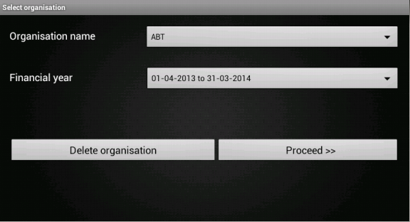

Maintaining organisations
=========================
* This chapter explains maintainance of ``organisations`` in ABT. 
* It includes ``creation`` of organisation, ``saving`` organisation details and setting ``preferences``.

Welcome page of ABT
+++++++++++++++++++
The first layout of the android APK is activity_main.xml, which is located in ``res/layout/`` folder.
It contains the features for the first screen that displays two buttons:
	#. Create new organisation
	#. Select existing organisation, besides the main logo of Aakash Business Tool(ABT).
  	
**File res/layout/activity_main.xml**
        
	.. code-block:: xml
	
		<?xml version="1.0" encoding="utf-8"?>
		<LinearLayout xmlns:android="http://schemas.android.com/apk/res/android"
		    xmlns:tools="http://schemas.android.com/tools"
		    android:layout_width="match_parent"
		    android:layout_height="match_parent"
		    android:orientation="vertical" 
		    android:background="@drawable/black_main_page">

		    <LinearLayout
			    android:layout_width="wrap_content"
			    android:layout_height="wrap_content"
			    android:layout_gravity="center_horizontal"
			    android:paddingTop="79dp">
			    
			<TextView
			    android:layout_width="wrap_content"
			    android:layout_height="wrap_content"
			    android:layout_gravity="center_horizontal"
			    android:text="on Aakash"
			    android:textColor="#FFFFFF" />

		    </LinearLayout>
		    
			<LinearLayout
			    android:layout_width="match_parent"
			    android:layout_height="match_parent"
			    android:layout_gravity="right"
			    android:orientation="vertical" >

			    <LinearLayout
				android:layout_width="wrap_content"
				android:layout_height="wrap_content"
				android:layout_gravity="right"
				android:orientation="vertical"
				android:paddingBottom="50dp"
				android:paddingRight="70dp"
				android:paddingTop="51dp" >

			    <Button
				android:id="@+id/bcreateOrg"
				android:layout_width="300dp"
				android:layout_height="50dp"
				android:layout_gravity="top"
				android:background="@drawable/button_yellow"
				android:clickable="true"
				android:gravity="center"
				android:text="@string/createOrgButton"
				android:textColor="#000000"
				android:textSize="20dp" />
			    </LinearLayout>

			    <LinearLayout
			    android:layout_width="wrap_content"
			    android:layout_height="wrap_content"
			    android:layout_gravity="right"
			    android:orientation="vertical"
			    android:paddingRight="70dp" >
			    <Button
				android:id="@+id/bselectOrg"
				android:layout_width="300dp"
				android:layout_height="50dp"
				android:layout_gravity="bottom"
				android:background="@drawable/button_yellow"
				android:clickable="true"
				android:gravity="center"
				android:text="@string/selectOrgButton"
				android:textColor="#000000"
				android:textSize="20dp" />
			    </LinearLayout>

			    <TextView
				android:layout_width="wrap_content"
				android:layout_height="wrap_content"
				android:layout_gravity="center_horizontal|right"
				android:paddingRight="40dp"
				android:paddingTop="72dp"
				android:text="IIT Bombay"
				android:textColor="#FFFFFF" />

			</LinearLayout>
		   

		</LinearLayout>
			
			

	   
	   

**src/com/example/gkaakash/MainActivity.java**

* The below method handles the ``click event`` of Create organization and Select existing organization.

	.. code-block:: java

		//Attach a listener to the click event for the button
		private void addListenerOnButton() {
			//Create a class implementing “OnClickListener”
			//and set it as the on click listener for the button
			create_org.setOnClickListener(new OnClickListener() {
	
				public void onClick(View arg0) {
						reportmenuflag = true;
					//To pass on the activity to the next page
					Intent intent = new Intent(context, createOrg.class);
					startActivity(intent);
				    
				    }// end of onClick
			});// end of create_org.setOnClickListener
		
			select_org.setOnClickListener(new OnClickListener() {
			
				public void onClick(View arg0) {
					reportmenuflag = false;
				    	// check existing organisation name list is null
					try{
					    	// call the getOrganisationName method from startup
					    	orgNameList = startup.getOrgnisationName(); // return lists of existing organisations
					    	if(orgNameList.length<1)
					    	{
							AlertDialog.Builder builder = new AlertDialog.Builder(context);
							builder.setMessage("Please create organisation")
								.setCancelable(false)
								.setPositiveButton("Ok",
									new DialogInterface.OnClickListener() {
									    public void onClick(DialogInterface dialog, int id) {
									       //do nothing
									    }
									});
							       
							AlertDialog alert = builder.create();
							alert.show();                    }
						else
						    {
							//To pass on the activity to the next page
							Intent intent = new Intent(context, selectOrg.class);
							startActivity(intent);  
						    }
						    
					   }catch(Exception e)
						{
							AlertDialog.Builder builder = new AlertDialog.Builder(context);
							builder.setMessage("Please check server connection")
							.setCancelable(false)
							.setPositiveButton("Ok",
								new DialogInterface.OnClickListener() {
								    public void onClick(DialogInterface dialog, int id) {
								       //do nothing
								    }
								});
						       
							AlertDialog alert = builder.create();
							alert.show();    
						}
					}// end of onClick
				});// end of select_org.setOnClickListener
			}// end of addListenerOnButton() method

	
Create new organisation
+++++++++++++++++++++++
	
* On clicking ``Create new organisation`` button, application loads  ``create_org.xml``.

**File  res/layout/create_org.xml**

	.. code-block:: xml

		?xml version="1.0" encoding="utf-8"?>
		<LinearLayout xmlns:android="http://schemas.android.com/apk/res/android"
		 android:layout_width="fill_parent" 
		 android:layout_height="fill_parent"
		 android:orientation="vertical"
		 android:weightSum="100"
		 android:background="@drawable/dark_gray_background">
		 
		<ScrollView xmlns:android="http://schemas.android.com/apk/res/android"
		    android:layout_width="fill_parent"
		    android:layout_height="fill_parent"
		    android:background="@drawable/dark_gray_background"
		    android:layout_weight="80">
		    
		<LinearLayout xmlns:android="http://schemas.android.com/apk/res/android"
		    	xmlns:tools="http://schemas.android.com/tools"
		    	android:layout_width="fill_parent"
		    	android:layout_height="fill_parent"
		    	android:orientation="vertical" 
		    	android:paddingLeft="10dp"
		 	android:paddingRight="10dp">

		    <TextView
			android:id="@+id/tvOrgName"
			android:layout_width="fill_parent"
			android:layout_height="wrap_content"
			android:text="Enter organisation name"
			android:textColor="#FFFFFF"
			android:textSize="20dp" />

		    <EditText
			android:id="@+id/etOrgName"
			android:layout_width="fill_parent"
			android:layout_height="wrap_content"
			android:ems="10"
			android:hint="Maximum 50 characters " 
			android:inputType="textCapWords"
			android:maxLength="50">

			<requestFocus android:layout_width="wrap_content" />

		    </EditText>

		    <TextView
			android:id="@+id/tvOrgType"
			android:layout_width="fill_parent"
			android:layout_height="wrap_content"
			android:text="Select organisation type"
			android:textColor="#FFFFFF"
			android:textSize="20dp" />

		    <Spinner
			android:id="@+id/sOrgType"
			android:layout_width="fill_parent"
			android:layout_height="wrap_content"
			android:entries="@array/orgType_arrays"
			android:prompt="@string/orgType_prompt" />
		    
		    <TextView
			android:id="@+id/tvFnclYear"
			android:layout_width="fill_parent"
			android:layout_height="60dp"
			android:layout_weight="30"
			android:gravity="center"
			android:text="Financial year"
			android:textColor="#FFFFFF"
			android:textSize="20dp" />
		    
		      
		    <LinearLayout
			android:layout_width="fill_parent"
			android:layout_height="wrap_content"
			android:orientation="horizontal"
			android:paddingLeft="40dp"
			android:paddingRight="40dp"
			android:weightSum="100" >

			<Button
			    android:id="@+id/btnChangeFromDate"
			    android:layout_width="wrap_content"
			    android:layout_height="wrap_content"
			    android:layout_weight="40"
			    android:textSize="20dp"
			    android:text="Set from date" />
				<View
				android:layout_width="0dp"
			android:layout_height="0dp"
			android:layout_weight="20" >
		    	</View>
			<Button
			    android:id="@+id/btnChangeToDate"
			    android:layout_width="wrap_content"
			    android:layout_height="wrap_content"
			    android:layout_weight="40"
			    android:textSize="20dp"
			    android:text=" Set to date " />
		    </LinearLayout>
		    
		    <LinearLayout
			android:layout_width="fill_parent"
			android:layout_height="wrap_content"
			android:orientation="horizontal"
			android:weightSum="100" 
			android:paddingLeft="40dp"
			android:paddingRight="40dp">

			<TextView
			    android:id="@+id/tvFromDate"
			    android:layout_width="wrap_content"
			    android:layout_height="wrap_content"
			    android:layout_weight="40"
			    android:gravity="center"
			    android:text=""
			    android:textSize="20dp"
			    android:textColor="#FFFFFF" />

			<View
			android:layout_width="0dp"
			android:layout_height="0dp"
			android:layout_weight="20" >
		    	</View>

			<TextView
			    android:id="@+id/tvToDate"
			    android:layout_width="wrap_content"
			    android:layout_height="wrap_content"
			    android:layout_weight="40"
			    android:gravity="center"
			    android:text=""
			   	android:textSize="20dp"
			    android:textColor="#FFFFFF" />
		    </LinearLayout>

		    
		</LinearLayout>
		</ScrollView>

		<LinearLayout
			android:layout_width="fill_parent"
			android:layout_height="wrap_content"
			android:orientation="horizontal"
			android:layout_weight="20"
			android:layout_alignParentBottom="true"
			android:background="@drawable/blackbutton" >

			<Button
			    android:id="@+id/btnNext"
			    android:layout_width="fill_parent"
			    android:layout_height="match_parent"
			    android:layout_gravity="center_vertical"
			    android:text="Next"
			    android:textSize="20dp" />
		    </LinearLayout>
		</LinearLayout>

.. image:: images/create_org.png
	   :name: ABT main page
	   :align: center

* The associated activity with the above xml page is ``createOrg.java`` which contains logic for adding new organisation.

**File src/com/example/gkaakash/createOrg.java**

* To get started with the application, there should be ``atleast one`` organization.

* This page allow the user to create organizaion with a particular ``financial year`` under certain organization type 
  such as,``NGO or Profit Making``.

* Its activiy is explained below along with code.

* The activity contains the essential and required import like 

	.. code-block:: java

		import java.math.RoundingMode;
		import java.text.DecimalFormat;
		import java.text.SimpleDateFormat;
		import java.util.Calendar;
		import java.util.Date;
		import com.gkaakash.controller.Startup;
		import android.app.AlertDialog;
		import android.content.Context;
		import android.content.DialogInterface;
		import android.content.Intent;
		import android.os.Bundle;
		import android.view.LayoutInflater;
		import android.view.View;
		import android.view.View.OnClickListener;
		import android.view.ViewGroup;
		import android.widget.AdapterView;
		import android.widget.AdapterView.OnItemSelectedListener;
		import android.widget.Button;
		import android.widget.DatePicker;
		import android.widget.EditText;
		import android.widget.Spinner;
		import android.widget.TextView;

* The activity intializes all the essential parameters and variables.

	.. code-block:: java

		TextView tvDisplayFromDate, tvDisplayToDate;
		Button btnChangeFromDate, btnChangeToDate, btnNext;
		static int year, month, day, toYear, toMonth, toDay;
		static final int FROM_DATE_DIALOG_ID = 0;
		static final int TO_DATE_DIALOG_ID = 1;
		Spinner orgType; 
		String org;
		static String organisationName,orgTypeFlag,selectedOrgType,todate;
		static String fromdate;
		AlertDialog dialog;
		final Calendar c = Calendar.getInstance();
		final Context context = this;
		private EditText orgName;
		Object[] deployparams;
		DecimalFormat mFormat;
		private Object[] orgNameList;
		Object[] financialyearList;
		boolean orgExistFlag;
		static Integer client_id;
		
* ``onCreate`` method loads all the required methods at load time.

	.. code-block:: java	
			
		@Override
		public void onCreate(Bundle savedInstanceState) {
			super.onCreate(savedInstanceState);
			
			//Calling create_org.xml
			setContentView(R.layout.create_org);
			
			client_id= Startup.getClient_id();
	
			MainActivity.no_dailog = true; //comment this line if running this app on emulator
			MainActivity.help_dialog.dismiss(); //comment this line if running this app on emulator
	
			//for two digit format date for dd and mm
			mFormat= new DecimalFormat("00");
			mFormat.setRoundingMode(RoundingMode.DOWN);
	
			//Declaring new method for setting date into "from date" and "to date" textview
			setDateOnLoad();
			
			/*
			 * creating a new interface for showing a date picker dialog that
			 * allows the user to select financial year start date and to date
			 */
			addListeneronDateButton();
			
			//creating interface to pass on the activity to next page
			addListeneronNextButton();
			
			orgType = (Spinner) findViewById(R.id.sOrgType);
			org  = (String) orgType.getSelectedItem();
			
			//creating interface to listen activity on Item 
			addListenerOnItem();
		}

* The below method sets standard financial ``From`` and ``To`` date, when the page gets loaded ie. 1st April to 31st March.

* Once the ``From`` date is seted, ``To`` date gets automatically updated by ``12`` months and minus ``1`` day.

	.. code-block:: java	

		private void setDateOnLoad() {

			tvDisplayFromDate = (TextView) findViewById(R.id.tvFromDate);
			tvDisplayToDate = (TextView) findViewById(R.id.tvToDate);

			/*
			 * set "from date" and "to date" textView
			 * for creating calendar object and linking with its 'getInstance' method, 
			 * for getting a default instance of this class for general use
			 */

			year = c.get(Calendar.YEAR);
			month = 3; //month = april
			day = 1;

			//set from date: day=01, month=April, year=current year
			tvDisplayFromDate.setText(new StringBuilder()
			.append(mFormat.format(Double.valueOf(1))).append("-")
			.append(mFormat.format(Double.valueOf(4))).append("-")
			.append(year));

			//Add one year to current date time
			c.add(Calendar.YEAR,1);
			toYear = c.get(Calendar.YEAR);
			toMonth = 2;
			toDay = 31;

			//set to date: day=31, month=March, year=current year+1
			tvDisplayToDate.setText(new StringBuilder()
			.append(mFormat.format(Double.valueOf(31))).append("-")
			.append(mFormat.format(Double.valueOf(3))).append("-")
			.append(toYear));

		}

* The below method builds date picker dialog on click and sets selected date on the 
  ``From`` date button(same with`` To`` date button).  

* We can also change the To date ``manually`` according to organization's rules or requirement.

	.. code-block:: java

		private void addListeneronDateButton() {
		
			btnChangeFromDate = (Button) findViewById(R.id.btnChangeFromDate);
			btnChangeToDate = (Button) findViewById(R.id.btnChangeToDate);

			/*
			 * when button is clicked, user can select from date(day, month and year) from datepicker,
			 * selected date will set in 'from date' textview and set date in 'to date' text view
			 * which is greater than from date by one year and minus one day(standard financial year format)
			 * 
			 */
			btnChangeFromDate.setOnClickListener(new OnClickListener() {

				@Override
				public void onClick(View arg0) {
					//Preparing views
					LayoutInflater inflater = (LayoutInflater) getSystemService(LAYOUT_INFLATER_SERVICE);
					View layout = inflater.inflate(R.layout.datepiker, (ViewGroup) findViewById(R.id.layout_root));
					
					//Building DatepPcker dialog
					AlertDialog.Builder builder = new AlertDialog.Builder(context);
					builder.setView(layout);
			    		builder.setTitle("Set from date");
			    		
			    		final DatePicker dp = (DatePicker)layout.findViewById(R.id.datePicker1);
			    		dp.init(year,month,day, null);
			    
			    		builder.setPositiveButton("Set",new  DialogInterface.OnClickListener() {
					@Override
					public void onClick(DialogInterface arg0, int arg1) {
						 year = dp.getYear();
						 month = dp.getMonth();
						 day =  dp.getDayOfMonth();
						 String strDateTime = mFormat.format(Double.valueOf(day)) + "-" 
						 + (mFormat.format(Double.valueOf(Integer.parseInt((mFormat.format(Double.valueOf(month))))+ 1))) + "-" + year;
						 //set date in from date textview
						 tvDisplayFromDate.setText(strDateTime);
						 
						 //setting selected date into calender's object
						 c.set(year, month, day);
						 //add one year
						 c.add(Calendar.YEAR, +1);
						 //subtracting one day
						 c.add(Calendar.DAY_OF_MONTH, -1);
						 
						 toYear = c.get(Calendar.YEAR);
						 toMonth = c.get(Calendar.MONTH);
						 toDay = c.get(Calendar.DAY_OF_MONTH);
						 
						 //set date in to date textview
						 tvDisplayToDate.setText(new StringBuilder()
						 .append(mFormat.format(Double.valueOf(toDay)))
						 .append("-").append(mFormat.format(Double.valueOf(Integer.parseInt((mFormat.format(Double.valueOf(toMonth+1)))))))
						 .append("-").append(toYear));
					}
					}); 
					dialog=builder.create();
					dialog.show();
				}	
			});
	
			/*
			 * when button clicked, user can change the 'to date' from datepicker,
			 * it will set the selected date in 'to date' textview, if to date is greater than from date
			 */
			btnChangeToDate.setOnClickListener(new OnClickListener() {

				@Override
				public void onClick(View arg0) {
					//Preparing views
					LayoutInflater inflater = (LayoutInflater) getSystemService(LAYOUT_INFLATER_SERVICE);
					View layout = inflater.inflate(R.layout.datepiker, (ViewGroup) findViewById(R.id.layout_root));
					
					//Building DatepPicker dialog
					AlertDialog.Builder builder = new AlertDialog.Builder(context);
					builder.setView(layout);
			    		builder.setTitle("Set to date");
			    
			    		final   DatePicker dp = (DatePicker) layout.findViewById(R.id.datePicker1);
			    		dp.init(toYear,toMonth,toDay, null);
			    
			    		builder.setPositiveButton("Set",new  DialogInterface.OnClickListener() {
					@Override
					public void onClick(DialogInterface arg0, int arg1) {
						 
						int Year = dp.getYear();
						int Month = dp.getMonth();
						int Day =  dp.getDayOfMonth();
						 
						 try {
							SimpleDateFormat sdf = new SimpleDateFormat("dd-MM-yyyy");
							Date date1 = sdf.parse(day+"-"+month+"-"+year); //from date
						    	Date date2 = sdf.parse(Day+"-"+Month+"-"+Year); //to date
						
						    	Calendar cal1 = Calendar.getInstance(); 
						    	Calendar cal2 = Calendar.getInstance(); 
						    	
						    	cal1.setTime(date1);
						    	cal2.setTime(date2);
						    	
						    	if(cal2.after(cal1)){
						    		toYear = Year;
								toMonth = Month;
								toDay =  Day;
								String strDateTime = mFormat.format(Double.valueOf(toDay)) + "-" 
									 + (mFormat.format(Double.valueOf(Integer.parseInt((mFormat.format(Double.valueOf(toMonth))))+ 1))) + "-" 
									 + toYear;
						    		tvDisplayToDate.setText(strDateTime);
						    	}
						    	else{
						    		String message = "Please enter proper date";
								toastValidationMessage(messsage);
						    	}
						} catch (Exception e) {
							// TODO: handle exception
						}
					}
					}); 
					dialog=builder.create();
					dialog.show();
				}	
			});
	    	}

Select existing organisation
++++++++++++++++++++++++++++

* On clicking ``Select existing organisation`` button from welcome page, application loads  ``select_org.xml``.

**File  res/layout/select_org.xml**

	.. code-block:: xml

		<LinearLayout xmlns:android="http://schemas.android.com/apk/res/android"
			   android:layout_width="fill_parent"
			   android:layout_height="fill_parent"
			   android:background="@drawable/dark_gray_background"
			   android:orientation="vertical"
			   android:padding="20dp" >

			   <LinearLayout
			       android:layout_width="match_parent"
			       android:layout_height="wrap_content"
			       android:orientation="vertical" >

			       <LinearLayout
				   android:layout_width="match_parent"
				   android:layout_height="81dp" >

				   <TableLayout
				android:layout_width="fill_parent"
				android:layout_height="wrap_content">
		       
				 <TableRow
				     android:layout_width="wrap_content"
				     android:layout_height="wrap_content" >

				   <TextView
				       android:id="@+id/textView1"
				       android:layout_width="wrap_content"
				       android:layout_height="wrap_content"
				       android:layout_weight="0.5"
				       android:text="Organisation name"
				       android:textColor="#FFFFFF"
				       android:textSize="20dp" />

				   <Spinner
				       android:id="@+id/sGetOrgNames"
				       android:layout_width="0dip"
				       android:layout_height="wrap_content"
				       android:layout_weight="2.5"
				       android:prompt="@string/orgName_prompt" />

				   </TableRow>
				   </TableLayout>
			       </LinearLayout>
			   </LinearLayout>

			   <LinearLayout
			       android:layout_width="match_parent"
			       android:layout_height="wrap_content" >

			     <TableRow
				 android:layout_width="fill_parent"
				 android:layout_height="wrap_content" >

			       <TextView
				   android:id="@+id/textView2"
				   android:layout_width="wrap_content"
				   android:layout_height="wrap_content"
				   android:layout_weight="0.5"
				   android:text="Financial year         "
				   android:textColor="#FFFFFF"
				   android:textSize="20dp" />

			       <Spinner
				   android:id="@+id/sGetFinancialYear"
				   android:layout_width="0dip"
				   android:layout_height="wrap_content"
				   android:layout_weight="2.5"
				   android:prompt="@string/financialyear_prompt"/>
				</TableRow>
			   </LinearLayout>

			    
			    <LinearLayout
			android:layout_width="fill_parent"
			android:layout_height="wrap_content"
			android:orientation="horizontal"
			android:layout_weight="20">

			<Button
			    android:id="@+id/btnDeleteOrg"
			    android:layout_width="wrap_content"
			    android:layout_height="wrap_content"
			    android:layout_gravity="center_vertical"
			    android:layout_weight="0.90"
			    android:text="Delete organisation"
			    android:textSize="20dp" />
	
			<Button
			    android:id="@+id/bProceed"
			    android:layout_width="wrap_content"
			    android:layout_height="wrap_content"
			    android:layout_weight="0.96"
			    android:text="  Proceed >>"
			    android:textSize="20dp" 
			    android:layout_gravity="center_vertical"/>

		</LinearLayout>
		</LinearLayout>

* The associated activity to above xml page is ``selectOrg.java``.

**File src/com/example/gkaakash/selectOrg.java**

* This page allows to select the already created or existing organisation from database
  with a particular financial year.

* Its activiy is explained below along with code. 

* The activity contains the essential and required import like

	.. code-block:: java

		import java.util.ArrayList;
		import java.util.List;
		import com.gkaakash.controller.Startup;
		import android.app.Activity;
		import android.app.AlertDialog;
		import android.content.Context;
		import android.content.DialogInterface;
		import android.content.Intent;
		import android.os.Bundle;
		import android.view.View;
		import android.view.View.OnClickListener;
		import android.widget.AdapterView;
		import android.widget.AdapterView.OnItemSelectedListener;
		import android.widget.ArrayAdapter;
		import android.widget.Button;
		import android.widget.Spinner;
		import android.widget.SpinnerAdapter;

* The activity intializes all the essential parameters and variables.

	.. code-block:: java
	

		Object[] orgNameList;
		Spinner getOrgNames;
		private Spinner getFinancialyear;
		private Startup startup;
		private Button bProceed;
		Object[] financialyearList;
		final Context context = this;
		private Button btnDeleteOrg;
		protected AdapterView<SpinnerAdapter> parent;
		protected Object selectedFinancialYear;
		//static String existingOrgFlag;
		protected static Integer client_id;
		protected static String selectedOrgName;
		protected static String fromDate;
		protected static String  toDate;

* onCreate method loads all the required methods at load time. 

	.. code-block:: java
	

		public void onCreate(Bundle savedInstanceState) {
		    	super.onCreate(savedInstanceState);
		    	setContentView(R.layout.select_org);
		    	
		    	MainActivity.no_dailog = true; //comment this line if running this app on emulator
		    	
		    	// set flag to true , if we are in existing organisation
		    	//existingOrgFlag="true";
		    	
		    	// call startup to get client connection 
		    	startup = new Startup();
		    	
		    	getOrgNames = (Spinner) findViewById(R.id.sGetOrgNames);
		    	getFinancialyear = (Spinner) findViewById(R.id.sGetFinancialYear);
		    	getOrgNames.setMinimumWidth(100);
		    	getFinancialyear.setMinimumWidth(250);
		    	
		    	bProceed = (Button) findViewById(R.id.bProceed);
		    	btnDeleteOrg = (Button) findViewById(R.id.btnDeleteOrg);
		    	
		    	getExistingOrgNames();
		    	addListenerOnItem();
		    	addListenerOnButton();
	        }// End of onCreate

* The below method loads all the ``organisation name`` from the database and populates 
  organization name ``spinner``.

	.. code-block:: java

		// getExistingOrgNames()
		void getExistingOrgNames(){
		
			//call getOrganisationNames method 
		    	orgNameList = startup.getOrgnisationName();
		    	System.out.println(orgNameList);
		    	List<String> list = new ArrayList<String>();
		    	
		    	for(Object st : orgNameList)
		    		list.add((String) st);
	
		    	// creating array adaptor to take list of existing organisation name
		    	ArrayAdapter<String> dataAdapter = new ArrayAdapter<String>(this,
		    			android.R.layout.simple_spinner_item, list);
		    	//set resource layout of spinner to that adaptor
		    	dataAdapter.setDropDownViewResource(android.R.layout.simple_spinner_dropdown_item);
			    //set adaptor with orglist in spinner
		    	getOrgNames.setAdapter(dataAdapter);
	    	
		}// End of getExistingOrgNames()

* The below method attaches onclick listener to two buttons ie. ``Proceed and Delete`` .

	.. code-block:: java

		//Attach a listener to the click event for the button
		private void addListenerOnButton(){
		
			final Context context = this;
			bProceed.setOnClickListener(new OnClickListener() {
		
				private Object[] deployparams;

				@Override
				public void onClick(android.view.View v) {
			
					if(orgNameList.length>0)
					{
						//parameters pass to core_engine xml_rpc functions
						deployparams=new Object[]{selectedOrgName,fromDate,toDate};
						//call method login from startup.java 
						client_id = startup.login(deployparams);
						//System.out.println("login "+ client_id);
						//To pass on the activity to the next page  
						Intent intent = new Intent(context,menu.class);
						startActivity(intent); 
					}else{
						AlertDialog.Builder builder = new AlertDialog.Builder(context);
						builder.setMessage("Please create organisation")
						.setCancelable(false)
						.setPositiveButton("Ok",
						        new DialogInterface.OnClickListener() {
						            public void onClick(DialogInterface dialog, int id) {
						            	//parameters pass to core_engine xml_rpc functions
						            	//To pass on the activity to the next page  
					    					Intent intent = new Intent(context,MainActivity.class);
					    	                startActivity(intent); 
						            }
						        });
						
					AlertDialog alert = builder.create();
					alert.show();
					}
				}
			});
			
			btnDeleteOrg.setOnClickListener(new OnClickListener() {
		
				private Object[] deleteprgparams;
				private Boolean deleted;

				@Override
				public void onClick(View v) {
					// TODO Auto-generated method stub
				AlertDialog.Builder builder = new AlertDialog.Builder(context);
				builder.setMessage("Are you sure you want to permanetly delete "+selectedOrgName+" for financialyear "+fromDate+" To "+toDate+"?\n" +
						"if you will delete an item , It will be permanetly lost ")
					.setCancelable(false)
					
					.setPositiveButton("Delete",
					        new DialogInterface.OnClickListener() {
					            public void onClick(DialogInterface dialog, int id) {
					            
					           	//parameters pass to core_engine xml_rpc functions
							deleteprgparams=new Object[]{selectedOrgName,fromDate,toDate};
							deleted = startup.deleteOrgnisationName(deleteprgparams);
							getExistingOrgNames();
						    	addListenerOnItem();
						    	addListenerOnButton();
						    	
							//Intent intent = new Intent(context,selectOrg.class);
							//startActivity(intent);
									
					            }
					        })
					        
					.setNegativeButton("Cancel", new DialogInterface.OnClickListener() {
					    public void onClick(DialogInterface dialog, int id) {
					        dialog.cancel();
					    }
					});
				AlertDialog alert = builder.create();
				alert.show();
			       
				}
			});
		}
