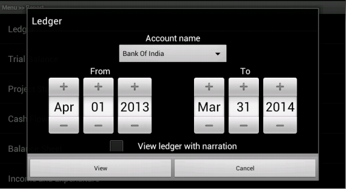
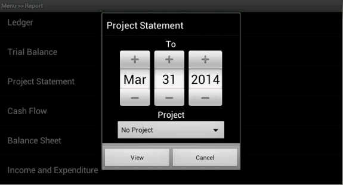
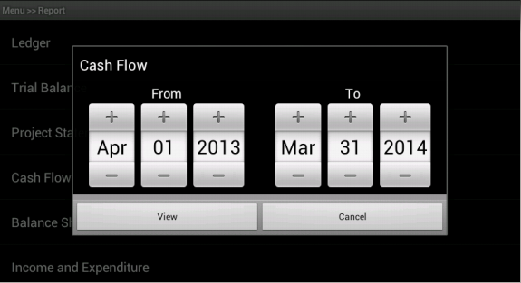
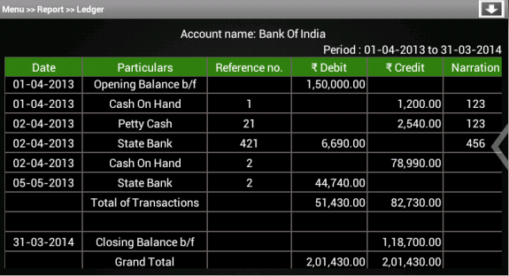
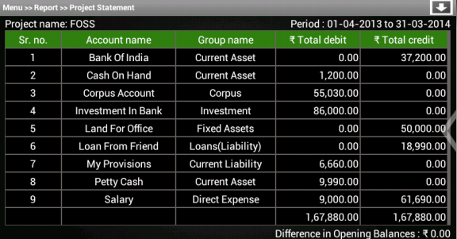

Reports
=======
* This chapter explains how to generate different types of reports. In ABT, we have following types of reports:
	#. Ledger
	
	#. Trial balance
	
	#. Project statement
	
	#. Cash flow
	
	#. Balance sheet
	
	#. Profit and Loss(for ``profit making`` organisation )/Income and Expenditure(for ``NGO``)
	
Report menu
+++++++++++

* On clicking ``Reports`` menu from ``master menu``, we get the list of all report types. 

* The layout of list items is included in ``res/layout/report.xml``.

**File res/layout/report.xml**

	.. code-block:: xml
		
		<?xml version="1.0" encoding="utf-8"?>
		<TextView xmlns:android="http://schemas.android.com/apk/res/android"
		    android:id="@+id/reportType"
		    android:layout_width="fill_parent"
		    android:layout_height="fill_parent"
		    android:padding="20dp"
		    android:textSize="20sp"
		    android:textColor="#FFFFFF" >
		</TextView>
		
.. image:: images/report_list.png
	   :name: ABT main page
	   :align: center
	   
* The associated activity to display report types in a listview is ``File src/com/example/gkaakash/reportMenu.java``,

**File src/com/example/gkaakash/reportMenu.java**

* The activity is explained below along with code.

* It contains the essential and required import like

* The activity also includes the setOnItemClickListener for list items.

	.. code-block:: java
	
		package com.example.gkaakash;

		import java.math.RoundingMode;
		import java.text.DecimalFormat;
		import java.text.SimpleDateFormat;
		import java.util.ArrayList;
		import java.util.Calendar;
		import java.util.Date;
		import java.util.List;
		import org.w3c.dom.Text;
		import com.gkaakash.controller.Account;
		import com.gkaakash.controller.Organisation;
		import com.gkaakash.controller.Startup;
		import com.gkaakash.controller.Transaction;
		import android.app.AlertDialog;
		import android.app.ListActivity;
		import android.content.Context;
		import android.content.DialogInterface;
		import android.content.Intent;
		import android.graphics.Color;
		import android.os.Bundle;
		import android.view.LayoutInflater;
		import android.view.View;
		import android.view.ViewGroup;
		import android.view.WindowManager;
		import android.widget.AdapterView;
		import android.widget.ArrayAdapter;
		import android.widget.CheckBox;
		import android.widget.DatePicker;
		
* The activity intializes all the essential parameters and variables.

* onCreate method sets report menu items in a listview.

	.. code-block:: java
	
		public class reportMenu extends ListActivity{
			//adding report list items
	
			final Context context = this;
			AlertDialog dialog;
			DecimalFormat mFormat;
			static String financialFromDate;
			static String financialToDate;
			static String givenfromDateString;
			static String givenToDateString;
			static Integer client_id;
			private Account account;
			private Organisation organisation;
			static String selectedAccount;
			static String selectedProject;
			static boolean cheched = false;
			static String fromday, frommonth, fromyear, today, tomonth, toyear; 
			static boolean validateDateFlag;
			static String trialbalancetype;
			String[] reportType;
			static String orgtype;
			boolean reportmenuflag;
			String orgname;
			static String reportTypeFlag;
			static String balancetype;
	
	
			@Override
			public void onCreate(Bundle savedInstanceState) {
				super.onCreate(savedInstanceState);
		
				account = new Account();
				organisation = new Organisation();
		
		       		client_id= Startup.getClient_id();
		       		
		       		/*
			       	 * get org type from create page or select org page
			       	 */
			       	reportmenuflag=MainActivity.reportmenuflag;
			       	if(reportmenuflag==true){
					orgtype=createOrg.orgTypeFlag;
				}
			       	else {
					orgname=selectOrg.selectedOrgName;
					//System.out.println("org name in selett "+orgname);
					Object[] params = new Object[]{orgname};
					orgtype = (String) organisation.getorgTypeByname(params, client_id);;
					//System.out.println("org type in select"+orgtype);
			       	}
				if("NGO".equals(orgtype))
				{
					reportType = new String[] { "Ledger","Trial Balance","Project Statement",
					 "Cash Flow","Balance Sheet","Income and Expenditure" };
				}
				else{
				    	reportType = new String[] { "Ledger","Trial Balance","Project Statement",
					 "Cash Flow","Balance Sheet","Profit and Loss account" };
				}
			       	
			       	//get financial from and to date, split and store day, month and year in seperate variable
			       	financialFromDate =Startup.getfinancialFromDate();  	   	
			   	String dateParts[] = financialFromDate.split("-");
			   	fromday  = dateParts[0];
			   	frommonth = dateParts[1];
			   	fromyear = dateParts[2];
			   	
			   	financialToDate = Startup.getFinancialToDate();
			   	String dateParts1[] = financialToDate.split("-");
			   	today  = dateParts1[0];
			   	tomonth = dateParts1[1];
			   	toyear = dateParts1[2];
	
				//calling report.xml page
				setListAdapter(new ArrayAdapter<String>(this, R.layout.report,reportType));
	
				//getting the list view and setting background
				final ListView listView = getListView();
				listView.setTextFilterEnabled(true);
				listView.setBackgroundColor(R.drawable.dark_gray_background);
				listView.setCacheColorHint(Color.TRANSPARENT);
	
				//for two digit format date for dd and mm
				mFormat= new DecimalFormat("00");
				mFormat.setRoundingMode(RoundingMode.DOWN);
				
* When list items are clicked, code for respective actions goes here,
	.. code-block:: java
		
		//when report list items are clicked, code for respective actions goes here ...
		listView.setOnItemClickListener(new OnItemClickListener() {
			public void onItemClick(AdapterView<?> parent, View view,
					int position, long id) {
				
* lets start with ledger. On clicking ledger option, it builds the alert dialog which will look like this,

	   
* The associated layout is included in ``res/layout/ledger.xml``.

**File res/layout/ledger.xml**
	.. code-block:: xml
	
		 <ScrollView xmlns:android="http://schemas.android.com/apk/res/android"
		    android:layout_width="fill_parent"
		    android:layout_height="fill_parent" >
		    
		    <LinearLayout xmlns:android="http://schemas.android.com/apk/res/android"
			android:layout_width="fill_parent"
			android:layout_height="fill_parent" 
			android:orientation="vertical"
			android:id="@+id/layout_root" >
			 
			 <TextView
			     android:id="@+id/tvAccName"
			     android:layout_width="wrap_content"
			     android:layout_height="wrap_content"
			     android:layout_gravity="center"
			     android:text="Account name"
			     android:textColor="#FFFFFF"
			     android:textSize="20dp" />

			<Spinner
			    android:id="@+id/sAccountNameinLedger"
			    android:layout_width="254dp"
			    android:layout_height="wrap_content"
			    android:layout_gravity="center"
			    android:entries="@array/getaccNamesinLedger"
			    android:prompt="@string/getaccNamesinLedger" />
		
		
			   <LinearLayout xmlns:android="http://schemas.android.com/apk/res/android"
				android:layout_width="fill_parent"
				android:layout_height="fill_parent" 
				android:orientation="horizontal"
			 	android:id="@+id/layout_root" >
		
			 
			 	<LinearLayout
					android:layout_width="fill_parent"
					android:layout_height="fill_parent" 
					android:orientation="vertical"
			 		android:id="@+id/layout_root"
			 		android:layout_gravity="left"
			  		android:layout_weight="50" >
		
				 <TextView
				     android:id="@+id/tvsetFromdate"
				     android:layout_width="wrap_content"
				     android:layout_height="wrap_content"
				     android:layout_gravity="center"
				     android:text="From"
				     android:textColor="#FFFFFF"
				     android:textSize="20dp" />

				 <DatePicker
				     android:id="@+id/dpsetLedgerFromdate"
				     android:layout_width="wrap_content"
				     android:layout_height="wrap_content"
				     android:layout_gravity="center" />

				</LinearLayout>
		
		
				 <LinearLayout xmlns:android="http://schemas.android.com/apk/res/android"
					android:layout_width="fill_parent"
					android:layout_height="fill_parent" 
					android:orientation="vertical"
					android:id="@+id/layout_root"
				 	android:layout_weight="50" >
				 
				<TextView
				    android:id="@+id/tvsetT0date"
				    android:layout_width="wrap_content"
				    android:layout_height="wrap_content"
				    android:layout_gravity="center"
				    android:text="To"
				    android:textColor="#FFFFFF"
				    android:textSize="20dp" />

				<DatePicker
				    android:id="@+id/dpsetLedgerT0date"
				    android:layout_width="wrap_content"
				    android:layout_height="wrap_content"
				    android:layout_gravity="center" />
				</LinearLayout>
		
			 </LinearLayout>

			<TableLayout xmlns:android="http://schemas.android.com/apk/res/android"
		    		android:layout_width="wrap_content"
				android:layout_height="wrap_content"
				android:layout_gravity="center">

				<TableRow>
				    <CheckBox
					android:id="@+id/cbNarration"
					android:layout_width="wrap_content"
					android:layout_height="wrap_content"
					android:layout_weight="0.3" 
					android:layout_marginRight="30dp"/>
				    
				    <TextView
					android:id="@+id/tvcbNarration"
					android:layout_width="wrap_content"
					android:layout_weight="1.7"
					android:text="View ledger with narration"
					android:textColor="#FFFFFF"
					android:textSize="20dp" />
				</TableRow>
				</TableLayout>
		
			<TextView
			    android:id="@+id/tvProject"
			    android:layout_width="wrap_content"
			    android:layout_height="wrap_content"
			    android:layout_gravity="center"
			    android:text="Project"
			    android:textColor="#FFFFFF" 
			    android:textSize="20dp"/>

			<Spinner
			    android:id="@+id/sLedgerProject"
			    android:layout_width="254dp"
			    android:layout_height="wrap_content"
			    android:layout_gravity="center"
			    android:prompt="@string/projectName_prompt" />

		    </LinearLayout>
		</ScrollView>

* and the associated java code to build above dialog is given below,
	.. code-block:: java
	
		//for "Ledger"
		if(position == 0)
		{
			//call the allAccountNames method to get all account names
			Object[] accountnames = (Object[]) account.getAllAccountNames(client_id);
			// create new array list of type String to add account names
			List<String> accountnamelist = new ArrayList<String>();
			for(Object an : accountnames)
			{	
				accountnamelist.add((String) an); 
			}	

			
			if(accountnamelist.size() <= 0){
				String message = "Ledger cannot be displayed, Please create account!";
				toastValidationMessage(message);
			}
			else{
				//call the getAllProjects method to get all projects
				Object[] projectnames = (Object[]) organisation.getAllProjects(client_id);
				// create new array list of type String to add projectnames
				List<String> projectnamelist = new ArrayList<String>();
				projectnamelist.add("No Project");
				for(Object pn : projectnames)
				{	
					Object[] p = (Object[]) pn;
					projectnamelist.add((String) p[1]); //p[0] is project code & p[1] is projectname
				}	
				
				LayoutInflater inflater = (LayoutInflater) getSystemService(LAYOUT_INFLATER_SERVICE);
				View layout = inflater.inflate(R.layout.ledger, (ViewGroup) findViewById(R.id.layout_root));
				//Building DatepPcker dialog
				AlertDialog.Builder builder = new AlertDialog.Builder(context);
				builder.setView(layout);
				builder.setTitle("Ledger");
				
				//populate all account names in accountname dropdown(spinner)
				final Spinner accountNames = (Spinner)layout.findViewById(R.id.sAccountNameinLedger);
				ArrayAdapter<String> da = new ArrayAdapter<String>(reportMenu.this, 
											android.R.layout.simple_spinner_item,accountnamelist);
		  	   	da.setDropDownViewResource(android.R.layout.simple_spinner_dropdown_item);
		  	   	accountNames.setAdapter(da);
		  	   	
		  	   	
		  	   	//populate all project names in project dropdown(spinner)
				final Spinner projectNames = (Spinner)layout.findViewById(R.id.sLedgerProject);
				ArrayAdapter<String> da1 = new ArrayAdapter<String>(reportMenu.this, 
											android.R.layout.simple_spinner_item,projectnamelist);
		  	   	da1.setDropDownViewResource(android.R.layout.simple_spinner_dropdown_item);
		  	   	projectNames.setAdapter(da1);
		  	   	
		  	   	
			   	
		  	   	final CheckBox cbNarration = (CheckBox)layout.findViewById(R.id.cbNarration);
		  	   	TextView tvcbNarration= (TextView)layout.findViewById(R.id.tvcbNarration);
			   	
			   	final DatePicker LedgerFromdate = (DatePicker) layout.findViewById(R.id.dpsetLedgerFromdate);
			   	LedgerFromdate.init(Integer.parseInt(fromyear),(Integer.parseInt(frommonth)-1),Integer.parseInt(fromday), null);
			   	
			   	final DatePicker LedgerT0date = (DatePicker) layout.findViewById(R.id.dpsetLedgerT0date);
			   	LedgerT0date.init(Integer.parseInt(toyear),(Integer.parseInt(tomonth)-1),Integer.parseInt(today), null);
			   	
			   	
			   	//on clicking view button pass on the activity to the next page
				builder.setPositiveButton("View",new  DialogInterface.OnClickListener(){

					@Override
					public void onClick(DialogInterface arg0, int arg1) {
						
						selectedAccount = accountNames.getSelectedItem().toString();
						selectedProject = projectNames.getSelectedItem().toString();
						cheched = cbNarration.isChecked();
						
						//below method is explained at the end of onItemSelectedListener
						validateDate(LedgerFromdate, LedgerT0date, "validatebothFromToDate");
						
						if(validateDateFlag){
							Intent intent = new Intent(context, ledger.class);
							// To pass on the value to the next page
							startActivity(intent);
						}
						
					}
				});
				
				builder.setNegativeButton("Cancel",new  DialogInterface.OnClickListener(){
					@Override
					public void onClick(DialogInterface dialog, int which) {
					
					}	
				});
				dialog=builder.create();
				dialog.show();
				WindowManager.LayoutParams lp = new WindowManager.LayoutParams();
				//customizing the width and location of the dialog on screen 
				lp.copyFrom(dialog.getWindow().getAttributes());
				lp.width = 700;
				dialog.getWindow().setAttributes(lp);
				
			}
			
			
		}
		
* Next is ``Trial balance`` report. We have 3 types of Trial Balances.
	#. Net Trial Balance
	
	#. Gross Trial Balance
	
	#. Extended Trial Balance
	
* Option to select required Trial Balance ``type`` and ``datepicker`` are added in a alert dialog which will look like given below,

.. image:: images/trial_before.png
	   :name: ABT main page
	   :align: center
	 
* The layout is included in below file.

**File res/layout/trial_balance.xml**
	
	.. code-block:: xml
		
		<LinearLayout xmlns:android="http://schemas.android.com/apk/res/android"
		android:layout_width="fill_parent"
		android:layout_height="fill_parent" 
		android:orientation="vertical"
		 android:id="@+id/layout_root" >

			<TextView
			    android:id="@+id/tvsetT0date"
			    android:layout_width="wrap_content"
			    android:layout_height="wrap_content"
			    android:layout_gravity="center"
			    android:text="To"
			    android:textColor="#FFFFFF"
			    android:textSize="20dp" />

			<DatePicker
			    android:id="@+id/dpTrialsetT0date"
			    android:layout_width="wrap_content"
			    android:layout_height="wrap_content"
			    android:layout_gravity="center" />

			<TextView
			    android:id="@+id/tvtrialBalanceType"
			    android:layout_width="wrap_content"
			    android:layout_height="wrap_content"
			    android:layout_gravity="center"
			    android:text="Trial Balance type"
			    android:textColor="#FFFFFF"
			    android:textSize="20dp" />

			<Spinner
			    android:id="@+id/strialBalanceType"
			    android:layout_width="254dp"
			    android:layout_height="wrap_content"
			    android:layout_gravity="center"
			    android:entries="@array/TrialBalance_arrays"
			    android:prompt="@string/TrialBalance_prompt" />

		</LinearLayout>

* and the associated java code is as given below,

	.. code-block:: java
	
		//trial balance
		if(position == 1)
		{
			LayoutInflater inflater = (LayoutInflater) getSystemService(LAYOUT_INFLATER_SERVICE);
			View layout = inflater.inflate(R.layout.trial_balance, (ViewGroup) findViewById(R.id.layout_root));
			//Building DatepPcker dialog
			AlertDialog.Builder builder = new AlertDialog.Builder(context);
			builder.setView(layout);
			builder.setTitle("Trial Balance");	
			
			
			final DatePicker trialtodate = (DatePicker) layout.findViewById(R.id.dpTrialsetT0date);
			trialtodate.init(Integer.parseInt(toyear),(Integer.parseInt(tomonth)-1),Integer.parseInt(today), null);
			
			final Spinner strialBalanceType = (Spinner)layout.findViewById(R.id.strialBalanceType);
			
			builder.setPositiveButton("View",new  DialogInterface.OnClickListener(){
				@Override
				public void onClick(DialogInterface arg0, int arg1) {
					
					trialbalancetype=strialBalanceType.getSelectedItem().toString();
					
					validateDate(null, trialtodate, null);
					
				   	if(validateDateFlag){
						Intent intent = new Intent(context, trialBalance.class);
						// To pass on the value to the next page
						startActivity(intent);
					}
					
				}
				
			});
			builder.setNegativeButton("Cancel",new  DialogInterface.OnClickListener(){
				@Override
				public void onClick(DialogInterface dialog, int which) {
					
				}
			});
			dialog=builder.create();
			dialog.show();
		}
		
* 3rd report is ``Project Statement``. On clicking this menu, build alert dialog which should look like

* The layout is included in below file.

**File res/layout/project_statement.xml**
	
	.. code-block:: xml
	
		
		<LinearLayout xmlns:android="http://schemas.android.com/apk/res/android"
		android:layout_width="fill_parent"
		android:layout_height="fill_parent" 
		android:orientation="vertical"
		 android:id="@+id/layout_root" >

			<TextView
			    android:id="@+id/tvsetT0date"
			    android:layout_width="wrap_content"
			    android:layout_height="wrap_content"
			    android:layout_gravity="center"
			    android:text="To"
			    android:textColor="#FFFFFF"
			    android:textSize="20dp" />

			<DatePicker
			    android:id="@+id/dpProjectStatementSetT0date"
			    android:layout_width="wrap_content"
			    android:layout_height="wrap_content"
			    android:layout_gravity="center" />

			<TextView
			    android:id="@+id/tvProject"
			    android:layout_width="wrap_content"
			    android:layout_height="wrap_content"
			    android:layout_gravity="center"
			    android:text="Project"
			    android:textColor="#FFFFFF" 
			    android:textSize="20dp"/>

			<Spinner
			    android:id="@+id/sProject"
			    android:layout_width="254dp"
			    android:layout_height="wrap_content"
			    android:layout_gravity="center"
			    android:prompt="@string/projectName_prompt" />

		</LinearLayout>
		
* and the associated java code is as given below,

	.. code-block:: java
		

		//project statement
		if(position == 2)
		{
			
			LayoutInflater inflater = (LayoutInflater) getSystemService(LAYOUT_INFLATER_SERVICE);
			View layout = inflater.inflate(R.layout.project_statement, (ViewGroup) findViewById(R.id.layout_root));
			//Building DatepPcker dialog
			AlertDialog.Builder builder = new AlertDialog.Builder(context);
			builder.setView(layout);
			builder.setTitle("Project Statement");
			
			
			final DatePicker dpProjectStatementSetT0date = (DatePicker) layout.findViewById(R.id.dpProjectStatementSetT0date);
			dpProjectStatementSetT0date.init(Integer.parseInt(toyear),(Integer.parseInt(tomonth)-1),Integer.parseInt(today), null);
			
			//call the getAllProjects method to get all projects
			Object[] projectnames = (Object[]) organisation.getAllProjects(client_id);
			// create new array list of type String to add projectnames
			List<String> projectnamelist = new ArrayList<String>();
			projectnamelist.add("No Project");
			for(Object pn : projectnames)
			{	
				Object[] p = (Object[]) pn;
				projectnamelist.add((String) p[1]); //p[0] is project code & p[1] is projectname
			}	
			
			//populate all project names in project dropdown(spinner)
			final Spinner projectNames = (Spinner)layout.findViewById(R.id.sProject);
			ArrayAdapter<String> da1 = new ArrayAdapter<String>(reportMenu.this, 
										android.R.layout.simple_spinner_item,projectnamelist);
	  	   	da1.setDropDownViewResource(android.R.layout.simple_spinner_dropdown_item);
	  	   	projectNames.setAdapter(da1);
			
			builder.setPositiveButton("View",new  DialogInterface.OnClickListener(){

				@Override
				public void onClick(DialogInterface dialog, int which) {
					selectedProject = projectNames.getSelectedItem().toString();
					
					validateDate(null, dpProjectStatementSetT0date, null);
					
				   	if(validateDateFlag){
						Intent intent = new Intent(context, projectStatement.class);
						// To pass on the value to the next page
						startActivity(intent);
					}
				}
			});
			
			builder.setNegativeButton("Cancel",new  DialogInterface.OnClickListener(){
				@Override
				public void onClick(DialogInterface dialog, int which) {
					
				}
			});
			dialog=builder.create();
			dialog.show();
		
		}

* Next report is ``cash flow``. On clicking this menu, build alert dialog which should look like

* The layout is included in below file.

**File res/layout/cash_flow.xml**
	
	.. code-block:: xml
	
		  <LinearLayout xmlns:android="http://schemas.android.com/apk/res/android"
			android:layout_width="fill_parent"
			android:layout_height="fill_parent" 
			android:orientation="horizontal"
		 	android:id="@+id/layout_root" >
		
		 
			 <LinearLayout xmlns:android="http://schemas.android.com/apk/res/android"
				android:layout_width="fill_parent"
				android:layout_height="fill_parent" 
				android:orientation="vertical"
			 	android:id="@+id/layout_root"
			 	android:layout_gravity="left"
			  	android:layout_weight="50" >
		
			 <TextView
			     android:layout_width="wrap_content"
			     android:layout_height="wrap_content"
			     android:layout_gravity="center"
			     android:text="From"
			     android:textColor="#FFFFFF"
			     android:textSize="20dp" />

			 <DatePicker
			     android:id="@+id/dpsetCashFlowFromdate"
			     android:layout_width="wrap_content"
			     android:layout_height="wrap_content"
			     android:layout_gravity="center" />

			</LinearLayout>
		
		
		 	<LinearLayout xmlns:android="http://schemas.android.com/apk/res/android"
				android:layout_width="fill_parent"
				android:layout_height="fill_parent" 
				android:orientation="vertical"
			 	android:id="@+id/layout_root"
			 	android:layout_weight="50" >
		 
				<TextView
				    android:layout_width="wrap_content"
				    android:layout_height="wrap_content"
				    android:layout_gravity="center"
				    android:text="To"
				    android:textColor="#FFFFFF"
				    android:textSize="20dp" />

				<DatePicker
				    android:id="@+id/dpsetCashFlowT0date"
				    android:layout_width="wrap_content"
				    android:layout_height="wrap_content"
				    android:layout_gravity="center" />
			</LinearLayout>
		
	     	</LinearLayout>
	
* and the associated java code is as given below,

	.. code-block:: java
	
		//cash flow
		if(position == 3)
		{
			LayoutInflater inflater = (LayoutInflater) getSystemService(LAYOUT_INFLATER_SERVICE);
			View layout = inflater.inflate(R.layout.cash_flow, (ViewGroup) findViewById(R.id.layout_root));
			//Building DatepPcker dialog
			AlertDialog.Builder builder = new AlertDialog.Builder(context);
			builder.setView(layout);
			builder.setTitle("Cash Flow");
			
			final DatePicker CashFlowFromdate = (DatePicker) layout.findViewById(R.id.dpsetCashFlowFromdate);
			CashFlowFromdate.init(Integer.parseInt(fromyear),(Integer.parseInt(frommonth)-1),Integer.parseInt(fromday), null);
		   	
		   	final DatePicker CashFlowT0date = (DatePicker) layout.findViewById(R.id.dpsetCashFlowT0date);
		   	CashFlowT0date.init(Integer.parseInt(toyear),(Integer.parseInt(tomonth)-1),Integer.parseInt(today), null);
			
			 builder.setPositiveButton("View",new  DialogInterface.OnClickListener(){

				@Override
				public void onClick(DialogInterface dialog, int which) {
					
					validateDate(CashFlowFromdate, CashFlowT0date, "validatebothFromToDate");
					
					if(validateDateFlag){
						Intent intent = new Intent(context, cashFlow.class);
						// To pass on the value to the next page
						startActivity(intent);
					}
				}
			 });
			 builder.setNegativeButton("Cancel",new  DialogInterface.OnClickListener(){
					@Override
					public void onClick(DialogInterface dialog, int which) {
						
					}
					 
				 });
			 dialog=builder.create();
			 dialog.show();
			 WindowManager.LayoutParams lp = new WindowManager.LayoutParams();
			 //customizing the width and location of the dialog on screen 
			 lp.copyFrom(dialog.getWindow().getAttributes());
			 lp.width = 600;
			 dialog.getWindow().setAttributes(lp);
			
		}
				
* Next report is ``Balance Sheet``. On clicking this menu, build alert dialog which should look like

.. image:: images/balancesheet_before.png
	   :name: ABT main page
	   :align: center

* We have 2 types of Balance sheets:
	#. Conventional Balance Sheet
	#. Sources and Applications of Funds

* Option to select any one of the type and other layout is included in below file.

**File res/layout/balance_sheet.xml**
	
	.. code-block:: xml
	
		
		<LinearLayout xmlns:android="http://schemas.android.com/apk/res/android"
		android:layout_width="fill_parent"
		android:layout_height="fill_parent" 
		android:orientation="vertical"
		 android:id="@+id/layout_root" >

			<TextView
			    android:id="@+id/tvsetT0date"
			    android:layout_width="wrap_content"
			    android:layout_height="wrap_content"
			    android:layout_gravity="center"
			    android:text="To"
			    android:textColor="#FFFFFF"
			    android:textSize="20dp" />

			<DatePicker
			    android:id="@+id/dpBalanceSheetsetT0date"
			    android:layout_width="wrap_content"
			    android:layout_height="wrap_content"
			    android:layout_gravity="center" />

			<TextView
			    android:id="@+id/tvbalanceSheetType"
			    android:layout_width="wrap_content"
			    android:layout_height="wrap_content"
			    android:layout_gravity="center"
			    android:text="Balance Sheet type"
			    android:textColor="#FFFFFF"
			    android:textSize="20dp" />

			<Spinner
			    android:id="@+id/sbalanceSheetType"
			    android:layout_width="254dp"
			    android:layout_height="wrap_content"
			    android:layout_gravity="center"
			    android:entries="@array/BalanceSheet_arrays"
			    android:prompt="@string/BalanceSheet_prompt" />

		</LinearLayout>

	
* and the associated java code is as given below,

	.. code-block:: java
				
		//Balance Sheet
		if(position == 4)
		{
			LayoutInflater inflater = (LayoutInflater) getSystemService(LAYOUT_INFLATER_SERVICE);
			View layout = inflater.inflate(R.layout.balance_sheet, (ViewGroup) findViewById(R.id.layout_root));
			final DatePicker dpBalanceSheetsetT0date = (DatePicker) layout.findViewById(R.id.dpBalanceSheetsetT0date);
			dpBalanceSheetsetT0date.init(Integer.parseInt(toyear),(Integer.parseInt(tomonth)-1),Integer.parseInt(today), null);
			
			final Spinner sbalanceSheetType = (Spinner)layout.findViewById(R.id.sbalanceSheetType);
			
			TextView tvbalanceSheetType = (TextView)layout.findViewById(R.id.tvbalanceSheetType);
			
			//Building DatepPcker dialog
			AlertDialog.Builder builder = new AlertDialog.Builder(context);
			builder.setView(layout);
			builder.setTitle("Balance Sheet");
			builder.setPositiveButton("View",new  DialogInterface.OnClickListener(){
				
			

				@Override
				public void onClick(DialogInterface dialog, int which) {

					validateDate(null, dpBalanceSheetsetT0date, null);
					
				   	if(validateDateFlag){
						balancetype=sbalanceSheetType.getSelectedItem().toString();
						Intent intent = new Intent(context, balanceSheet.class);
						// To pass on the value to the next page
						startActivity(intent);
				   	}
				}
				
			});
			
			builder.setNegativeButton("Cancel",new  DialogInterface.OnClickListener(){

				@Override
				public void onClick(DialogInterface dialog, int which) {
					// TODO Auto-generated method stub
				}
				
			});
			dialog=builder.create();
			dialog.show();
		
		}
				
* last report is ``Profit and Loss/Income and Expenditure``. 

* On clicking this menu, build alert dialog which should look like

.. image:: images/profitloss_before.png
	   :name: ABT main page
	   :align: center

* The layout is included in below file.

**File res/layout/income_expenditure.xml**
	
	.. code-block:: xml
	
		<LinearLayout xmlns:android="http://schemas.android.com/apk/res/android"
		android:layout_width="fill_parent"
		android:layout_height="fill_parent"
		android:id="@+id/layout_root" 
		android:orientation="vertical">
		
		<TextView
		    android:id="@+id/tvsetT0date"
		    android:layout_width="wrap_content"
		    android:layout_height="wrap_content"
		    android:layout_gravity="center"
		    android:text="To"
		    android:textColor="#FFFFFF" 
		    android:textSize="20dp"/>
		
		<DatePicker
		    android:id="@+id/dpIEPLSetT0date"
		    android:layout_width="wrap_content"
		    android:layout_height="wrap_content"
		    android:layout_gravity="center" />

	    </LinearLayout>

* and the associated java code is as given below,

	.. code-block:: java
				
		//Profit and Loss
		if(position == 5)
		{
		    LayoutInflater inflater = (LayoutInflater) getSystemService(LAYOUT_INFLATER_SERVICE);
			View layout = inflater.inflate(R.layout.income_expenditure, (ViewGroup) findViewById(R.id.layout_root));
			//Building DatepPcker dialog
			AlertDialog.Builder builder = new AlertDialog.Builder(context);
			builder.setView(layout);
			if(orgtype.equalsIgnoreCase("NGO")){
				builder.setTitle("Income and Expenditure");
				reportTypeFlag = "Income and Expenditure";
			}
			else{
				builder.setTitle("Profit and Loss");
				reportTypeFlag = "Profit and Loss";
			}
			
			
			final DatePicker dpIEPLT0date = (DatePicker) layout.findViewById(R.id.dpIEPLSetT0date);
			dpIEPLT0date.init(Integer.parseInt(toyear),(Integer.parseInt(tomonth)-1),Integer.parseInt(today), null);
			
			builder.setPositiveButton("View",new  DialogInterface.OnClickListener(){
				@Override
				public void onClick(DialogInterface dialog, int which) {
					
					validateDate(null, dpIEPLT0date, null);
					
				   	if(validateDateFlag){
						Intent intent = new Intent(context, incomeExpenditure.class);
						// To pass on the value to the next page
						startActivity(intent);
					}
				}
				 
			 });
			 builder.setNegativeButton("Cancel",new  DialogInterface.OnClickListener(){
					@Override
					public void onClick(DialogInterface dialog, int which) {
						
					}
					 
				 });
			dialog=builder.create();
		dialog.show();
		}
	
* Below method is used for validation of dates, that date should be any date from Financial year.

	.. code-block:: java
		
		public boolean validateDate(DatePicker fromdate, DatePicker todate, String flag) {
			try {
				SimpleDateFormat sdf = new SimpleDateFormat("dd-MM-yyyy");
				Date date1 = sdf.parse(financialFromDate);
		    	Date date2 = sdf.parse(financialToDate);
			
		    	Calendar cal1 = Calendar.getInstance(); //financial from date
		    	Calendar cal2 = Calendar.getInstance(); //financial to date
		    	Calendar cal3 = Calendar.getInstance(); //from date
		    	Calendar cal4 = Calendar.getInstance(); //to date
		    	
		    	cal1.setTime(date1);
		    	cal2.setTime(date2);
		    	
				if("validatebothFromToDate".equals(flag)){
					int FromDay = fromdate.getDayOfMonth();
				   	int FromMonth = fromdate.getMonth();
				   	int FromYear = fromdate.getYear();
				   	
				   	givenfromDateString = mFormat.format(Double.valueOf(FromDay))+ "-" 
				   	+(mFormat.format(Double.valueOf(Integer.parseInt((mFormat.format(Double.valueOf(FromMonth))))+ 1))) + "-" 
				   	+ FromYear;
				   	
				   	Date date3 = sdf.parse(givenfromDateString);
				   	cal3.setTime(date3);
				}
			
				int T0Day = todate.getDayOfMonth();
			   	int T0Month = todate.getMonth();
			   	int T0Year = todate.getYear();
			   	
			   	givenToDateString = mFormat.format(Double.valueOf(T0Day))+ "-" 
			   	+(mFormat.format(Double.valueOf(Integer.parseInt((mFormat.format(Double.valueOf(T0Month))))+ 1))) + "-" 
			   	+ T0Year;
			   	
			   	Date date4 = sdf.parse(givenToDateString);
			   	cal4.setTime(date4);  
			
		    	//System.out.println("all dates are...........");
		    	//System.out.println(financialFromDate+"---"+financialToDate+"---"+givenfromDateString+"---"+givenToDateString);
		    	
		    	if("validatebothFromToDate".equals(flag)){
		    		if(((cal3.after(cal1)&&(cal3.before(cal2))) || (cal3.equals(cal1) || (cal3.equals(cal2)))) 
						&& ((cal4.after(cal1) && (cal4.before(cal2))) || (cal4.equals(cal2)) || (cal4.equals(cal1)))){
					
					validateDateFlag = true;
				}
				else{
					String message = "Please enter proper date";
					toastValidationMessage(message);
					validateDateFlag = false;
				}
		    	}
		    	else {
		    		if((cal4.after(cal1) && cal4.before(cal2)) || cal4.equals(cal1) || cal4.equals(cal2) ){
					
		    			validateDateFlag = true;
				}
				else{
					String message = "Please enter proper date";
					toastValidationMessage(message);
					validateDateFlag = false;
				}
		    	}
	    	
			} catch (Exception e) {
				// TODO: handle exception
			}
			return validateDateFlag;
		
		} 

Ledger
++++++
* In Mater menu >> Report menu >> Ledger alert dialog, select ``account name``, ``period`` (narrations/project name are optional) and click on ``View`` button will take us to the next page which contains ledger report in a ``tabular format``.

* The ledger report layout is included in ``res/layout/ledger_table.xml``.

**File res/layout/ledger_table.xml**

* This file contains ``two`` tablelayout, one for table heading and other for table rows.

* These two tablelayouts are added in vertical scrollview and horizontal scrollview respectively.

* It also includes account name and date elements at the top of the screen and animated dialog to show organisation info.

	.. code-block:: xml
	
		<RelativeLayout xmlns:android="http://schemas.android.com/apk/res/android"
		    android:layout_width="fill_parent"
		    android:layout_height="fill_parent">
		    
		   <LinearLayout xmlns:android="http://schemas.android.com/apk/res/android"
			    android:layout_width="fill_parent"
			    android:layout_height="wrap_content"
			    android:orientation="vertical"
			    android:id="@+id/main_heading"
			    android:layout_weight="50"
			    android:paddingTop="10dp"
			    android:background="@drawable/dark_gray_background">
		
		       <TextView
			   android:id="@+id/tvaccountName"
			   android:layout_width="wrap_content"
			   android:layout_height="match_parent" 
			   android:layout_gravity="center"
			   android:gravity="center_horizontal"
			   android:textColor="#FFFFFF"
			   android:textSize="18dp" />
		      
			<LinearLayout
			    xmlns:android="http://schemas.android.com/apk/res/android"
			    android:id="@+id/llperiod"
			    android:layout_width="fill_parent"
			    android:layout_height="wrap_content"
			    android:orientation="horizontal" >
			   
			 <TextView
			     android:id="@+id/tvProjectName"
			     android:layout_width="wrap_content"
			     android:layout_height="wrap_content"
			     android:gravity="center_horizontal"
			     android:textColor="#FFFFFF"
			     android:textSize="18dp"
			     android:paddingLeft="10dp" />
			    
			  <TextView
			      android:id="@+id/tvfinancialToDate"
			      android:layout_width="wrap_content"
			      android:layout_height="wrap_content"
			      android:layout_gravity="right"
			      android:layout_weight="50"
			      android:gravity="right"
			      android:paddingRight="10dp"
			      android:textColor="#FFFFFF"
			      android:textSize="18dp" />
			  
			</LinearLayout>
		  
		
		      
			 <LinearLayout
			    xmlns:android="http://schemas.android.com/apk/res/android"
			    android:id="@+id/layout_root"
			    android:layout_width="fill_parent"
			    android:layout_height="fill_parent"
			    android:paddingRight="10dp"
			    android:paddingLeft="10dp"
			    android:paddingBottom="10dp" >
			    <HorizontalScrollView 
				android:layout_height="fill_parent"
			    	android:layout_width="fill_parent"
			    	android:fillViewport="true">
				
				<LinearLayout 
				    	android:layout_height="fill_parent"
			    		android:layout_width="fill_parent"
			    		android:orientation="vertical">
			    		
				    <TableLayout
				    android:layout_width="wrap_content"
				    android:layout_height="wrap_content"
				    android:stretchColumns="0,1,2,3,4,5"
				    android:id="@+id/floating_heading_table"
				    android:background="#696565" 
				    android:visibility="invisible">
				</TableLayout>
				
			      <ScrollView
			    	android:layout_width="match_parent"
			    	android:layout_height="wrap_content"
			    	android:id="@+id/ScrollLedger"
			    	android:fillViewport="true">
			    
				<TableLayout
				    android:layout_width="fill_parent"
				    android:layout_height="0dp"
				    android:stretchColumns="0,1,2,3,4,5"
				    android:id="@+id/maintable"
				    android:background="#696565">
				</TableLayout>
			    </ScrollView>
		       		</LinearLayout>
			    </HorizontalScrollView>
			    
			 </LinearLayout>
		     

		   </LinearLayout>
		 	<!-- floating button at top|left
		   <Button
			android:layout_width="wrap_content"
			android:layout_height="wrap_content"
			android:layout_alignParentTop="true"
			android:layout_alignParentLeft="true"
			android:layout_marginTop="15dp"
			android:layout_marginLeft="15dp"
			android:text="Button" />
			 -->
		    <Button 
			android:id="@+id/btnOrgDetailsDialog"
			android:layout_width="wrap_content"
			android:layout_height="wrap_content"
			android:layout_centerInParent="true"
			android:layout_alignParentRight="true"
		       android:background="@drawable/arrow"/>
		      
		    <LinearLayout 
			android:id="@+id/Llalert"
			android:layout_width="wrap_content"
			android:layout_height="wrap_content"
			android:layout_centerInParent="true"
			android:layout_alignParentRight="true"
			   android:background="#FFFFFF">

			<ScrollView xmlns:android="http://schemas.android.com/apk/res/android"
			    android:layout_width="fill_parent"
			    android:layout_height="fill_parent">

			    <LinearLayout 
				    android:layout_width="fill_parent"
				    android:layout_height="wrap_content"
				    android:orientation="vertical" 
				    android:background="#FFFFFF"
				    android:padding="1dp">
			    
				<TextView
				    android:layout_width="fill_parent"
				    android:layout_height="35dp"
				    android:background="#000000"
				    android:textSize="20dp"
				    android:text="Organisation info" 
				    android:gravity="center"
				    android:textColor="#FFFFFF"/>
				
				<LinearLayout 
				    android:layout_width="fill_parent"
				    android:layout_height="wrap_content"
				    android:orientation="vertical" 
				    android:background="#FFFFFF"
				    android:padding="10dp">
				 <TextView
				    android:layout_width="fill_parent"
				    android:layout_height="wrap_content"
				    android:background="#CCCCB2"
				    android:textSize="17dp"
				    android:text="Organisation name" 
				    android:textColor="#000000"/>
				
				 <TextView
				    android:id="@+id/tvOrgNameAlert"
				    android:layout_width="fill_parent"
				    android:layout_height="30dp"
				    android:gravity="center_vertical"
				    android:textColor="#000000"
				    android:textSize="17dp"/>
				
				 
				 <TextView
				    android:layout_width="fill_parent"
				    android:layout_height="wrap_content"
				    android:background="#CCCCB2"
				    android:text="Organisation type" 
				    android:textSize="17dp"
				    android:textColor="#000000"/>
				 
				 <TextView
				    android:id="@+id/tvOrgTypeAlert"
				    android:layout_width="fill_parent"
				    android:layout_height="30dp"
				    android:gravity="center_vertical"
				    android:textColor="#000000"
				    android:textSize="17dp"/>
				 
				 <TextView
				    android:layout_width="fill_parent"
				    android:layout_height="wrap_content"
				    android:background="#CCCCB2"
				    android:text="Financial year(dd-mm-yyyy)" 
				    android:textSize="17dp"
				    android:textColor="#000000"/>
				
				 <TextView
				    android:id="@+id/tvFinancialYearAlert"
				    android:layout_width="fill_parent"
				    android:layout_height="30dp"
				    android:gravity="center_vertical"
				    android:textColor="#000000"
				    android:textSize="17dp"/>
				</LinearLayout>
			</LinearLayout>
		</ScrollView>
		</LinearLayout>
	     </RelativeLayout>
	     
	     

	     
* and java logic is included in ``src/com/example/gkaakash/ledger.java``.

**File src/com/example/gkaakash/ledger.java**

* Get values of all the required ``static variables`` from reportMenu.java to the activity ``ledger.java``.

* Send a ``request`` to the back-end server through controller functions and get the ``response``.

* Response will be the list containing ledger report.

* List is displayed in a tabular formate using TableLayout.

* Set selected account name, period and project name programatically.

* The activity contains the essential and required import like

	.. code-block:: java
	
		package com.example.gkaakash;

		import java.text.DecimalFormat;
		import java.util.ArrayList;
		import java.util.List;
		import java.util.regex.Matcher;
		import java.util.regex.Pattern;

		import com.gkaakash.controller.Report;
		import com.gkaakash.controller.Startup;

		import android.animation.ObjectAnimator;
		import android.app.ActionBar.LayoutParams;
		import android.app.ActionBar.Tab;
		import android.app.Activity;
		import android.app.AlertDialog;
		import android.content.DialogInterface;
		import android.graphics.Color;
		import android.os.Bundle;
		import android.text.SpannableString;
		import android.util.DisplayMetrics;
		import android.view.Gravity;
		import android.view.MotionEvent;
		import android.view.View;
		import android.view.ViewGroup;
		import android.view.View.OnTouchListener;
		import android.view.Window;
		import android.view.View.OnClickListener;
		import android.widget.Button;
		import android.widget.LinearLayout;
		import android.widget.ScrollView;
		import android.widget.TableLayout;
		import android.widget.TableRow;
		import android.widget.TextView;
		import android.widget.Toast;

* The activity intializes all the essential parameters and variables.

* OnCreate method calls all required methods at load time.

	.. code-block:: java
	
		public class ledger extends Activity{
		    TableLayout ledgertable;
		    TableRow tr;
		    TextView label,tvaccontName,tvfinancialFromDate,tvfinancialToDate;
		    ArrayList<ArrayList> ledgerGrid;
		    static Object[] ledgerResult;
		    static Integer client_id;
		    private Report report;
		    ArrayList<String> ledgerResultList;
		    private ArrayList accountlist;
		    Boolean updown=false;
		    boolean checked;
		    DecimalFormat formatter = new DecimalFormat("#,##,##,###.00");
		    String colValue;
		    Boolean alertdialog = false;
		    ObjectAnimator animation2;
		    boolean reportmenuflag;
		    int oneTouch = 1;
		    TableLayout floating_heading_table;
		    LinearLayout Ll;
		    ScrollView sv;
		     
		    public void onCreate(Bundle savedInstanceState) {
			super.onCreate(savedInstanceState);
			requestWindowFeature(Window.FEATURE_CUSTOM_TITLE);
			setContentView(R.layout.ledger_table);

			report = new Report();
			client_id= Startup.getClient_id();
			reportmenuflag = MainActivity.reportmenuflag;
	
			//customizing title bar
			getWindow().setFeatureInt(Window.FEATURE_CUSTOM_TITLE,R.layout.bank_recon_title);

			try {
			   floating_heading_table = (TableLayout)findViewById(R.id.floating_heading_table);
			   floating_heading_table.setVisibility(TableLayout.GONE);
			   sv = (ScrollView)findViewById(R.id.ScrollLedger);
			   
			   //get and store the values of static variables
			   String financialFromDate =Startup.getfinancialFromDate();
			   String financialToDate=Startup.getFinancialToDate();
			   String accountName = reportMenu.selectedAccount;
			   String projectName = reportMenu.selectedProject;
			   checked = reportMenu.cheched;
			   String fromDate = reportMenu.givenfromDateString;
			   String toDate = reportMenu.givenToDateString;

			   tvaccontName = (TextView) findViewById( R.id.tvaccountName );
			   tvfinancialToDate = (TextView) findViewById( R.id.tvfinancialToDate );
			  
			   //set account name and date
			   tvaccontName.setText("Account name: "+accountName);
			   //tvfinancialFromDate.setText("Financial from: " +fromDate);
			   //tvfinancialToDate.setText("Financial to: " +toDate);
			   tvfinancialToDate.setText("Period : "+fromDate+" to "+toDate);   
			   
			   //set project name
			   if(!projectName.equalsIgnoreCase("No Project")){
				TextView tvProjectName = (TextView) findViewById( R.id.tvProjectName );
				tvProjectName.setText("Project name: " +projectName);
			   }

			   //send request to back-end and get the result
			   Object[] params = new Object[]{accountName,financialFromDate,fromDate,toDate,projectName};
			   ledgerResult = (Object[]) report.getLedger(params,client_id);
			   
			   ledgerGrid = new ArrayList<ArrayList>();
			   for(Object tb : ledgerResult) 
			   {
				   Object[] t = (Object[]) tb;
				   ledgerResultList = new ArrayList<String>();
				   for(int i=0;i<(t.length-1);i++) 
				   {
					   if(i == 5){ //****************
						   if(checked == true){
							   ledgerResultList.add((String) t[i].toString());
						   }
						   
					   }else{
						   ledgerResultList.add((String) t[i].toString());
					   }
				   }

				   ledgerGrid.add(ledgerResultList);
			   }  
			   
			   ledgertable = (TableLayout)findViewById(R.id.maintable);
			   addTable();
			   
			   //customise the title bar
			   final TextView tvReportTitle = (TextView)findViewById(R.id.tvReportTitle);
			   tvReportTitle.setText("Menu >> "+"Report >> "+"Ledger");
			   final Button btnSaveRecon = (Button)findViewById(R.id.btnSaveRecon);
			   btnSaveRecon.setVisibility(Button.GONE);
			   final Button btnScrollDown = (Button)findViewById(R.id.btnScrollDown);
			   
			   //add event on scroll up-down button
			   btnScrollDown.setOnClickListener(new OnClickListener() {

				   @Override
				   public void onClick(View v) {
					   if(updown==false){
						   sv.fullScroll(ScrollView.FOCUS_DOWN); 
						   btnScrollDown.setBackgroundResource(R.drawable.up);
						   updown=true;
					   }else {
						   sv.fullScroll(ScrollView.FOCUS_UP); 
						   btnScrollDown.setBackgroundResource(R.drawable.down);
						   updown=false;
					   }
				   }
			   });
			   
			   animated_dialog();
			   floatingHeader();
			    
			} catch (Exception e) {
			   AlertDialog.Builder builder = new AlertDialog.Builder(ledger.this);
			   builder.setMessage("Please try again")
				   .setCancelable(false)
				   .setPositiveButton("Ok",
					   new DialogInterface.OnClickListener() {
					       public void onClick(DialogInterface dialog, int id) {
						   
					       }
					   });
				   
			   AlertDialog alert = builder.create();
			   alert.show();
			   
			}
		}
		
* Below method is used to set a floating header.

* At onTouch event of main table, get the width of each column and set for the header table.

* So, both the tables will have same no. of columns with similar width

	.. code-block:: java
	
		private void floatingHeader() {
	    		ledgertable.setOnTouchListener(new OnTouchListener() {
			
	    		@Override
			public boolean onTouch(View v, MotionEvent event) {
				
				if(oneTouch == 1){
					floating_heading_table.setVisibility(TableLayout.VISIBLE);
					int rowcount = ledgertable.getChildCount();    
					View row = ledgertable.getChildAt(rowcount-1);
					
					final SpannableString rsSymbol = new SpannableString(ledger.this.getText(R.string.Rs));
					/** Create a TableRow dynamically **/
					String[] ColumnNameList = new String[] {"Date","Particulars","Reference no.",rsSymbol+" Debit",rsSymbol+" Credit","Narration"};
					       
					tr = new TableRow(ledger.this);
					
					int len;
					if(checked == true){
						len = ColumnNameList.length;
					}
					else{
						len = ColumnNameList.length-1;
					}
					
					for(int k=0;k<len;k++){
						/** Creating a TextView to add to the row **/
						addRow(ColumnNameList[k]);
						label.setBackgroundColor(Color.parseColor("#348017"));
						label.setGravity(Gravity.CENTER);

						LinearLayout l = (LinearLayout)((ViewGroup) row).getChildAt(k);
						label.setWidth(l.getWidth());
						//System.out.println("size is"+l.getWidth());
					}
					
					// Add the TableRow to the TableLayout
					floating_heading_table.addView(tr, new TableLayout.LayoutParams(
						LayoutParams.FILL_PARENT,
						LayoutParams.MATCH_PARENT));
					
					//ledgertable.removeViewAt(0);
					ledgertable.getChildAt(0).setVisibility(View.INVISIBLE);
			
					View firstrow = ledgertable.getChildAt(0);
					for(int k=0;k<len;k++){
						LinearLayout l = (LinearLayout)((ViewGroup) firstrow).getChildAt(k);
						TextView tv = (TextView) l.getChildAt(0);
				    		tv.setHeight(0);
						    
						l.getLayoutParams().height = 0;
					}
					//ledgertable.getChildAt(0).setLayoutParams(new TableLayout.LayoutParams(TableRow.LayoutParams.WRAP_CONTENT, 0));
				
				}
				oneTouch ++;
				
				return false;
			}
		});
		}

* Below method is used to build the animated dialog.

* It contains Organisation info such as name, type and financial year. See the fiure given below

.. image:: images/org_info_dialog.png
	   :name: ABT main page
           :align: center
         
* To build this dialog programatically, 

	.. code-block:: java
	
		private void animated_dialog() {
			try {
			    final LinearLayout Llalert = (LinearLayout)findViewById(R.id.Llalert);
			    Llalert.setVisibility(LinearLayout.GONE);
			    animation2 = ObjectAnimator.ofFloat(Llalert,
				    "x", 1000);
			    animation2.setDuration(1000);
			    animation2.start();
			    
			    Button btnOrgDetailsDialog = (Button) findViewById(R.id.btnOrgDetailsDialog);
			    btnOrgDetailsDialog.setOnClickListener(new OnClickListener() {
				
				@Override
				public void onClick(View v) {
				    
				    if(alertdialog==false){
				    	Llalert.setVisibility(LinearLayout.VISIBLE);
				        TextView tvOrgNameAlert = (TextView)findViewById(R.id.tvOrgNameAlert);
				        
				        if(reportmenuflag==true){
				        	tvOrgNameAlert.setText(createOrg.organisationName);
				        }
				        else {
				        	tvOrgNameAlert.setText(selectOrg.selectedOrgName);
				        }
				        
				        
				        TextView tvOrgTypeAlert = (TextView)findViewById(R.id.tvOrgTypeAlert);
				        tvOrgTypeAlert.setText(reportMenu.orgtype);
				        
				        TextView tvFinancialYearAlert = (TextView)findViewById(R.id.tvFinancialYearAlert);
				        tvFinancialYearAlert.setText(reportMenu.financialFromDate+" to "+ reportMenu.financialToDate);
				        
				        animation2 = ObjectAnimator.ofFloat(Llalert,
				                  "x", 300);
				        alertdialog=true;
				    }else {
				    	animation2 = ObjectAnimator.ofFloat(Llalert,
				                  "x", 1000);
				        alertdialog=false;
				    }
				      
				    animation2.setDuration(1000);
				    animation2.start();
				}	
				
			    });
				} catch (Exception e) {
			    // TODO: handle exception
			}
		}

* Below method is used to set the ledger result in a tablelayout.

* Set Gravity and background color of row content.
	.. code-block:: java
	
		private void addTable() {
			//add header for table
			addHeader();
        
			/** Create a TableRow dynamically **/
			for(int i=0;i<ledgerGrid.size();i++){
			    ArrayList<String> columnValue = new ArrayList<String>();
			    columnValue.addAll(ledgerGrid.get(i));
			    tr = new TableRow(this);
			   
			    for(int j=0;j<columnValue.size();j++){
			    	addRow(columnValue.get(j));   
			    	label.setBackgroundColor(Color.BLACK);
			    	if(j == 3 || j == 4){
			    		label.setGravity(Gravity.RIGHT);
				    
			    		if(columnValue.get(j).length() > 0){
				    
			    			colValue=columnValue.get(j);
			    			if(!"".equals(colValue)){
			    				//System.out.println("m in ");
			    				if(!"0.00".equals(colValue)){
			    					// for checking multiple \n and pattern matching
			    					Pattern pattern = Pattern.compile("\\n");
			    					Matcher matcher = pattern.matcher(colValue);
			    					boolean found = matcher.find();
			    					//System.out.println("value:"+found);
			    					if(found==false){
			    						double amount = Double.parseDouble(colValue);	
			    						label.setText(formatter.format(amount));
			    					}else {
			    						label.setText(colValue);
			    					}
				   
			    				}else {
			    					label.setText(colValue);
			    				}
			    			}
				    	}
				}
				else{ 
				    label.setGravity(Gravity.CENTER);
				}
			    }
			   
			    // Add the TableRow to the TableLayout
			    ledgertable.addView(tr, new TableLayout.LayoutParams(
				    LayoutParams.FILL_PARENT,
				    LayoutParams.MATCH_PARENT));
			} 
		}
		
* Below method is used to set a header for main table.
	.. code-block:: java
	
		void addHeader(){
		    	//For adding rupee symbol
		    	final SpannableString rsSymbol = new SpannableString(ledger.this.getText(R.string.Rs));
			/** Create a TableRow dynamically **/
			String[] ColumnNameList = new String[] {"Date","Particulars","Reference no.",rsSymbol+" Debit",rsSymbol+" Credit","Narration"};
		       
			tr = new TableRow(this);
		
			int len;
			if(checked == true){
				len = ColumnNameList.length;
			}
			else{
				len = ColumnNameList.length-1;
			}
		
			for(int k=0;k<len;k++){
			    /** Creating a TextView to add to the row **/
			    addRow(ColumnNameList[k]);
			    label.setBackgroundColor(Color.parseColor("#348017"));
			    label.setGravity(Gravity.CENTER);
			}
		       
			// Add the TableRow to the TableLayout
			ledgertable.addView(tr, new TableLayout.LayoutParams(
				LayoutParams.FILL_PARENT,
				LayoutParams.MATCH_PARENT));
		    }

* Below method explains how to set a row layout programatically.

* We can also set layout parameters, gravity, background and padding.
	.. code-block:: java
	
		void addRow(String param){ 
			label = new TextView(this);
			label.setText(param);
			label.setTextColor(Color.WHITE);
			label.setTextSize(18);
			//label.setBackgroundColor(Color.);
			label.setLayoutParams(new LayoutParams(LayoutParams.WRAP_CONTENT,
				LayoutParams.MATCH_PARENT));
			label.setBackgroundColor(Color.BLACK);
			label.setPadding(2, 2, 2, 2);
		      
			Ll = new LinearLayout(this);
			LinearLayout.LayoutParams params = new LinearLayout.LayoutParams(LayoutParams.MATCH_PARENT,
				LayoutParams.MATCH_PARENT);
			params.setMargins(1, 1, 1, 1);
			//Ll.setPadding(10, 5, 5, 5);
			Ll.addView(label,params);
			tr.addView((View)Ll);
        	}

Trial Balance
+++++++++++++

* We have 3 types of Trial Balances:
	#. Net Trial Balance
	
	#. Gross Trial Balance
	
	#. Extended Trial Balance
	
* In Mater menu >> Report menu >> Trial Balance alert dialog, select trial balacne type, enter date and click on ``View`` button will take us to the next page which contains Trial Balance report in a ``tabular format``.

* The layout is included in ``res/layout/trial_table.xml``.

**File res/layout/trial_table.xml**

* This file contains a tablelayout with vertical scrollview and horizontal scrollview respectively.

* ``date`` textview is aligned at the top right side and ``difference in opening balance`` aligned at bottom.

* It also includes animated dialog to show organisation info.

	.. code-block:: xml
	
		<RelativeLayout xmlns:android="http://schemas.android.com/apk/res/android"
		    android:layout_width="fill_parent"
		    android:layout_height="fill_parent">

		   <LinearLayout xmlns:android="http://schemas.android.com/apk/res/android"
			    android:layout_width="fill_parent"
			    android:layout_height="wrap_content"
			    android:orientation="vertical"
			    android:id="@+id/layout_root1"
			    android:layout_weight="50"
			    android:background="@drawable/dark_gray_background" >
		      
			<LinearLayout
			    xmlns:android="http://schemas.android.com/apk/res/android"
			    android:id="@+id/llperiod"
			    android:layout_width="fill_parent"
			    android:layout_height="wrap_content"
			    android:orientation="horizontal" >
			   
			 <TextView
			     android:id="@+id/tvTfinancialFromDate"
			     android:layout_width="wrap_content"
			     android:layout_height="wrap_content"
			      android:layout_gravity="start"
			     android:layout_weight="50"
			     android:gravity="center_horizontal"
			     android:textColor="#FFFFFF"
			     android:textSize="18dp"
			     />
			    
			  <TextView
			      android:id="@+id/tvTfinancialToDate"
			      android:layout_width="wrap_content"
			      android:layout_height="wrap_content"
			      android:layout_gravity="right"
			      android:layout_weight="50"
			      android:gravity="right"
			      android:paddingRight="10dp"
			      android:textColor="#FFFFFF"
			      android:textSize="18dp"/>
			  
			</LinearLayout>
		  
			 <LinearLayout
			    xmlns:android="http://schemas.android.com/apk/res/android"
			    android:id="@+id/content"
			    android:layout_width="fill_parent"
			    android:layout_height="fill_parent"
			    android:paddingRight="10dp"
			    android:paddingLeft="10dp"
			    android:paddingBottom="30dp" >
			    <HorizontalScrollView 
				android:layout_height="fill_parent"
			    android:layout_width="fill_parent"
			    android:fillViewport="true">
				
				<LinearLayout 
				    android:layout_height="fill_parent"
			    		android:layout_width="fill_parent"
			    		android:orientation="vertical">
			    		
				    <TableLayout
				    android:layout_width="wrap_content"
				    android:layout_height="wrap_content"
				    android:stretchColumns="0,1,2,3,4,5"
				    android:id="@+id/floating_heading_table"
				    android:background="#696565" 
				    android:visibility="invisible">
				</TableLayout>
				
			      <ScrollView
			    android:layout_width="match_parent"
			    android:layout_height="wrap_content"
			    android:id="@+id/ScrollTrial"
			    android:fillViewport="true">
			    
				<TableLayout
				    android:layout_width="fill_parent"
				    android:layout_height="0dp"
				    android:stretchColumns="0,1,2,3,4,5"
				    android:id="@+id/maintable"
				    android:background="#696565">
				</TableLayout>
			    </ScrollView>
		       		</LinearLayout>
			    </HorizontalScrollView>
			    
			 </LinearLayout>
		       
			 </LinearLayout>
		 	<!-- floating button at top|left
		<Button
			android:layout_width="wrap_content"
			android:layout_height="wrap_content"
			android:layout_alignParentTop="true"
			android:layout_alignParentLeft="true"
			android:layout_marginTop="15dp"
			android:layout_marginLeft="15dp"
			android:text="Button" />
			 -->
			 
		    <Button
			android:id="@+id/btnOrgDetailsDialog"
			android:layout_width="wrap_content"
			android:layout_height="wrap_content"
			android:layout_centerInParent="true"
			android:layout_alignParentRight="true"
			android:background="@drawable/arrow"/>
		      
		    <LinearLayout 
			android:id="@+id/Llalert"
			android:layout_width="wrap_content"
			android:layout_height="wrap_content"
			android:layout_centerInParent="true"
			   android:layout_alignParentRight="true"
			   android:background="#FFFFFF">

			<ScrollView xmlns:android="http://schemas.android.com/apk/res/android"
			    android:layout_width="fill_parent"
			    android:layout_height="fill_parent">

			    <LinearLayout 
				    android:layout_width="fill_parent"
				    android:layout_height="wrap_content"
				    android:orientation="vertical" 
				    android:background="#FFFFFF"
				    android:padding="1dp">
			    
				<TextView
				    android:layout_width="fill_parent"
				    android:layout_height="35dp"
				    android:background="#000000"
				    android:textSize="20dp"
				    android:text="Organisation info" 
				    android:gravity="center"
				    android:textColor="#FFFFFF"/>
				
				<LinearLayout 
				    android:layout_width="fill_parent"
				    android:layout_height="wrap_content"
				    android:orientation="vertical" 
				    android:background="#FFFFFF"
				    android:padding="10dp">
				 <TextView
				    android:layout_width="fill_parent"
				    android:layout_height="wrap_content"
				    android:background="#CCCCB2"
				    android:textSize="17dp"
				    android:text="Organisation name" 
				    android:textColor="#000000"/>
				
				 <TextView
				    android:id="@+id/tvOrgNameAlert"
				    android:layout_width="fill_parent"
				    android:layout_height="30dp"
				    android:gravity="center_vertical"
				    android:textColor="#000000"
				    android:textSize="17dp"/>
				
				 
				 <TextView
				    android:layout_width="fill_parent"
				    android:layout_height="wrap_content"
				    android:background="#CCCCB2"
				    android:text="Organisation type" 
				    android:textSize="17dp"
				    android:textColor="#000000"/>
				
				 <TextView
				    android:id="@+id/tvOrgTypeAlert"
				    android:layout_width="fill_parent" 
				    android:layout_height="30dp"
				    android:gravity="center_vertical"
				    android:textColor="#000000"
				    android:textSize="17dp"/>
				 
				 <TextView
				    android:layout_width="fill_parent"
				    android:layout_height="wrap_content"
				    android:background="#CCCCB2"
				    android:text="Financial year(dd-mm-yyyy)" 
				    android:textSize="17dp"
				    android:textColor="#000000"/>
				
				 <TextView
				    android:id="@+id/tvFinancialYearAlert"
				    android:layout_width="fill_parent"
				    android:layout_height="30dp"
				    android:gravity="center_vertical"
				    android:textColor="#000000"
				    android:textSize="17dp"/>
				</LinearLayout>
			</LinearLayout>
		  </ScrollView>
		</LinearLayout>
		       
			<LinearLayout
			      xmlns:android="http://schemas.android.com/apk/res/android"
			      android:id="@+id/layout_root"
			      android:layout_width="fill_parent"
			      android:layout_height="wrap_content"
			      android:paddingRight="10dp"
			      android:paddingBottom="10dp" 
			      android:layout_alignParentBottom="true"
			      android:layout_alignParentRight="true">
			     
			       <TextView
			      android:id="@+id/tvdifference"
			      android:layout_width="wrap_content"
			      android:layout_height="wrap_content"
			      android:layout_gravity="left"
			      android:text="Difference:"
			      android:layout_weight="80"
			      android:gravity="center|right"
			      android:textColor="#FFFFFF"
			      android:textSize="18dp" />
			     
			  </LinearLayout>
		</RelativeLayout>
		
		
.. image:: images/trial_balance.png
	   :name: ABT main page
           :align: center
	     
* and java logic is included in ``src/com/example/gkaakash/trialBalance.java``.

**File src/com/example/gkaakash/trialBalance.java**

* Get values of all the required ``static variables`` from reportMenu.java to the activity ``trialBalance.java``.

* Send a ``request`` to the back-end server through controller functions and get the ``response``.

* Response will be the list containing Trial Balance report.

* List is displayed in a tabular formate using TableLayout.

* Set selected ``date`` and ``different in opening balance`` programatically.

* The activity contains the essential and required import like

	.. code-block:: java
	
		package com.example.gkaakash;

		import java.text.DecimalFormat;
		import java.util.ArrayList;
		import java.util.List;
		import java.util.regex.Matcher;
		import java.util.regex.Pattern;
		import android.animation.ObjectAnimator;
		import android.app.Activity;
		import android.app.AlertDialog;
		import android.app.ActionBar.LayoutParams;
		import android.content.DialogInterface;
		import android.graphics.Color;
		import android.os.Bundle;
		import android.text.SpannableString;
		import android.util.DisplayMetrics;
		import android.view.Gravity;
		import android.view.MotionEvent;
		import android.view.View;
		import android.view.ViewGroup;
		import android.view.Window;
		import android.view.View.OnClickListener;
		import android.view.View.OnTouchListener;
		import android.widget.Button;
		import android.widget.DatePicker;
		import android.widget.LinearLayout;
		import android.widget.ScrollView;
		import android.widget.TableLayout;
		import android.widget.TableRow;
		import android.widget.TextView;
		import android.widget.Toast
		import com.gkaakash.controller.Report;
		import com.gkaakash.controller.Startup;
		
* The activity intializes all the essential parameters and variables.

* OnCreate method calls all required methods at load time.

	.. code-block:: java
	
		public class trialBalance extends Activity{
		    private Report report;
		    static Integer client_id;
		    static Object[] trialBalanceResult;
		    TableLayout trialBaltable;
		    TableRow tr;
		    TextView label;
		    ArrayList<ArrayList<String>> trialBalGrid;
		    ArrayList<String> trialBalanceResultList;
		    String trialbalancetype;
		    String[] ColumnNameList;
		    String trialToDateString ;
		    Boolean updown=false;
		    DecimalFormat formatter = new DecimalFormat("#,##,##,###.00");
		    String colValue;
		    Boolean alertdialog = false;
		    ObjectAnimator animation2;
		    boolean reportmenuflag;
		    int oneTouch = 1;
		    TableLayout floating_heading_table;
		    LinearLayout Ll;
		    ScrollView sv;
		    
		    public void onCreate(Bundle savedInstanceState) {
			    super.onCreate(savedInstanceState);
			    requestWindowFeature(Window.FEATURE_CUSTOM_TITLE);
			    setContentView(R.layout.trial_table);
			    report = new Report();
			    client_id= Startup.getClient_id();
			    reportmenuflag = MainActivity.reportmenuflag;
			    //customizing title bar
			    getWindow().setFeatureInt(Window.FEATURE_CUSTOM_TITLE,R.layout.bank_recon_title);
			   
			    try {
			    	floating_heading_table = (TableLayout)findViewById(R.id.floating_heading_table);
			    	floating_heading_table.setVisibility(TableLayout.GONE);
			    	sv = (ScrollView)findViewById(R.id.ScrollTrial);
				   
			    	/*
			    	 * get financial from and to date from startup page
			    	 */
			    	String financialFromDate =Startup.getfinancialFromDate();
			    	String financialToDate=Startup.getFinancialToDate();
			    	trialToDateString = reportMenu.givenToDateString;
			    	// String trialFromoDateString = reportMenu.givenfromDateString;
			    	trialbalancetype=reportMenu.trialbalancetype;
			    	
			    	/*
				 * set financial from date and to date in textview
			   	 */
			    	TextView tvfinancialFromDate = (TextView) findViewById( R.id.tvTfinancialFromDate );
			    	TextView tvfinancialToDate = (TextView) findViewById( R.id.tvTfinancialToDate );
				   
			    	//tvfinancialFromDate.setText("Financial from : " +financialFromDate);
			    	//tvfinancialToDate.setText("Financial to : " +trialToDateString);
			    	tvfinancialToDate.setText("Period : "+financialFromDate+" to "+trialToDateString);  
			    	 
			    	/*
				 * send params to controller report.getTrialBalance to get the result
				 */
				 
			    	Object[] params = new Object[]{financialFromDate,financialFromDate,trialToDateString};
			    	//System.out.println("Trial Balance Type: "+trialbalancetype);
			    	if("Net Trial Balance".equals(trialbalancetype)){
			    		trialBalanceResult = (Object[]) report.getTrialBalance(params,client_id);
			    	}else if ("Gross Trial Balance".equals(trialbalancetype)) {
			    		trialBalanceResult = (Object[]) report.getGrossTrialBalance(params,client_id);
			    	}else if ("Extended Trial Balance".equals(trialbalancetype)) {
			    		trialBalanceResult = (Object[]) report.getExtendedTrialBalance(params,client_id);
			    	}
				      
			    	trialBalGrid = new ArrayList<ArrayList<String>>();
			    	for(Object tb : trialBalanceResult)
			    	{
			    		Object[] t = (Object[]) tb;
			    		trialBalanceResultList = new ArrayList<String>();
			    		for(int i=0;i<t.length;i++){
				   	
			    			trialBalanceResultList.add((String) t[i].toString());
				      
			    		}
			    		trialBalGrid.add(trialBalanceResultList);
			    	}
			    	trialBaltable = (TableLayout)findViewById(R.id.maintable);
			    	addTable();
				
				//customise the title bar
			    	final TextView tvReportTitle = (TextView)findViewById(R.id.tvReportTitle);
			    	tvReportTitle.setText("Menu >> "+"Report >> "+trialbalancetype);
			    	final Button btnSaveRecon = (Button)findViewById(R.id.btnSaveRecon);
			    	btnSaveRecon.setVisibility(Button.GONE);
			    	
			    	//add event on scroll up-down button
			    	final Button btnScrollDown = (Button)findViewById(R.id.btnScrollDown);
			    	btnScrollDown.setOnClickListener(new OnClickListener() {
			    		@Override
					public void onClick(View v) {
						if(updown==false){
							sv.fullScroll(ScrollView.FOCUS_DOWN); 
							btnScrollDown.setBackgroundResource(R.drawable.up);
							updown=true;
						}else {
							sv.fullScroll(ScrollView.FOCUS_UP); 
							btnScrollDown.setBackgroundResource(R.drawable.down);
							updown=false;
						}
					}
				});
			
			       animated_dialog();
			       floatingHeader();
			    } catch (Exception e) {
				   	//System.out.println("m in exte err"+e);
				   	AlertDialog.Builder builder = new AlertDialog.Builder(trialBalance.this);
				   	
				   	builder.setMessage("Please try again")
					  .setCancelable(false)
					  .setPositiveButton("Ok",
					          new DialogInterface.OnClickListener() {
					              public void onClick(DialogInterface dialog, int id) {
					             
					              }
					          });
					  
				   	AlertDialog alert = builder.create();
				   	alert.show();	
			   	}
		    }
		    
* Below method is used to set a floating header.

* At onTouch event of main table, get the width of each column and set for the header table.

* So, both the tables will have same no. of columns with similar width.

	.. code-block:: java
		
		private void floatingHeader() {
    		trialBaltable.setOnTouchListener(new OnTouchListener() {
		
			@Override
			public boolean onTouch(View v, MotionEvent event) {
			
				if(oneTouch == 1){
					floating_heading_table.setVisibility(TableLayout.VISIBLE);
					int rowcount = trialBaltable.getChildCount();    
		        		View row = trialBaltable.getChildAt(rowcount-1);
				
					//For adding rupee symbol
					final SpannableString rsSymbol = new SpannableString(trialBalance.this.getText(R.string.Rs)); 
				       
					/** Create a TableRow dynamically **/
					if ("Net Trial Balance".equals(trialbalancetype)){
						ColumnNameList = new String[] { "Sr. no.","Account name","Group name",rsSymbol+" Debit",rsSymbol+" Credit"};	
					}else if ("Gross Trial Balance".equals(trialbalancetype)) {
						ColumnNameList = new String[] { "Sr. no.","Account name","Group name",rsSymbol+" Total debit",rsSymbol+" Total credit"};	
					}else if ("Extended Trial Balance".equals(trialbalancetype)) {
						ColumnNameList = new String[] { "Sr. no.","Account name"," Group name ",rsSymbol+" Opening  Balance ",rsSymbol+" Total  debit  transaction ",rsSymbol+" Total  credit  transaction ",rsSymbol+" Debit  balance ",rsSymbol+" Credit  balance "};	
					}
					   
				    	tr = new TableRow(trialBalance.this);
				   
					for(int k=0;k<ColumnNameList.length;k++){
						/** Creating a TextView to add to the row **/
						addRow(ColumnNameList[k]);
						label.setBackgroundColor(Color.parseColor("#348017"));
						label.setGravity(Gravity.CENTER);
						LinearLayout l = (LinearLayout)((ViewGroup) row).getChildAt(k);
						label.setWidth(l.getWidth());
					}
	           
					// Add the TableRow to the TableLayout
					floating_heading_table.addView(tr, new TableLayout.LayoutParams(
					    LayoutParams.FILL_PARENT,
					    LayoutParams.WRAP_CONTENT));
				
					//ledgertable.removeViewAt(0);
					trialBaltable.getChildAt(0).setVisibility(View.INVISIBLE);
				
					View firstrow = trialBaltable.getChildAt(0);
					for(int k=0;k<ColumnNameList.length;k++){
						LinearLayout l = (LinearLayout)((ViewGroup) firstrow).getChildAt(k);
						TextView tv = (TextView) l.getChildAt(0);
				    		tv.setHeight(0);
				    		l.getLayoutParams().height = 0;
					}
					//ledgertable.getChildAt(0).setLayoutParams(new TableLayout.LayoutParams(TableRow.LayoutParams.WRAP_CONTENT, 0));
			
				}
				oneTouch ++;
				return false;
			}
		});
		
		}
		
		
* Below method is used to build the animated dialog.

* It contains Organisation info such as name, type and financial year.

* To build this dialog programatically,
	
	.. code-block:: java
		
		private void animated_dialog() {
			try {
				final LinearLayout Llalert = (LinearLayout)findViewById(R.id.Llalert);
				Llalert.setVisibility(LinearLayout.GONE);
				animation2 = ObjectAnimator.ofFloat(Llalert,
				    "x", 1000);
				animation2.setDuration(1000);
				animation2.start();

				final Button btnOrgDetailsDialog = (Button) findViewById(R.id.btnOrgDetailsDialog);

				btnOrgDetailsDialog.setOnClickListener(new OnClickListener() {

				@Override
				public void onClick(View v) {
					btnOrgDetailsDialog.setAlpha(100);
				    	if(alertdialog==false){
						Llalert.setVisibility(LinearLayout.VISIBLE);
						TextView tvOrgNameAlert = (TextView)findViewById(R.id.tvOrgNameAlert);
		
						if(reportmenuflag==true){
						    tvOrgNameAlert.setText(createOrg.organisationName);
						}
					   	else {
					       		tvOrgNameAlert.setText(selectOrg.selectedOrgName);
					   	}
		
		
						TextView tvOrgTypeAlert = (TextView)findViewById(R.id.tvOrgTypeAlert);
						tvOrgTypeAlert.setText(reportMenu.orgtype);
		
						TextView tvFinancialYearAlert = (TextView)findViewById(R.id.tvFinancialYearAlert);
						tvFinancialYearAlert.setText(reportMenu.financialFromDate+" to "+ reportMenu.financialToDate);
		
						animation2 = ObjectAnimator.ofFloat(Llalert,
							  "x", 300);
						alertdialog=true;
				     	}else {
					 
						animation2 = ObjectAnimator.ofFloat(Llalert,
						  	"x", 1000);
						alertdialog=false;
				     	}
				      
				     	animation2.setDuration(1000);
				     	animation2.start();
				}

				});
				} catch (Exception e) {
					// TODO: handle exception
				}
			}
		}

* Below method is used to set the trial balance result in a tablelayout.

* Set Gravity and background color of row content.

	.. code-block:: java
	
		private void addTable() {
			addHeader();
			/** Create a TableRow dynamically **/
			for(int i=0;i<trialBalGrid.size();i++){
			    ArrayList<String> columnValue = new ArrayList<String>();
			    columnValue.addAll(trialBalGrid.get(i));
			    tr = new TableRow(this);
			   
			    for(int j=0;j<columnValue.size();j++){
				/** Creating a TextView to add to the row **/
				addRow(columnValue.get(j));   
				label.setBackgroundColor(Color.BLACK);
				
				/*
				 * set right aligned gravity for amount and for others set center gravity
				 */
				if(!"Extended Trial Balance".equals(trialbalancetype)){
					if(j==3 || j==4){
						label.setGravity(Gravity.RIGHT);
				
						if(columnValue.get(j).length() > 0){
						   	colValue=columnValue.get(j);
							if(!"".equals(colValue)){
								System.out.println("m in ");
								if(!"0.00".equals(colValue)){
									// for checking multiple \n and pattern matching
									Pattern pattern = Pattern.compile("\\n");
									Matcher matcher = pattern.matcher(colValue);
									boolean found = matcher.find();
									System.out.println("value:"+found);
									if(found==false){
										double amount = Double.parseDouble(colValue);	
										System.out.println("A:"+amount);
										label.setText(formatter.format(amount));
									}else {
										label.setText(colValue);
									}
								}else {
									label.setText(colValue);
								}
							}
						}
				    	}
				    	else{
						label.setGravity(Gravity.CENTER);
				    	}	
				}else {
				if(j==3 || j==4 || j==5 || j==6 || j==7){
					label.setGravity(Gravity.RIGHT);
					//For adding rupee symbol
					if(columnValue.get(j).length() > 0){
						colValue=columnValue.get(j);
						if(!"".equals(colValue)){
							if(!"0.00".equals(colValue)){
								// for checking multiple \n and pattern matching
								Pattern pattern = Pattern.compile("\\n");
								Matcher matcher = pattern.matcher(colValue);
								boolean found = matcher.find();
								System.out.println("value:"+found);
								if(j==3){
								    if(found==false){
									    String colValue1 = colValue.substring(0, colValue.length()-4);
									    String last_four_Char=colValue.substring(colValue.length() - 4); 
									    System.out.println("lst:"+last_four_Char);
						                System.out.println("after cuting:"+colValue1);
						                double amount = Double.parseDouble(colValue1);
						                label.setText(formatter.format(amount)+last_four_Char);
								    }else {
								    	label.setText(colValue);
								    }
							       
								}else {
									if(found==false){
										double amount = Double.parseDouble(colValue);
									    label.setText(formatter.format(amount));
									}else {
									    label.setText(colValue);
									    	}
								}
							 
							}
					       
					       
						}
					       
					}
				    }
				    else{
					label.setGravity(Gravity.CENTER);
				    }	
				}
		
			    }
			    // Add the TableRow to the TableLayout
			    trialBaltable.addView(tr, new TableLayout.LayoutParams(
				    LayoutParams.FILL_PARENT,
				    LayoutParams.WRAP_CONTENT));
			}

			/*
			 * display the difference between total dr and total cr
			 */
			TextView difference = (TextView) findViewById(R.id.tvdifference);
			final SpannableString rsSymbol = new SpannableString(trialBalance.this.getText(R.string.Rs));
			ArrayList<String> lastrow=trialBalGrid.get(trialBalGrid.size()-1);
			if(!"Extended Trial Balance".equals(trialbalancetype)){
				Float result=Float.parseFloat(lastrow.get(4))-Float.parseFloat(lastrow.get(3));
			    	difference.setText("Difference in Opening Balances: "+rsSymbol+" "+(String.format("%.2f", Math.abs(result))));
			}else {
				Float result=Float.parseFloat(lastrow.get(7))-Float.parseFloat(lastrow.get(6));
				difference.setText("Difference in Opening Balances: "+rsSymbol+" "+(String.format("%.2f", Math.abs(result))));
			}
		}

* Below method is used to set a header for main table.

	.. code-block:: java
	
		/*
		* add column heads to the table
		*/
    		void addHeader(){
			//For adding rupee symbol
			final SpannableString rsSymbol = new SpannableString(trialBalance.this.getText(R.string.Rs)); 

			/** Create a TableRow dynamically **/
			if ("Net Trial Balance".equals(trialbalancetype)){
				ColumnNameList = new String[] { "Sr. no.","Account name","Group name",rsSymbol+" Debit",rsSymbol+" Credit"};	
			}else if ("Gross Trial Balance".equals(trialbalancetype)) {
				ColumnNameList = new String[] { "Sr. no.","Account name","Group name",rsSymbol+" Total debit",rsSymbol+" Total credit"};	
			}else if ("Extended Trial Balance".equals(trialbalancetype)) {
				ColumnNameList = new String[] { "Sr. no.","Account name"," Group name ",rsSymbol+" Opening  Balance ",rsSymbol+" Total  debit  transaction ",rsSymbol+" Total  credit  transaction ",rsSymbol+" Debit  balance ",rsSymbol+" Credit  balance "};	
			}
		       
			tr = new TableRow(this);
	       
			for(int k=0;k<ColumnNameList.length;k++){
			    /** Creating a TextView to add to the row **/
			    addRow(ColumnNameList[k]);
			    label.setBackgroundColor(Color.parseColor("#348017"));
			    label.setGravity(Gravity.CENTER);
			}
	       
		 	// Add the TableRow to the TableLayout
			trialBaltable.addView(tr, new TableLayout.LayoutParams(
				LayoutParams.FILL_PARENT,
				LayoutParams.WRAP_CONTENT));
		}
	
* Below method explains how to set a row layout programatically.

* We can also set layout parameters, gravity, background and padding.
	
	.. code-block:: java
	
		/*
		* this function add the value to the row
		*/
		void addRow(String param){
			label = new TextView(this);
			label.setText(param);
			label.setTextSize(18);
			label.setTextColor(Color.WHITE);
			label.setLayoutParams(new LayoutParams(LayoutParams.WRAP_CONTENT,
				LayoutParams.WRAP_CONTENT));
			label.setPadding(2, 2, 2, 2);
			LinearLayout Ll = new LinearLayout(this);
			LinearLayout.LayoutParams params = new LinearLayout.LayoutParams(LayoutParams.MATCH_PARENT,
				LayoutParams.WRAP_CONTENT);
			params.setMargins(1, 1, 1, 1);
			Ll.addView(label,params);
			tr.addView((View)Ll); // Adding textView to tablerow.
		}
		
		
Project Statement
+++++++++++++++++
* In Mater menu >> Report menu >> Project Statement alert dialog, select project name, enter date and click on ``View`` button will take us to the next page which contains Project Statement report in a ``tabular format``.

* The layout is included in ``res/layout/project_statement_table.xml``.

**File res/layout/project_statement_table.xml**

* This file contains a tablelayout with vertical scrollview and horizontal scrollview respectively.

* ``Project name`` and ``date`` textview are aligned at the top of the screen and ``difference in opening balance`` aligned at right bottom.

* It also includes animated dialog to show organisation info.

	.. code-block:: xml
	
		<RelativeLayout xmlns:android="http://schemas.android.com/apk/res/android"
		    android:layout_width="fill_parent"
		    android:layout_height="fill_parent">

		   <LinearLayout xmlns:android="http://schemas.android.com/apk/res/android"
			    android:layout_width="fill_parent"
			    android:layout_height="wrap_content"
			    android:orientation="vertical"
			    android:id="@+id/layout_root"
			    android:layout_weight="50"
			    android:background="@drawable/dark_gray_background" >
		      
			<LinearLayout
			    xmlns:android="http://schemas.android.com/apk/res/android"
			    android:id="@+id/layout_root"
			    android:layout_width="fill_parent"
			    android:layout_height="wrap_content"
			    android:orientation="horizontal" >
			   
			 <TextView
			     android:id="@+id/tvProjectName"
			     android:layout_width="wrap_content"
			     android:layout_height="wrap_content"
			     android:gravity="center_horizontal"
			     android:textColor="#FFFFFF"
			     android:textSize="18dp"
			     android:paddingLeft="10dp" />
			    
			  <TextView
			      android:id="@+id/tvTfinancialToDate"
			      android:layout_width="wrap_content"
			      android:layout_height="wrap_content"
			      android:layout_gravity="right"
			      android:layout_weight="50"
			      android:gravity="right"
			      android:paddingRight="10dp"
			      android:textColor="#FFFFFF"
			      android:textSize="18dp" />
			  
			</LinearLayout>
		  
			<LinearLayout
			    xmlns:android="http://schemas.android.com/apk/res/android"
			    android:id="@+id/content"
			    android:layout_width="fill_parent"
			    android:layout_height="fill_parent"
			    android:paddingRight="10dp"
			    android:paddingLeft="10dp"
			    android:paddingBottom="30dp" >
			    <HorizontalScrollView 
				android:layout_height="fill_parent"
			    android:layout_width="match_parent"
			    android:fillViewport="true">
				
				<LinearLayout 
				    android:layout_height="match_parent"
			    		android:layout_width="wrap_content"
			    		
			    		android:orientation="vertical">
			    		
				    <TableLayout
				    android:layout_width="wrap_content"
				    android:layout_height="wrap_content"
				    android:stretchColumns="0,1,2,3,4,5"
				    android:id="@+id/floating_heading_table"
				    android:background="#696565" 
				    android:visibility="invisible">
				</TableLayout>
				
			      <ScrollView
			    android:layout_width="match_parent"
			    android:layout_height="wrap_content"
			    android:id="@+id/ScrollProjStatement"
			    android:fillViewport="true">
			    
				<TableLayout
				    android:layout_width="fill_parent"
				    android:layout_height="0dp"
				    android:stretchColumns="0,1,2,3,4,5"
				    android:id="@+id/maintable"
				    android:background="#696565">
				</TableLayout>
			    </ScrollView>
		       		</LinearLayout>
			    </HorizontalScrollView>
			    
			 </LinearLayout>
			  </LinearLayout>
		 	<!-- floating button at top|left
		<Button
			android:layout_width="wrap_content"
			android:layout_height="wrap_content"
			android:layout_alignParentTop="true"
			android:layout_alignParentLeft="true"
			android:layout_marginTop="15dp"
			android:layout_marginLeft="15dp"
			android:text="Button" />
			 -->
			 
		    <Button
			android:id="@+id/btnOrgDetailsDialog"
			android:layout_width="wrap_content"
			android:layout_height="wrap_content"
			android:layout_centerInParent="true"
			android:layout_alignParentRight="true"
			android:background="@drawable/arrow"/>
		      
		    <LinearLayout 
			android:id="@+id/Llalert"
			android:layout_width="wrap_content"
			android:layout_height="wrap_content" 
			android:layout_centerInParent="true"
			   android:layout_alignParentRight="true"
			   android:background="#FFFFFF">

			<ScrollView xmlns:android="http://schemas.android.com/apk/res/android"
			    android:layout_width="fill_parent"
			    android:layout_height="fill_parent">

			    <LinearLayout 
				    android:layout_width="fill_parent"
				    android:layout_height="wrap_content"
				    android:orientation="vertical" 
				    android:background="#FFFFFF"
				    android:padding="1dp">
			    
				<TextView
				    android:layout_width="fill_parent"
				    android:layout_height="35dp"
				    android:background="#000000"
				    android:textSize="20dp"
				    android:text="Organisation info" 
				    android:gravity="center"
				    android:textColor="#FFFFFF"/>
				
				<LinearLayout 
				    android:layout_width="fill_parent"
				    android:layout_height="wrap_content"
				    android:orientation="vertical" 
				    android:background="#FFFFFF"
				    android:padding="10dp">
				 <TextView
				    android:layout_width="fill_parent"
				    android:layout_height="wrap_content"
				    android:background="#CCCCB2"
				    android:textSize="17dp"
				    android:text="Organisation name" 
				    android:textColor="#000000"/>
				
				 <TextView
				    android:id="@+id/tvOrgNameAlert"
				    android:layout_width="fill_parent"
				    android:layout_height="30dp"
				    android:gravity="center_vertical"
				    android:textColor="#000000"
				    android:textSize="17dp"/>
				
				 
				 <TextView
				    android:layout_width="fill_parent"
				    android:layout_height="wrap_content"
				    android:background="#CCCCB2"
				    android:text="Organisation type" 
				    android:textSize="17dp"
				    android:textColor="#000000"/>
				
				 <TextView
				    android:id="@+id/tvOrgTypeAlert"
				    android:layout_width="fill_parent" 
				    android:layout_height="30dp"
				    android:gravity="center_vertical"
				    android:textColor="#000000"
				    android:textSize="17dp"/>
				 
				 <TextView
				    android:layout_width="fill_parent"
				    android:layout_height="wrap_content"
				    android:background="#CCCCB2"
				    android:text="Financial year(dd-mm-yyyy)" 
				    android:textSize="17dp"
				    android:textColor="#000000"/>
				
				 <TextView
				    android:id="@+id/tvFinancialYearAlert"
				    android:layout_width="fill_parent"
				    android:layout_height="30dp"
				    android:gravity="center_vertical"
				    android:textColor="#000000"
				    android:textSize="17dp"/>
				</LinearLayout>
			</LinearLayout>
		  </ScrollView>
		</LinearLayout> 
		
		    
			 <LinearLayout
			      xmlns:android="http://schemas.android.com/apk/res/android"
			      android:id="@+id/layout_root"
			      android:layout_width="fill_parent"
			      android:layout_height="wrap_content"
			      android:paddingRight="10dp"
			      android:paddingBottom="10dp" 
			      android:layout_alignParentBottom="true"
			      android:layout_alignParentRight="true">
			     
			       <TextView
			      android:id="@+id/tvdifference"
			      android:layout_width="wrap_content"
			      android:layout_height="wrap_content"
			      android:layout_gravity="left"
			      android:text="Difference:"
			      android:layout_weight="80"
			      android:gravity="center|right"
			      android:textColor="#FFFFFF"
			      android:textSize="18dp" />
			     
			  </LinearLayout>
		  
		</RelativeLayout>

	     
* and java logic is included in ``src/com/example/gkaakash/projectStatement.java``.

**File src/com/example/gkaakash/projectStatement.java**

* Get values of all the required ``static variables`` from reportMenu.java to the activity ``projectStatement.java``.

* Send a ``request`` to the back-end server through controller functions and get the ``response``.

* Response will be the list containing Project Statement report.

* List is displayed in a tabular formate using TableLayout.

* Set selected ``project name``, ``date`` and ``different in opening balance`` programatically.

* The activity contains the essential and required import like

	.. code-block:: java
	
		package com.example.gkaakash;

		import java.text.DecimalFormat;
		import java.util.ArrayList;
		import java.util.List;
		import java.util.regex.Matcher;
		import java.util.regex.Pattern;
		import android.animation.ObjectAnimator;
		import android.app.Activity;
		import android.app.AlertDialog;
		import android.app.ActionBar.LayoutParams; 
		import android.content.DialogInterface;
		import android.graphics.Color;
		import android.os.Bundle;
		import android.text.SpannableString;
		import android.view.Gravity;
		import android.view.MotionEvent;
		import android.view.View;
		import android.view.ViewGroup;
		import android.view.Window;
		import android.view.View.OnClickListener;
		import android.view.View.OnTouchListener;
		import android.widget.Button;
		import android.widget.DatePicker;
		import android.widget.LinearLayout;
		import android.widget.ScrollView;
		import android.widget.TableLayout;
		import android.widget.TableRow;
		import android.widget.TextView;
		import android.widget.Toast;
		import com.gkaakash.controller.Report;
		import com.gkaakash.controller.Startup;

* The activity intializes all the essential parameters and variables.

* OnCreate method calls all required methods at load time.
	
	.. code-block:: java

		public class projectStatement extends Activity{
		    private Report report;
		    static Integer client_id;
		    static Object[] projectStatementResult;
		    TableLayout projectStatementTable;
		    TableRow tr;
		    TextView label;
		    ArrayList<ArrayList<String>> projectStatementGrid;
		    ArrayList<String> projectStatementResultList;
		    String ToDateString;
		    Boolean updown=false;
		    DecimalFormat formatter = new DecimalFormat("#,##,##,###.00");
		    String colValue;
		    Boolean alertdialog = false;
		    ObjectAnimator animation2;
		    boolean reportmenuflag;
		    int oneTouch = 1;
		    TableLayout floating_heading_table;
		    LinearLayout Ll;
		    ScrollView sv;
		    
		    public void onCreate(Bundle savedInstanceState) {
		    	super.onCreate(savedInstanceState);
		    	requestWindowFeature(Window.FEATURE_CUSTOM_TITLE);
			setContentView(R.layout.project_statement_table);
			report = new Report();
			client_id= Startup.getClient_id();
		   
			reportmenuflag=MainActivity.reportmenuflag;
			//customizing title bar
			getWindow().setFeatureInt(Window.FEATURE_CUSTOM_TITLE,R.layout.bank_recon_title);
		   
			try {
				floating_heading_table = (TableLayout)findViewById(R.id.floating_heading_table);
				floating_heading_table.setVisibility(TableLayout.GONE);
			   
				/*
				 * get financial from and to date from startup page
				 */
				String financialFromDate =Startup.getfinancialFromDate();
				String financialToDate=Startup.getFinancialToDate();
				ToDateString = reportMenu.givenToDateString;
		   
				String projectName = reportMenu.selectedProject;
		   
				if(!projectName.equalsIgnoreCase("No Project")){
					TextView tvProjectName = (TextView) findViewById( R.id.tvProjectName );
					tvProjectName.setText("Project name: " +projectName);
				}
				/*
				 * set financial from date and to date in textview
				 */
				TextView tvfinancialToDate = (TextView) findViewById( R.id.tvTfinancialToDate );
				tvfinancialToDate.setText("Period : "+financialFromDate+" to "+ToDateString);
				
				/*
				 * send params to controller report.getProjectStatementReport to get the result
				 */
				Object[] params = new Object[]{projectName, financialFromDate,financialFromDate,ToDateString};
				projectStatementResult = (Object[]) report.getProjectStatementReport(params,client_id);
		      
				projectStatementGrid = new ArrayList<ArrayList<String>>();
				for(Object tb : projectStatementResult)
				{
					Object[] t = (Object[]) tb;
					projectStatementResultList = new ArrayList<String>();
					for(int i=0;i<t.length;i++){
			   	
						projectStatementResultList.add((String) t[i].toString());
			      
					}
					projectStatementGrid.add(projectStatementResultList);
				}
				projectStatementTable = (TableLayout)findViewById(R.id.maintable);
				addTable();
		
				final TextView tvReportTitle = (TextView)findViewById(R.id.tvReportTitle);
				tvReportTitle.setText("Menu >> "+"Report >> "+"Project Statement");
				final Button btnSaveRecon = (Button)findViewById(R.id.btnSaveRecon);
				btnSaveRecon.setVisibility(Button.GONE);
				
				final Button btnScrollDown = (Button)findViewById(R.id.btnScrollDown);
				btnScrollDown.setOnClickListener(new OnClickListener() {
					@Override
					public void onClick(View v) {
						if(updown==false){
							ScrollView sv = (ScrollView)findViewById(R.id.ScrollProjStatement);
							sv.fullScroll(ScrollView.FOCUS_DOWN); 
							btnScrollDown.setBackgroundResource(R.drawable.up);
							updown=true;
						}else {
							ScrollView sv = (ScrollView)findViewById(R.id.ScrollProjStatement);
							sv.fullScroll(ScrollView.FOCUS_UP); 
							btnScrollDown.setBackgroundResource(R.drawable.down);
							updown=false;
						}
					}
				});
				animated_dialog();
				floatingHeader();
		
			} catch (Exception e) {
				//System.out.println("error:"+e);
				AlertDialog.Builder builder = new AlertDialog.Builder(projectStatement.this);
				builder.setMessage("Please try again")
				  .setCancelable(false)
				  .setPositiveButton("Ok",
				          new DialogInterface.OnClickListener() {
				              public void onClick(DialogInterface dialog, int id) {
				             
				              }
				          });
				  
				AlertDialog alert = builder.create();
				alert.show();	}
		    }		
		
* Below method is used to set a floating header.

* At onTouch event of main table, get the width of each column and set for the header table.

* So, both the tables will have same no. of columns with similar width.

	.. code-block:: java

		private void floatingHeader() {
	    		projectStatementTable.setOnTouchListener(new OnTouchListener() {
			
			@Override
			public boolean onTouch(View v, MotionEvent event) {
			
				if(oneTouch == 1){
					floating_heading_table.setVisibility(TableLayout.VISIBLE);
				
					int rowcount = projectStatementTable.getChildCount();    
		        		View row = projectStatementTable.getChildAt(rowcount-1);
				
		        		final SpannableString rsSymbol = new SpannableString(projectStatement.this.getText(R.string.Rs)); 
					/** Create a TableRow dynamically **/
					String[] ColumnNameList = new String[] { "Sr. no.","Account name","Group name",rsSymbol+" Total debit",rsSymbol+" Total credit"};
		       
		        		tr = new TableRow(projectStatement.this);
				
					for(int k=0;k<ColumnNameList.length;k++){
					    /** Creating a TextView to add to the row **/
					    addRow(ColumnNameList[k]);
					    label.setBackgroundColor(Color.parseColor("#348017"));
					    label.setGravity(Gravity.CENTER);
					    LinearLayout l = (LinearLayout)((ViewGroup) row).getChildAt(k);
					    label.setWidth(l.getWidth());
					}
				
				 	// Add the TableRow to the TableLayout
					floating_heading_table.addView(tr, new TableLayout.LayoutParams(
						LayoutParams.FILL_PARENT,
						LayoutParams.MATCH_PARENT));
				
					//ledgertable.removeViewAt(0);
					projectStatementTable.getChildAt(0).setVisibility(View.INVISIBLE);
				
					View firstrow = projectStatementTable.getChildAt(0);
					for(int k=0;k<ColumnNameList.length;k++){
						LinearLayout l = (LinearLayout)((ViewGroup) firstrow).getChildAt(k);
						TextView tv = (TextView) l.getChildAt(0);
				    		tv.setHeight(0);
				    
				    		l.getLayoutParams().height = 0;
					}
				
					//ledgertable.getChildAt(0).setLayoutParams(new TableLayout.LayoutParams(TableRow.LayoutParams.WRAP_CONTENT, 0));
			
				}
				oneTouch ++;
				return false;
			}
		});
	}

	
* Below method is used to build the animated dialog.

* It contains Organisation info such as name, type and financial year.

* To build this dialog programatically,
	
	.. code-block:: java
	
		private void animated_dialog() {
			try {
			    final LinearLayout Llalert = (LinearLayout)findViewById(R.id.Llalert);
			    Llalert.setVisibility(LinearLayout.GONE);
			    animation2 = ObjectAnimator.ofFloat(Llalert,
				    "x", 1000);
			    animation2.setDuration(1000);
			    animation2.start();
			    
			    final Button btnOrgDetailsDialog = (Button) findViewById(R.id.btnOrgDetailsDialog);
		
			   
			    btnOrgDetailsDialog.setOnClickListener(new OnClickListener() {
				
				@Override
				public void onClick(View v) {
				    btnOrgDetailsDialog.setAlpha(100);
				    if(alertdialog==false){
				        Llalert.setVisibility(LinearLayout.VISIBLE);
				        TextView tvOrgNameAlert = (TextView)findViewById(R.id.tvOrgNameAlert);
				        
				        if(reportmenuflag==true){
				            	tvOrgNameAlert.setText(createOrg.organisationName);
				        }
				        else {
				        	tvOrgNameAlert.setText(selectOrg.selectedOrgName);
				        }
				        
				        
				        TextView tvOrgTypeAlert = (TextView)findViewById(R.id.tvOrgTypeAlert);
				        tvOrgTypeAlert.setText(reportMenu.orgtype);
				        
				        TextView tvFinancialYearAlert = (TextView)findViewById(R.id.tvFinancialYearAlert);
				        tvFinancialYearAlert.setText(reportMenu.financialFromDate+" to "+ reportMenu.financialToDate);
				        
				        animation2 = ObjectAnimator.ofFloat(Llalert,
				                  "x", 300);
				        alertdialog=true;
				    }else {
				         
				        animation2 = ObjectAnimator.ofFloat(Llalert,
				                  "x", 1000);
				        alertdialog=false;
				     }
				      
				     animation2.setDuration(1000);
				     animation2.start();
				}
				
			    });
			} catch (Exception e) {
			    // TODO: handle exception
			}
		}

* Below method is used to set the project statement result in a tablelayout.

* Set Gravity and background color of row content.

	.. code-block:: java
	
		private void addTable() {
			addHeader();
			/** Create a TableRow dynamically **/
			for(int i=0;i<projectStatementGrid.size();i++){
			    ArrayList<String> columnValue = new ArrayList<String>();
			    columnValue.addAll(projectStatementGrid.get(i));
			    tr = new TableRow(this);
			   
			    for(int j=0;j<columnValue.size();j++){
				/** Creating a TextView to add to the row **/
				addRow(columnValue.get(j));   
				label.setBackgroundColor(Color.BLACK);
				/*
				 * set right aligned gravity for amount and for others set center gravity
				 */
				if(j==3 || j==4){
				    label.setGravity(Gravity.RIGHT);
				    //For adding rupee symbol
				    if(columnValue.get(j).length() > 0){
				    	colValue=columnValue.get(j);
				    	if(!"".equals(colValue)){
				    		//System.out.println("m in ");
				    		if(!"0.00".equals(colValue)){
				    			// for checking multiple \n and pattern matching
				    			Pattern pattern = Pattern.compile("\\n");
				    			Matcher matcher = pattern.matcher(colValue);
				    			boolean found = matcher.find();
				    			//System.out.println("value:"+found);
				    			if(found==false){
				    				double amount = Double.parseDouble(colValue);	
				    				label.setText(formatter.format(amount));
				    			}else {
				    				label.setText(colValue);
				    			}
				   
				    		}else {
				    			label.setText(colValue);
				    		}
				    	}
				    }
				}
				else{
				    label.setGravity(Gravity.CENTER);
				}
			    }
			    // Add the TableRow to the TableLayout
			    projectStatementTable.addView(tr, new TableLayout.LayoutParams(
				    LayoutParams.FILL_PARENT,
				    LayoutParams.MATCH_PARENT));
			}
		
			/*
			 * display the difference between total dr and total cr
			 */
			ArrayList<String> lastrow=projectStatementGrid.get(projectStatementGrid.size()-1);
			Float result=Float.parseFloat(lastrow.get(4))-Float.parseFloat(lastrow.get(3));
			TextView difference = (TextView) findViewById(R.id.tvdifference);
		
			final SpannableString rsSymbol = new SpannableString(projectStatement.this.getText(R.string.Rs));
			difference.setText("Difference in Opening Balances : "+rsSymbol+" "+(String.format("%.2f", Math.abs(result))));
		}

* Below method is used to set a header for main table.
	
	.. code-block:: java
	
		/*
		* add column heads to the table
		*/
		void addHeader(){
			//For adding rupee symbol
			final SpannableString rsSymbol = new SpannableString(projectStatement.this.getText(R.string.Rs)); 
			/** Create a TableRow dynamically **/
			String[] ColumnNameList = new String[] { "Sr. no.","Account name","Group name",rsSymbol+" Total debit",rsSymbol+" Total credit"};

			tr = new TableRow(this);

			for(int k=0;k<ColumnNameList.length;k++){
			    /** Creating a TextView to add to the row **/
			    addRow(ColumnNameList[k]);
			    label.setBackgroundColor(Color.parseColor("#348017"));
			    label.setGravity(Gravity.CENTER);
			}

			// Add the TableRow to the TableLayout
			projectStatementTable.addView(tr, new TableLayout.LayoutParams(
				LayoutParams.FILL_PARENT,
				LayoutParams.MATCH_PARENT));
		}

* Below method explains how to set a row layout programatically.

* We can also set layout parameters, gravity, background and padding.

	.. code-block:: java
	
		/*
		* this function add the value to the row
		*/
		void addRow(String param){
			label = new TextView(this);
			label.setText(param);
			label.setTextSize(18);
			label.setTextColor(Color.WHITE);
			label.setLayoutParams(new LayoutParams(LayoutParams.MATCH_PARENT,
				LayoutParams.WRAP_CONTENT));
			label.setPadding(2, 2, 2, 2);
			LinearLayout Ll = new LinearLayout(this);
			LinearLayout.LayoutParams params = new LinearLayout.LayoutParams(LayoutParams.MATCH_PARENT,
				LayoutParams.MATCH_PARENT);
			params.setMargins(1, 1, 1, 1);
			Ll.addView(label,params);
			tr.addView((View)Ll); // Adding textView to tablerow.
		}

Cash Flow
+++++++++
* In Mater menu >> Report menu >> Cash Flow alert dialog, select period and click on ``View`` button will take us to the next page which contains Cash Flow report in a ``tabular format``.

* The layout is included in ``res/layout/cash_flow_table.xml``.

**File res/layout/cash_flow_table.xml**

* This file contains ``two`` tablelayouts aligned horizontally.

* ``date`` textview is aligned at the top right side and ``Net Flow`` aligned at bottom.

* It also includes animated dialog to show organisation info.

	.. code-block:: xml
	
		<RelativeLayout xmlns:android="http://schemas.android.com/apk/res/android"
		    android:layout_width="fill_parent"
		    android:layout_height="fill_parent">

		   <LinearLayout 
			    android:layout_width="fill_parent"
			    android:layout_height="wrap_content"
			    android:orientation="vertical"
			    android:id="@+id/layout_root"
			    android:layout_weight="50"
			    >
		      
			<LinearLayout
			    android:id="@+id/layout_root"
			    android:layout_width="fill_parent"
			    android:layout_height="wrap_content"
			    android:orientation="horizontal" >
			   
			 <TextView
			     android:id="@+id/tvTfinancialFromDate"
			     android:layout_width="wrap_content"
			     android:layout_height="wrap_content"
			     android:layout_gravity="start"
			     android:layout_weight="50"
			     android:gravity="center_horizontal"
			     android:textColor="#FFFFFF"
			     android:textSize="18dp" />
			    
			  <TextView
			      android:id="@+id/tvTfinancialToDate"
			      android:layout_width="wrap_content"
			      android:layout_height="wrap_content"
			      android:layout_gravity="right"
			      android:layout_weight="50"
			      android:gravity="right"
			      android:paddingRight="10dp"
			      android:textColor="#FFFFFF"
			      android:textSize="18dp" />
			  
			</LinearLayout>
		  
			<ScrollView xmlns:android="http://schemas.android.com/apk/res/android"
		    xmlns:tools="http://schemas.android.com/tools"
		    android:id="@+id/ScrollCashFlow"
		    android:layout_width="match_parent"
		    android:layout_height="match_parent"
		    android:background="@drawable/dark_gray_background">
			 <LinearLayout
			    xmlns:android="http://schemas.android.com/apk/res/android"
			    android:id="@+id/layout_root"
			    android:layout_width="fill_parent"
			    android:layout_height="fill_parent"
			    android:padding="10dp" >
			     <HorizontalScrollView 
			      android:layout_height="fill_parent"
			  android:layout_width="fill_parent"
			    android:fillViewport="true">
			    
				  <LinearLayout 
				    android:layout_height="fill_parent"
			    		android:layout_width="fill_parent"
			    		android:orientation="vertical">
			    		
				    <LinearLayout
		       		android:layout_width="wrap_content"
			    android:layout_height="wrap_content"
			    android:orientation="vertical">
			   
			   <LinearLayout
			       android:layout_width="wrap_content"
			   android:layout_height="wrap_content"
			   android:orientation="horizontal">
			   
			       <TableLayout
			   android:layout_width="wrap_content"
			   android:layout_height="wrap_content"
			   android:stretchColumns="0"
			   android:id="@+id/mainheadertable1"
			   android:background="#696565"
			   android:layout_weight="1" />
			      
			   <!-- just add space line -->
		   		<Space
		   	   android:layout_width="10dip"
		       android:layout_height="10dip"/>
		   	
			       <TableLayout
			   android:id="@+id/mainheadertable2"
			   android:layout_width="wrap_content"
			   android:layout_height="wrap_content"
			   android:stretchColumns="0"
			   android:background="#696565"
			   android:layout_weight="1" />
			       
				</LinearLayout>
				
				</LinearLayout>
				 
				 
			      <ScrollView
			   android:layout_width="wrap_content"
			   android:layout_height="wrap_content"
			   android:fillViewport="true"
			   android:scrollbarFadeDuration="0"
			   android:scrollbarAlwaysDrawVerticalTrack="true" 
			   android:scrollbarAlwaysDrawHorizontalTrack="true">
			   
			    <LinearLayout
		       	android:layout_width="wrap_content"
			    android:layout_height="0dp"
			    android:orientation="vertical">
			   
			   <LinearLayout
			       android:layout_width="wrap_content"
			   android:layout_height="wrap_content"
			   android:orientation="horizontal">
			   
			       <TableLayout
			   android:layout_width="wrap_content"
			   android:layout_height="wrap_content"
			   android:stretchColumns="0"
			   android:id="@+id/maintable1"
			   android:background="#696565"
			   android:layout_weight="1" />
			      
			   <!-- just add space line -->
		   	<Space
		   	   android:layout_width="10dip"
		       android:layout_height="10dip"/>
		   	
			       <TableLayout
			   android:id="@+id/maintable2"
			   android:layout_width="wrap_content"
			   android:layout_height="wrap_content"
			   android:stretchColumns="0"
			   android:background="#696565"
			   android:layout_weight="1" />
			       
				</LinearLayout>
				
				</LinearLayout>
			    </ScrollView>
			    </LinearLayout>
			    </HorizontalScrollView>
			 </LinearLayout>  
			 </ScrollView>
			  </LinearLayout>
		 	<!-- floating button at top|left
		<Button
			android:layout_width="wrap_content"
			android:layout_height="wrap_content"
			android:layout_alignParentTop="true"
			android:layout_alignParentLeft="true"
			android:layout_marginTop="15dp"
			android:layout_marginLeft="15dp"
			android:text="Button" />
			 -->
			 
		    <Button
			android:id="@+id/btnOrgDetailsDialog"
			android:layout_width="wrap_content"
			android:layout_height="wrap_content"
			android:layout_centerInParent="true"
			android:layout_alignParentRight="true"
			android:background="@drawable/arrow"/> 
		      
		    <LinearLayout 
			android:id="@+id/Llalert"
			android:layout_width="wrap_content"
			android:layout_height="wrap_content"
			android:layout_centerInParent="true"
			   android:layout_alignParentRight="true"
			   android:background="#FFFFFF">

			<ScrollView xmlns:android="http://schemas.android.com/apk/res/android"
			    android:layout_width="fill_parent"
			    android:layout_height="fill_parent">

			    <LinearLayout 
				    android:layout_width="fill_parent"
				    android:layout_height="wrap_content"
				    android:orientation="vertical" 
				    android:background="#FFFFFF"
				    android:padding="1dp">
			    
				<TextView
				    android:layout_width="fill_parent"
				    android:layout_height="35dp"
				    android:background="#000000"
				    android:textSize="20dp"
				    android:text="Organisation info" 
				    android:gravity="center"
				    android:textColor="#FFFFFF"/>
				
				<LinearLayout 
				    android:layout_width="fill_parent"
				    android:layout_height="wrap_content"
				    android:orientation="vertical" 
				    android:background="#FFFFFF"
				    android:padding="10dp">
				 <TextView
				    android:layout_width="fill_parent"
				    android:layout_height="wrap_content"
				    android:background="#CCCCB2"
				    android:textSize="17dp"
				    android:text="Organisation name" 
				    android:textColor="#000000"/>
				
				 <TextView
				    android:id="@+id/tvOrgNameAlert"
				    android:layout_width="fill_parent"
				    android:layout_height="30dp"
				    android:gravity="center_vertical"
				    android:textColor="#000000"
				    android:textSize="17dp"/>
				
				 
				 <TextView
				    android:layout_width="fill_parent"
				    android:layout_height="wrap_content"
				    android:background="#CCCCB2"
				    android:text="Organisation type" 
				    android:textSize="17dp"
				    android:textColor="#000000"/>
				
				 <TextView
				    android:id="@+id/tvOrgTypeAlert"
				    android:layout_width="fill_parent" 
				    android:layout_height="30dp"
				    android:gravity="center_vertical"
				    android:textColor="#000000"
				    android:textSize="17dp"/>
				 
				 <TextView
				    android:layout_width="fill_parent"
				    android:layout_height="wrap_content"
				    android:background="#CCCCB2"
				    android:text="Financial year(dd-mm-yyyy)" 
				    android:textSize="17dp"
				    android:textColor="#000000"/>
				
				 <TextView
				    android:id="@+id/tvFinancialYearAlert"
				    android:layout_width="fill_parent"
				    android:layout_height="30dp"
				    android:gravity="center_vertical"
				    android:textColor="#000000"
				    android:textSize="17dp"/>
				</LinearLayout>
			</LinearLayout>
		  </ScrollView>
		</LinearLayout>

			 <LinearLayout
			      xmlns:android="http://schemas.android.com/apk/res/android"
			      android:id="@+id/layout_root"
			      android:layout_width="fill_parent"
			      android:layout_height="wrap_content"
			      android:paddingRight="10dp"
			      android:paddingBottom="10dp" 
			      android:layout_alignParentBottom="true"
			      android:layout_alignParentRight="true">
			     
			     
			       <TextView
			      android:id="@+id/tvdifference"
			      android:layout_width="wrap_content"
			      android:layout_height="wrap_content"
			      android:layout_gravity="left"
			      android:text="Difference:"
			      android:layout_weight="80"
			      android:gravity="center|right"
			      android:textColor="#FFFFFF"
			      android:textSize="18dp" />
			     
			  </LinearLayout> 
		
		   
		</RelativeLayout>

.. image:: images/cashflow.png
	   :name: ABT main page
           :align: center
	     
* and java logic is included in ``src/com/example/gkaakash/cashFlow.java``.

**File src/com/example/gkaakash/cashFlow.java**

* Get values of all the required ``static variables`` from reportMenu.java to the activity ``cashFlow.java``.

* Send a ``request`` to the back-end server through controller functions and get the ``response``.

* Response will be the list containing Cash Flow report.

* List is displayed in a tabular formate using TableLayout.

* Set selected ``period`` and ``Net Flow`` programatically.

* The activity contains the essential and required import like

	.. code-block:: java
	
		package com.example.gkaakash;

		import java.text.DecimalFormat;
		import java.util.ArrayList;
		import java.util.regex.Matcher;
		import java.util.regex.Pattern;
		import android.R.color;
		import android.animation.ObjectAnimator;
		import android.app.Activity;
		import android.app.AlertDialog;
		import android.app.ActionBar.LayoutParams;
		import android.content.DialogInterface;
		import android.graphics.Color;
		import android.os.Bundle;
		import android.text.SpannableString;
		import android.view.Gravity;
		import android.view.MotionEvent;
		import android.view.View;
		import android.view.ViewGroup;
		import android.view.Window;
		import android.view.View.OnClickListener;
		import android.view.View.OnTouchListener;
		import android.widget.Button;
		import android.widget.LinearLayout;
		import android.widget.ScrollView;
		import android.widget.TableLayout;
		import android.widget.TableRow;
		import android.widget.TextView;
		import com.gkaakash.controller.Report;
		import com.gkaakash.controller.Startup;

* The activity intializes all the essential parameters and variables.

* OnCreate method calls all required methods at load time.
	
	.. code-block:: java
	
		public class cashFlow extends Activity{
		    private Report report;
		    static Integer client_id;
		    static Object[] cashFlowResult;
		    TableLayout cashFlowtable1, cashFlowtable2;
		    TableRow tr;
		    TextView label;
		    ArrayList<String> cashFlowResultList;
		    ArrayList<ArrayList<String>> cashFlowGrid;
		    String[] ColumnNameList;
		    String getSelectedOrgType;
		    TextView Netdifference ;
		    Boolean updown=false;
		    Boolean alertdialog = false;
		    ObjectAnimator animation2;
		    boolean reportmenuflag;
		    int oneTouch = 1;
		    TableLayout floating_heading_table1, floating_heading_table2;
		    LinearLayout Ll;
		    ScrollView sv;
		    
		    public void onCreate(Bundle savedInstanceState) {
		    super.onCreate(savedInstanceState);
		    requestWindowFeature(Window.FEATURE_CUSTOM_TITLE);
			setContentView(R.layout.cash_flow_table);
			report = new Report();
			client_id= Startup.getClient_id();
		   
			//customizing title bar
			getWindow().setFeatureInt(Window.FEATURE_CUSTOM_TITLE,R.layout.bank_recon_title);
		   
			try {
				floating_heading_table1 = (TableLayout)findViewById(R.id.mainheadertable1);
				floating_heading_table2 = (TableLayout)findViewById(R.id.mainheadertable2);
			   
				floating_heading_table1.setVisibility(TableLayout.GONE);
				floating_heading_table2.setVisibility(TableLayout.GONE);
				sv = (ScrollView)findViewById(R.id.ScrollCashFlow);
		   	
				/*
				 * display the difference between total dr and total cr
				 */
				Netdifference = (TextView) findViewById(R.id.tvdifference);
		    
				/*
				 * get reference of all table IDs
				 */
				cashFlowtable1 = (TableLayout)findViewById(R.id.maintable1);
				cashFlowtable2 = (TableLayout)findViewById(R.id.maintable2);
		   	
				/*
				 * get financial from and to date from startup page
				 */
				String financialFromDate =Startup.getfinancialFromDate();
				String financialToDate=Startup.getFinancialToDate();
				String fromDateString = reportMenu.givenfromDateString;
				String toDateString = reportMenu.givenToDateString;
		   
				/*
				 * set financial from date and to date in textview
				 */
				TextView tvfinancialFromDate = (TextView) findViewById( R.id.tvTfinancialFromDate );
				TextView tvfinancialToDate = (TextView) findViewById( R.id.tvTfinancialToDate );
		     
				//tvfinancialFromDate.setText();
				tvfinancialToDate.setText("Period : " +fromDateString+" to " +toDateString);
				/*
				 * send params to controller report.getCashFlow to get the result
				 */
		 
				Object[] params = new Object[]{financialFromDate,fromDateString,toDateString};
		   
				cashFlowResult = (Object[]) report.getCashFlow(params,client_id);
		   
				//cashFlowResult is 3 dimensional list 
				int count = 0;
				for(Object cf : cashFlowResult){
		       	
					Object[] c = (Object[]) cf;
					count = count + 1;
					cashFlowGrid = new ArrayList<ArrayList<String>>();
					if(count !=3)   
					{
						for(Object cf1 : c){
			   	
							Object[] c1 = (Object[]) cf1;
							cashFlowResultList = new ArrayList<String>();
			   	
							for(int j=0;j<c1.length;j++){
			   	
								cashFlowResultList.add((String) c1[j].toString());
							}
			   	
							cashFlowGrid.add(cashFlowResultList);
						}
					}
					// System.out.println("i am cash flow "+count+cashFlowGrid);
			  
					if(count == 1){
						addTable(cashFlowtable1);
					}
					if(count == 2){
						addTable(cashFlowtable2);
					}
					if(count == 3)
					{
						final SpannableString rsSymbol = new SpannableString(cashFlow.this.getText(R.string.Rs)); 
						Netdifference.setText("Net Flow: "+rsSymbol+" "+c[0].toString());
			   
					}
				}
		  
				final TextView tvReportTitle = (TextView)findViewById(R.id.tvReportTitle);
				tvReportTitle.setText("Menu >> "+"Report >> "+"Cash Flow");
				final Button btnSaveRecon = (Button)findViewById(R.id.btnSaveRecon);
				btnSaveRecon.setVisibility(Button.GONE);
				final Button btnScrollDown = (Button)findViewById(R.id.btnScrollDown);
				btnScrollDown.setOnClickListener(new OnClickListener() {
		 	
				    	@Override
				    	public void onClick(View v) {
				    		if(updown==false){
				    			sv.fullScroll(ScrollView.FOCUS_DOWN); 
				    			btnScrollDown.setBackgroundResource(R.drawable.up);
				    			updown=true;
				    		}else {
				    			sv.fullScroll(ScrollView.FOCUS_UP); 
				    			btnScrollDown.setBackgroundResource(R.drawable.down);
				    			updown=false;
				    		}
				    	}
			    	});
			    	animated_dialog();
			} catch (Exception e) {
				//System.out.println("I am an error"+e);
				AlertDialog.Builder builder = new AlertDialog.Builder(cashFlow.this);
		   	
				builder.setMessage("Please try again")
				  .setCancelable(false)
				  .setPositiveButton("Ok",
				          new DialogInterface.OnClickListener() {
				              public void onClick(DialogInterface dialog, int id) {
				             
				              }
				          });
				  
				AlertDialog alert = builder.create();
				alert.show();	
				
			}
		    }
   

* Below method is used to build the animated dialog.

* It contains Organisation info such as name, type and financial year.

* To build this dialog programatically,
	
	.. code-block:: java

		private void animated_dialog() {
		    	try {
		    		final LinearLayout Llalert = (LinearLayout)findViewById(R.id.Llalert);
			    	Llalert.setVisibility(LinearLayout.GONE);
				animation2 = ObjectAnimator.ofFloat(Llalert,
				    "x", 1000);
				animation2.setDuration(1000);
				animation2.start();

				final Button btnOrgDetailsDialog = (Button) findViewById(R.id.btnOrgDetailsDialog);

				btnOrgDetailsDialog.setOnClickListener(new OnClickListener() {

				@Override
				public void onClick(View v) {
					btnOrgDetailsDialog.setAlpha(100);
				    if(alertdialog==false){
					Llalert.setVisibility(LinearLayout.VISIBLE);
					TextView tvOrgNameAlert = (TextView)findViewById(R.id.tvOrgNameAlert);
		
					if(reportmenuflag==true){
					    	tvOrgNameAlert.setText(createOrg.organisationName);
					}
					else {
						tvOrgNameAlert.setText(selectOrg.selectedOrgName);
					}
		
		
					TextView tvOrgTypeAlert = (TextView)findViewById(R.id.tvOrgTypeAlert);
					tvOrgTypeAlert.setText(reportMenu.orgtype);
		
					TextView tvFinancialYearAlert = (TextView)findViewById(R.id.tvFinancialYearAlert);
					tvFinancialYearAlert.setText(reportMenu.financialFromDate+" to "+ reportMenu.financialToDate);
		
					animation2 = ObjectAnimator.ofFloat(Llalert,
						  "x", 300);
					alertdialog=true;
				    }else {
					 
				    	animation2 = ObjectAnimator.ofFloat(Llalert,
						  "x", 1000);
					alertdialog=false;
				     }
				      
				     animation2.setDuration(1000);
				     animation2.start();
				}
				});
			} catch (Exception e) {
			// TODO: handle exception
			}
		    }
		    
* Below method is used to set the cash flow result in a tablelayout.

* Set Gravity and background color of row content.

	.. code-block:: java

		private void addTable(TableLayout tableID) {
			/** Create a TableRow dynamically **/
			for(int i=0;i<cashFlowGrid.size();i++){

			    ArrayList<String> columnValue = new ArrayList<String>();
			    columnValue.addAll(cashFlowGrid.get(i));
			    //create new row
			    tr = new TableRow(this);
			    if(columnValue.get(0).equalsIgnoreCase("Account Name")){
			       	//for heading pass green color code
			    	// System.out.println("iam in chaninging color "+columnValue.get(1));
			       	setRowColorSymbolGravity(columnValue, Color.parseColor("#348017"), true);
			    }
			    else{
			    	//for remaining rows pass black color code
			       	setRowColorSymbolGravity(columnValue, Color.BLACK, false);
			    }
			    // Add the TableRow to the TableLayout
			    tableID.addView(tr, new TableLayout.LayoutParams(
				    LayoutParams.FILL_PARENT,
				    LayoutParams.WRAP_CONTENT));
			}
			}  

* Below method is used to set the green background color for heading and black for remaining rows.
* set right aligned gravity for amount and center aligned for other values.
* set rupee symbol for amount.
	
	.. code-block:: java
	
		private void setRowColorSymbolGravity(ArrayList<String> columnValue, int color, Boolean headerFlag) {
			for(int j=0;j<columnValue.size();j++){
				/** Creating a TextView to add to the row **/
				if(headerFlag == true){
					if(j == 1){ //amount column
						//For adding rupee symbol
						final SpannableString rsSymbol = new SpannableString(cashFlow.this.getText(R.string.Rs));
						addRow(rsSymbol+" "+columnValue.get(j));   
					}else{
						addRow(columnValue.get(j));   
					}
				}
				else{
					addRow(columnValue.get(j));   
				}
				label.setBackgroundColor(color);
				String amount = columnValue.get(1).toString();
				String name = columnValue.get(0).toString();
				if(j==1){//for amount coloumn
			    	if(!amount.equalsIgnoreCase("Amount(Inflow)")&&!amount.equalsIgnoreCase("Amount(Outflow)"))
			    	{
			    		label.setGravity(Gravity.RIGHT);
		       
			    		if(columnValue.get(j).length() > 0){
			    			DecimalFormat formatter = new DecimalFormat("#,##,##,###.00");
			    			String colValue;
			    			((TextView)label).setGravity(Gravity.RIGHT);
			    			//For adding rupee symbol
			    			colValue=columnValue.get(j);
			    			if(!"".equals(colValue)){
			    				//System.out.println("m in ");
			    				if(!"0.00".equals(colValue)){
			    					Pattern pattern = Pattern.compile("\\n");
			    					Matcher matcher = pattern.matcher(colValue);
			    					boolean found = matcher.find();
			    					//System.out.println("value:"+found);
			    					if(found==false){
			    						double amount1 = Double.parseDouble(colValue);	
			    						//System.out.println("A:"+amount1);
			    						((TextView) label).setText(formatter.format(amount1));
			    					}else {
			    						((TextView) label).setText(colValue);
			    					}
			    				}
			    			}
			    		}
			    	}else 
			    	{
			    		label.setGravity(Gravity.CENTER);
			      
			    	}
			    }
			    else{
			    	if(!name.equalsIgnoreCase("Total"))
			    	{
			    		label.setGravity(Gravity.CENTER);
			   
			    	}else{
			     
			    		label.setGravity(Gravity.RIGHT);
			    	}
			    }
			}
		}

* Below method explains how to set a row layout programatically.

* We can also set layout parameters, gravity, background and padding.

	.. code-block:: java
	
		/*
		* this function add the value to the row
		*/
		void addRow(String param){
			label = new TextView(this);
			label.setText(param);
			label.setTextSize(18);
			label.setTextColor(Color.WHITE);
			label.setLayoutParams(new LayoutParams(LayoutParams.WRAP_CONTENT,
				LayoutParams.WRAP_CONTENT));
			label.setPadding(2, 2, 2, 2);
			LinearLayout Ll = new LinearLayout(this);
			LinearLayout.LayoutParams params = new LinearLayout.LayoutParams(LayoutParams.MATCH_PARENT,
				LayoutParams.WRAP_CONTENT);
			params.setMargins(1, 1, 1, 1);
			Ll.addView(label,params);
			tr.addView((View)Ll); // Adding textView to tablerow.
		}

Balance Sheet
+++++++++++++
* In ABT, we have two types of Balance Sheets,
	#. Conventional Balance Sheet
	#. Sources and Applications of Funds

* In Mater menu >> Report menu >> Balance Sheet alert dialog, select Balance Sheet type, date and click on ``View`` button will take us to the next page which contains Balance Sheet report in a ``tabular format``.

* The layout for Conventional Balance Sheet(horizontal) and Sources and Applications of Funds(vertical) is included in ``res/layout/balance_sheet_table.xml`` and ``res/layout/vertical_balance_sheet_table.xml`` respectively.

**File res/layout/balance_sheet_table.xml**

* This file contains ``two`` tablelayout aligned ``horizontally``.

* ``date`` textview is aligned at the top right side and ``difference in opening balance`` aligned at bottom.

* It also includes animated dialog to show organisation info.

	.. code-block:: xml
	
		<RelativeLayout xmlns:android="http://schemas.android.com/apk/res/android"
		    android:layout_width="fill_parent"
		    android:layout_height="fill_parent">

		   <LinearLayout 
			    android:layout_width="fill_parent"
			    android:layout_height="wrap_content"
			    android:orientation="vertical"
			    android:id="@+id/layout_root"
			    android:layout_weight="50">
		      
			<LinearLayout
			    android:id="@+id/layout_root"
			    android:layout_width="fill_parent"
			    android:layout_height="wrap_content"
			    android:orientation="horizontal" >
			   
			 <TextView
			     android:id="@+id/tvTfinancialFromDate"
			     android:layout_width="wrap_content"
			     android:layout_height="wrap_content"
			     android:layout_gravity="start"
			     android:layout_weight="50"
			     android:gravity="center_horizontal"
			     android:textColor="#FFFFFF"
			     android:textSize="18dp" />
			    
			  <TextView
			      android:id="@+id/tvTfinancialToDate"
			      android:layout_width="wrap_content"
			      android:layout_height="wrap_content"
			      android:layout_gravity="right"
			      android:layout_weight="50"
			      android:gravity="right"
			      android:paddingRight="10dp"
			      android:textColor="#FFFFFF"
			      android:textSize="18dp" />
			 
			</LinearLayout>
		  
			<ScrollView xmlns:android="http://schemas.android.com/apk/res/android"
		    xmlns:tools="http://schemas.android.com/tools"
		    android:id="@+id/ScrollBalanceSheet"
		    android:layout_width="match_parent"
		    android:layout_height="match_parent"
		    android:background="@drawable/dark_gray_background">
			 <LinearLayout
			    xmlns:android="http://schemas.android.com/apk/res/android"
			    android:id="@+id/layout_root"
			    android:layout_width="fill_parent"
			    android:layout_height="fill_parent"
			    android:paddingRight="10dp"
			    android:paddingLeft="10dp"
			    android:paddingBottom="30dp" >
			     <HorizontalScrollView 
			      android:layout_height="fill_parent"
			  android:layout_width="fill_parent"
			    android:fillViewport="true">
			      <ScrollView
			   android:layout_width="wrap_content"
			   android:layout_height="wrap_content"
			   android:fillViewport="true"
			   android:scrollbarFadeDuration="0"
			   android:scrollbarAlwaysDrawVerticalTrack="true" 
			   android:scrollbarAlwaysDrawHorizontalTrack="true">

			    <LinearLayout
		       	android:layout_width="wrap_content"
			    android:layout_height="0dp"
			    android:orientation="vertical">
			   
			   <LinearLayout
			       android:layout_width="wrap_content"
			   android:layout_height="wrap_content"
			   android:orientation="horizontal">

			       <TableLayout
			   android:layout_width="wrap_content"
			   android:layout_height="wrap_content"
			   android:stretchColumns=",1,2"
			   android:id="@+id/col1"
			   android:background="#696565"
			   android:layout_weight="1" />

			   <!-- just add space line -->
		   	<Space
		   	   android:layout_width="10dip"
		       android:layout_height="10dip"/>

			       <TableLayout
			   android:id="@+id/col2"
			   android:layout_width="wrap_content"
			   android:layout_height="wrap_content"
			   android:stretchColumns=",1,2"
			   android:background="#696565"
			   android:layout_weight="1" />
			       
				</LinearLayout>
				
				</LinearLayout>
			    </ScrollView>
			    </HorizontalScrollView>
			    
			    
			 </LinearLayout>  
			 </ScrollView>
			   </LinearLayout>
		 	<!-- floating button at top|left
		<Button
			android:layout_width="wrap_content"
			android:layout_height="wrap_content"
			android:layout_alignParentTop="true"
			android:layout_alignParentLeft="true"
			android:layout_marginTop="15dp"
			android:layout_marginLeft="15dp"
			android:text="Button" />
			 -->
			 
		    <Button
			android:id="@+id/btnOrgDetailsDialog"
			android:layout_width="wrap_content"
			android:layout_height="wrap_content"
			android:layout_centerInParent="true"
			android:layout_alignParentRight="true"
			android:background="@drawable/arrow"/>
		      
		    <LinearLayout 
			android:id="@+id/Llalert"
			android:layout_width="wrap_content"
			android:layout_height="wrap_content"
			android:layout_centerInParent="true"
			   android:layout_alignParentRight="true"
			   android:background="#FFFFFF">

			<ScrollView xmlns:android="http://schemas.android.com/apk/res/android"
			    android:layout_width="fill_parent"
			    android:layout_height="fill_parent">

			    <LinearLayout 
				    android:layout_width="fill_parent"
				    android:layout_height="wrap_content"
				    android:orientation="vertical" 
				    android:background="#FFFFFF"
				    android:padding="1dp">
			    
				<TextView
				    android:layout_width="fill_parent"
				    android:layout_height="35dp"
				    android:background="#000000"
				    android:textSize="20dp"
				    android:text="Organisation info" 
				    android:gravity="center"
				    android:textColor="#FFFFFF"/>
				
				<LinearLayout 
				    android:layout_width="fill_parent"
				    android:layout_height="wrap_content"
				    android:orientation="vertical" 
				    android:background="#FFFFFF"
				    android:padding="10dp">
				 <TextView
				    android:layout_width="fill_parent"
				    android:layout_height="wrap_content"
				    android:background="#CCCCB2"
				    android:textSize="17dp"
				    android:text="Organisation name" 
				    android:textColor="#000000"/>
				
				 <TextView
				    android:id="@+id/tvOrgNameAlert"
				    android:layout_width="fill_parent"
				    android:layout_height="30dp"
				    android:gravity="center_vertical"
				    android:textColor="#000000"
				    android:textSize="17dp"/>
				
				 
				 <TextView
				    android:layout_width="fill_parent"
				    android:layout_height="wrap_content"
				    android:background="#CCCCB2"
				    android:text="Organisation type" 
				    android:textSize="17dp"
				    android:textColor="#000000"/>
				
				 <TextView
				    android:id="@+id/tvOrgTypeAlert"
				    android:layout_width="fill_parent" 
				    android:layout_height="30dp"
				    android:gravity="center_vertical"
				    android:textColor="#000000"
				    android:textSize="17dp"/>
				 
				 <TextView
				    android:layout_width="fill_parent"
				    android:layout_height="wrap_content"
				    android:background="#CCCCB2"
				    android:text="Financial year(dd-mm-yyyy)" 
				    android:textSize="17dp"
				    android:textColor="#000000"/>
				
				 <TextView
				    android:id="@+id/tvFinancialYearAlert"
				    android:layout_width="fill_parent"
				    android:layout_height="30dp"
				    android:gravity="center_vertical"
				    android:textColor="#000000"
				    android:textSize="17dp"/>
				</LinearLayout>
			</LinearLayout>
		  </ScrollView>
		</LinearLayout>

		<LinearLayout
			      xmlns:android="http://schemas.android.com/apk/res/android"
			      android:id="@+id/layout_root"
			      android:layout_width="fill_parent"
			      android:layout_height="wrap_content"
			      android:paddingRight="10dp"
			      android:paddingBottom="10dp" 
			      android:layout_alignParentBottom="true"
			      android:layout_alignParentRight="true">
			     
			       <TextView
			      android:id="@+id/tvdifference"
			      android:layout_width="wrap_content"
			      android:layout_height="wrap_content"
			      android:layout_gravity="left"
			      android:text="Difference:"
			      android:layout_weight="80"
			      android:gravity="center|right"
			      android:textColor="#FFFFFF"
			      android:textSize="18dp" 
			      />
			     
			  </LinearLayout>
		</RelativeLayout>

**File res/layout/vertical_balance_sheet_table.xml**

* This file contains ``two`` tablelayout aligned ``vertically``.

* ``date`` textview is aligned at the top right side and ``difference in opening balance`` aligned at bottom.

* It also includes animated dialog to show organisation info.

	.. code-block:: xml
	
		<RelativeLayout xmlns:android="http://schemas.android.com/apk/res/android"
		    android:layout_width="fill_parent"
		    android:layout_height="fill_parent">

		   <LinearLayout 
			    android:layout_width="fill_parent"
			    android:layout_height="wrap_content"
			    android:orientation="vertical"
			    android:id="@+id/layout_root"
			    android:layout_weight="50"
			   >
		      
			<LinearLayout
			    android:id="@+id/layout_root"
			    android:layout_width="fill_parent"
			    android:layout_height="wrap_content"
			    android:orientation="horizontal" >
			   
			 <TextView
			     android:id="@+id/tvTfinancialFromDate"
			     android:layout_width="wrap_content"
			     android:layout_height="wrap_content"
			     android:layout_gravity="start"
			     android:layout_weight="50"
			     android:gravity="center_horizontal"
			     android:textColor="#FFFFFF"
			     android:textSize="18dp" />
			    
			  <TextView
			      android:id="@+id/tvTfinancialToDate"
			      android:layout_width="wrap_content"
			      android:layout_height="wrap_content"
			      android:layout_gravity="right"
			      android:layout_weight="50"
			      android:gravity="right"
			      android:paddingRight="10dp"
			      android:textColor="#FFFFFF"
			      android:textSize="18dp" />
			  
			</LinearLayout>
		  
			<ScrollView xmlns:android="http://schemas.android.com/apk/res/android"
		    xmlns:tools="http://schemas.android.com/tools"
		    android:id="@+id/ScrollVertiBalanceSheet"
		    android:layout_width="match_parent"
		    android:layout_height="match_parent"
		    android:background="@drawable/dark_gray_background">
			 <LinearLayout
			    xmlns:android="http://schemas.android.com/apk/res/android"
			    android:id="@+id/layout_root"
			    android:layout_width="fill_parent"
			    android:layout_height="fill_parent"
			    android:paddingRight="10dp"
			    android:paddingLeft="10dp"
			    android:paddingBottom="30dp" >
			     <HorizontalScrollView 
			      android:layout_height="fill_parent"
			  android:layout_width="fill_parent"
			    android:fillViewport="true">
			      <ScrollView
			   android:layout_width="wrap_content"
			   android:layout_height="wrap_content"
			   android:fillViewport="true"
			   android:scrollbarFadeDuration="0"
			   android:scrollbarAlwaysDrawVerticalTrack="true" 
			   android:scrollbarAlwaysDrawHorizontalTrack="true">

			    <LinearLayout
		       	android:layout_width="wrap_content"
			    android:layout_height="wrap_content"
			    android:orientation="vertical">
			   
			 <TableLayout
			   android:layout_width="wrap_content"
			   android:layout_height="wrap_content"
			   android:stretchColumns=",1,2,3,4"
			   android:id="@+id/col1"
			   android:background="#696565"
			   android:layout_weight="1" />
			       
				<!-- just add space line -->
		   	<Space
		   	   android:layout_width="10dip"
		       android:layout_height="10dip"/>

				        <TableLayout
			   android:id="@+id/col2"
			   android:layout_width="wrap_content"
			   android:layout_height="wrap_content"
			   android:stretchColumns=",1,2,3,4"
			   android:background="#696565"
			   android:layout_weight="1" />
				</LinearLayout>
				 
			    </ScrollView>
			    </HorizontalScrollView>
			 </LinearLayout>  
			 </ScrollView>
			   </LinearLayout>
		 	<!-- floating button at top|left
		<Button
			android:layout_width="wrap_content"
			android:layout_height="wrap_content"
			android:layout_alignParentTop="true"
			android:layout_alignParentLeft="true"
			android:layout_marginTop="15dp"
			android:layout_marginLeft="15dp"
			android:text="Button" />
			 -->
			 
		    <Button
			android:id="@+id/btnOrgDetailsDialog"
			android:layout_width="wrap_content"
			android:layout_height="wrap_content"
			android:layout_centerInParent="true"
			android:layout_alignParentRight="true"
			android:background="@drawable/arrow"/>
		      
		    <LinearLayout 
			android:id="@+id/Llalert"
			android:layout_width="wrap_content" 
			android:layout_height="wrap_content"
			android:layout_centerInParent="true"
			   android:layout_alignParentRight="true"
			   android:background="#FFFFFF">

			<ScrollView xmlns:android="http://schemas.android.com/apk/res/android"
			    android:layout_width="fill_parent"
			    android:layout_height="fill_parent">

			    <LinearLayout 
				    android:layout_width="fill_parent"
				    android:layout_height="wrap_content"
				    android:orientation="vertical" 
				    android:background="#FFFFFF"
				    android:padding="1dp">
			    
				<TextView
				    android:layout_width="fill_parent"
				    android:layout_height="35dp"
				    android:background="#000000"
				    android:textSize="20dp"
				    android:text="Organisation info" 
				    android:gravity="center"
				    android:textColor="#FFFFFF"/>
				
				<LinearLayout 
				    android:layout_width="fill_parent"
				    android:layout_height="wrap_content"
				    android:orientation="vertical" 
				    android:background="#FFFFFF"
				    android:padding="10dp">
				 <TextView
				    android:layout_width="fill_parent"
				    android:layout_height="wrap_content"
				    android:background="#CCCCB2"
				    android:textSize="17dp"
				    android:text="Organisation name" 
				    android:textColor="#000000"/>
				
				 <TextView
				    android:id="@+id/tvOrgNameAlert"
				    android:layout_width="fill_parent"
				    android:layout_height="30dp"
				    android:gravity="center_vertical"
				    android:textColor="#000000"
				    android:textSize="17dp"/>
				
				 
				 <TextView
				    android:layout_width="fill_parent"
				    android:layout_height="wrap_content"
				    android:background="#CCCCB2"
				    android:text="Organisation type" 
				    android:textSize="17dp"
				    android:textColor="#000000"/>
				
				 <TextView
				    android:id="@+id/tvOrgTypeAlert"
				    android:layout_width="fill_parent" 
				    android:layout_height="30dp"
				    android:gravity="center_vertical"
				    android:textColor="#000000"
				    android:textSize="17dp"/>
				 
				 <TextView
				    android:layout_width="fill_parent"
				    android:layout_height="wrap_content"
				    android:background="#CCCCB2"
				    android:text="Financial year(dd-mm-yyyy)" 
				    android:textSize="17dp"
				    android:textColor="#000000"/>
				
				 <TextView
				    android:id="@+id/tvFinancialYearAlert"
				    android:layout_width="fill_parent"
				    android:layout_height="30dp"
				    android:gravity="center_vertical"
				    android:textColor="#000000"
				    android:textSize="17dp"/>
				</LinearLayout>
			</LinearLayout>
		  </ScrollView>
		</LinearLayout>
		    
		<LinearLayout
			      xmlns:android="http://schemas.android.com/apk/res/android"
			      android:id="@+id/layout_root"
			      android:layout_width="fill_parent"
			      android:layout_height="wrap_content"
			      android:paddingRight="10dp"
			      android:paddingBottom="10dp" 
			      android:layout_alignParentBottom="true"
			      android:layout_alignParentRight="true">
			     
			       <TextView
			      android:id="@+id/tvdifference"
			      android:layout_width="wrap_content"
			      android:layout_height="wrap_content"
			      android:layout_gravity="left"
			      android:text="Difference:"
			      android:layout_weight="80"
			      android:gravity="center|right"
			      android:textColor="#FFFFFF"
			      android:textSize="18dp" />
		   </LinearLayout>
			       
		</RelativeLayout>

.. image:: images/balancesheet.png
	   :name: ABT main page
           :align: center
	     
* and java logic is included in ``src/com/example/gkaakash/balanceSheet.java``.

**File src/com/example/gkaakash/balanceSheet.java**

* Get values of all the required ``static variables`` from reportMenu.java to the activity ``balanceSheet.java``.

* Send a ``request`` to the back-end server through controller functions and get the ``response``.

* Response will be the list containing Balance sheet report.

* List is displayed in a tabular formate using TableLayout.

* Set selected ``date`` and ``different in opening balance`` programatically.

* The activity contains the essential and required import like

	.. code-block:: java
	
		package com.example.gkaakash;

		import java.text.DecimalFormat;
		import java.util.ArrayList;
		import java.util.regex.Matcher;
		import java.util.regex.Pattern;
		import com.gkaakash.controller.Report;
		import com.gkaakash.controller.Startup;
		import android.animation.ObjectAnimator;
		import android.app.ActionBar.LayoutParams;
		import android.app.Activity;
		import android.app.AlertDialog;
		import android.content.DialogInterface;
		import android.graphics.Color;
		import android.os.Bundle;
		import android.text.SpannableString;
		import android.view.Gravity;
		import android.view.View;
		import android.view.Window;
		import android.view.View.OnClickListener;
		import android.widget.Button;
		import android.widget.LinearLayout;
		import android.widget.ScrollView;
		import android.widget.TableLayout;
		import android.widget.TableRow;
		import android.widget.TextView;
		import android.widget.Toast;

* The activity intializes all the essential parameters and variables.

* OnCreate method calls all required methods at load time.

	.. code-block:: java
	
		public class balanceSheet extends Activity{
   
		    static Integer client_id;
		    private Report report;
		    private Object[] balancesheetresult;
		    String financialFromDate,financialToDate,accountName,projectName,fromDate,toDate,balancetype;
		    TableRow tr;
		    private ArrayList<ArrayList<String>> BalanceSheetGrid;
		    private ArrayList<String> balancesheetresultList;
		    private TableLayout balanceSheetTable1; 
		    private TableLayout balanceSheetTable2;
		    private View label;
		    private ArrayList<String> TotalAmountList;
		    private TextView balDiff;
		    String balanceToDateString;
		    String getSelectedOrgType;
		    private String balancefromDateString;
		    Boolean updown=false;
		    ScrollView sv;
		    DecimalFormat formatter = new DecimalFormat("#,##,##,###.00");
		    String colValue;
		    Boolean alertdialog = false;
		    ObjectAnimator animation2;
		    boolean reportmenuflag;
		    
		    
		    public void onCreate(Bundle savedInstanceState) {
		    	super.onCreate(savedInstanceState);
		    	requestWindowFeature(Window.FEATURE_CUSTOM_TITLE);
		       
		    	try {
		    		balancetype=reportMenu.balancetype;
		       
		    		if(balancetype.equals("Conventional Balance Sheet"))
		    		{
		    			setContentView(R.layout.balance_sheet_table);
		    			sv = (ScrollView)findViewById(R.id.ScrollBalanceSheet);
		    		}
		    		else
		    		{
		    			setContentView(R.layout.vertical_balance_sheet_table);
		    			sv = (ScrollView)findViewById(R.id.ScrollVertiBalanceSheet);
		    		}
		       
		    		//customizing title bar
		    		getWindow().setFeatureInt(Window.FEATURE_CUSTOM_TITLE,R.layout.bank_recon_title);
		      
		    		report = new Report();
		    		client_id= Startup.getClient_id();
		    		financialFromDate =Startup.getfinancialFromDate();
		    		financialToDate=Startup.getFinancialToDate();
		    		// balancefromDateString = reportMenu.givenfromDateString;
		    		balanceToDateString = reportMenu.givenToDateString;
		       
		    		balanceSheetTable1 = (TableLayout)findViewById(R.id.col1);
		    		balanceSheetTable2 = (TableLayout)findViewById(R.id.col2);
		    		balDiff = (TextView) findViewById(R.id.tvdifference);
		   	
		    		getSelectedOrgType = reportMenu.orgtype;
		    		/*
		    		 * set financial from date and to date in textview
		    		 */
		    		TextView tvfinancialFromDate = (TextView) findViewById( R.id.tvTfinancialFromDate );
		    		TextView tvfinancialToDate = (TextView) findViewById( R.id.tvTfinancialToDate );
		  
		    		final TextView tvReportTitle = (TextView)findViewById(R.id.tvReportTitle);
		    		tvReportTitle.setText("Menu >> "+"Report >> "+balancetype);
		    		final Button btnSaveRecon = (Button)findViewById(R.id.btnSaveRecon);
		    		btnSaveRecon.setVisibility(Button.GONE);
		    		final Button btnScrollDown = (Button)findViewById(R.id.btnScrollDown);
		    		btnScrollDown.setOnClickListener(new OnClickListener() {
		    			@Override
		    			public void onClick(View v) {
		    				if(updown==false){
		    					sv.fullScroll(ScrollView.FOCUS_DOWN); 
		    					btnScrollDown.setBackgroundResource(R.drawable.up);
		    					updown=true;
		    				}else {
		    					sv.fullScroll(ScrollView.FOCUS_UP); 
		    					btnScrollDown.setBackgroundResource(R.drawable.down);
		    					updown=false;
		    				}
		    			}
		    		});
		    		animated_dialog();
		    		//tvfinancialFromDate.setText("Financial from : " +financialFromDate);
		    		tvfinancialToDate.setText("Period : "+financialFromDate+" to "+balanceToDateString);
		    		Object[] params = new Object[]{financialFromDate,financialFromDate,balanceToDateString,"balancesheet",getSelectedOrgType,balancetype};
		    		balancesheetresult = (Object[]) report.getBalancesheetDisplay(params,client_id);
		    		//balancesheetresult is 3 dimensional list 
		    		int count = 0;
		       
		    		for(Object tb : balancesheetresult){
		    			Object[] t = (Object[]) tb;
		    			count = count + 1;
		    			BalanceSheetGrid = new ArrayList<ArrayList<String>>();
		    			if(count !=3)   
		    			{
		    				for(Object tb1 : t){
		    					Object[] t1 = (Object[]) tb1;
		    					balancesheetresultList = new ArrayList<String>();
		    					for(int j=0;j<t1.length;j++){
		    						balancesheetresultList.add((String) t1[j].toString());
		    					}	
		    					BalanceSheetGrid.add(balancesheetresultList);
		    				} 
		    			}
			 
		    			if (count == 3)
		    			{
			 
		    				final SpannableString rsSymbol = new SpannableString(balanceSheet.this.getText(R.string.Rs)); 
		    				//System.out.println("diff"+t[0].toString());
		    				balDiff.setText("Difference in Opening Balances: "+rsSymbol+" "+t[0].toString());
		    			}
		    			if(count == 1){
		    				addTable(balanceSheetTable1);
		    			}
		    			else if(count == 2){
		    				addTable(balanceSheetTable2);
		    			}
		    		}
		    	} catch (Exception e) {
		    		AlertDialog.Builder builder = new AlertDialog.Builder(balanceSheet.this);

		    		builder.setMessage("Please try again")
				  .setCancelable(false)
				  .setPositiveButton("Ok",
				          new DialogInterface.OnClickListener() {
				              public void onClick(DialogInterface dialog, int id) {

				              }
				          });

		    		AlertDialog alert = builder.create();
		    		alert.show();	}
		    }

* Below method is used to build the animated dialog.

* It contains Organisation info such as name, type and financial year.

* To build this dialog programatically,
	
	.. code-block:: java
	
		private void animated_dialog() {
		    	try {
		    	    final LinearLayout Llalert = (LinearLayout)findViewById(R.id.Llalert);
			    Llalert.setVisibility(LinearLayout.GONE);
			    animation2 = ObjectAnimator.ofFloat(Llalert,
				    "x", 1000);
			    animation2.setDuration(1000);
			    animation2.start();
			    
			    final Button btnOrgDetailsDialog = (Button) findViewById(R.id.btnOrgDetailsDialog);
		
			    btnOrgDetailsDialog.setOnClickListener(new OnClickListener() {
				
				@Override
				public void onClick(View v) {
					btnOrgDetailsDialog.setAlpha(100);
				    if(alertdialog==false){
				        Llalert.setVisibility(LinearLayout.VISIBLE);
				        TextView tvOrgNameAlert = (TextView)findViewById(R.id.tvOrgNameAlert);
				        
				        if(reportmenuflag==true){
				            	tvOrgNameAlert.setText(createOrg.organisationName);
				        }
				       	else {
				               	tvOrgNameAlert.setText(selectOrg.selectedOrgName);
				        }
				        
				        TextView tvOrgTypeAlert = (TextView)findViewById(R.id.tvOrgTypeAlert);
				        tvOrgTypeAlert.setText(reportMenu.orgtype);
				        
				        TextView tvFinancialYearAlert = (TextView)findViewById(R.id.tvFinancialYearAlert);
				        tvFinancialYearAlert.setText(reportMenu.financialFromDate+" to "+ reportMenu.financialToDate);
				        
				        animation2 = ObjectAnimator.ofFloat(Llalert,
				                  "x", 300);
				        alertdialog=true;
				     }else {
				        animation2 = ObjectAnimator.ofFloat(Llalert,
				                  "x", 1000);
				        alertdialog=false;
				     }
				      
				     animation2.setDuration(1000);
				     animation2.start();
				}
			    });
			} catch (Exception e) {
			    // TODO: handle exception
			}
		    }

* Below method is used to set the balance sheet result in a tablelayout.

* Set Gravity and background color of row content.

	.. code-block:: java
	
		private void addTable(TableLayout tableID) {
		    	//System.out.println(BalanceSheetGrid);
		    	/** Create a TableRow dynamically **/
		    	for(int i=0;i<BalanceSheetGrid.size();i++){
		    		ArrayList<String> columnValue = new ArrayList<String>();
		    		columnValue.addAll(BalanceSheetGrid.get(i));
		    		//create new row
		    		tr = new TableRow(this);
			 
		    		if(columnValue.get(1).equalsIgnoreCase("Amount")||columnValue.get(1).equalsIgnoreCase("Debit")){
		    			//for heading pass green color code
		    			// System.out.println("iam in chaninging color "+columnValue.get(1));
		    			setRowColorSymbolGravity(columnValue, Color.parseColor("#348017"),true);
		    		}
		    		else{
		    			//for remaining rows pass black color code
		    			setRowColorSymbolGravity(columnValue, Color.BLACK,false);
		    		}
			  
		    		// Add the TableRow to the TableLayout
		    		tableID.addView(tr, new TableLayout.LayoutParams(
				  LayoutParams.FILL_PARENT,
				  LayoutParams.WRAP_CONTENT));
		    	}	
		}
		
	
* Below method is used to set the green background color for heading and black for remaining rows.

* set right aligned gravity for amount and center aligned for other values.

* set rupee symbol for amount.

	.. code-block:: java
	
    		private void setRowColorSymbolGravity(ArrayList<String> columnValue, int color,Boolean headerFlag) {
		    	for(int j=0;j<columnValue.size();j++)
		    	{
		    		/** Creating a TextView to add to the row **/
		    		if(headerFlag == true)
		    		{
		    			if(j == 1 || j == 2 || j == 3){ //amount column
		    				//For adding rupee symbol
		    				final SpannableString rsSymbol = new SpannableString(balanceSheet.this.getText(R.string.Rs));
		    				addRow(rsSymbol+" "+columnValue.get(j));
		    			}else{
		    				addRow(columnValue.get(j));
		    			}
		    		}else{
		    			addRow(columnValue.get(j));
		    		}
		    		
		    		label.setBackgroundColor(color);
		    		String name = columnValue.get(0).toString();
		    		String amount = columnValue.get(1).toString();
		    		String total_amount = columnValue.get(2).toString();
		    		String totalamount = columnValue.get(3);
		      
		    		if(j==1)
		    		{//for amount coloumn
			       if(amount.equalsIgnoreCase("Net Surplus")
			    		   ||amount.equalsIgnoreCase("Net Loss")
			    		   ||amount.equalsIgnoreCase("Net DEFICIT")
			    		   ||amount.equalsIgnoreCase("NET PROFIT")
			    		   ||amount.equalsIgnoreCase("Amount")
			    		   ||amount.equalsIgnoreCase("Debit"))
			   			{
			    	   	((TextView)label).setGravity(Gravity.CENTER);
		       	
			   			}
			       	else
			       	{
			       		((TextView)label).setGravity(Gravity.RIGHT);
			   		
			   			if(columnValue.get(j).length() > 0)
			   			{
			   				colValue=columnValue.get(j);
			   				if(!"".equals(colValue))
			   				{
					        if(!"0.00".equals(colValue))
					        {
					        	Pattern pattern = Pattern.compile("\\n");
					        	Matcher matcher = pattern.matcher(colValue);
					        	boolean found = matcher.find();
					        	//System.out.println("value:"+found);
					        	if(found==false)
					        	{
					        		double amount1 = Double.parseDouble(colValue);	
					        		//System.out.println("A:"+amount1);
					        		((TextView) label).setText(formatter.format(amount1));
					        	}else
					        	{
					        		((TextView) label).setText(colValue);
					        	}
					        }
			   				}
			   			}
			   		}
		    		}
		       
		    		if(j==2){//for amount coloumn

		    			if(total_amount.equalsIgnoreCase("Credit")){
		    				((TextView)label).setGravity(Gravity.CENTER);
		    			}else{
		    				((TextView)label).setGravity(Gravity.RIGHT);
		    				//For adding rupee symbol
		    				if(columnValue.get(j).length() > 0)
		    				{	
		    					colValue=columnValue.get(j);
		    					if(!"".equals(colValue)){
		    						//System.out.println("m in ");
		    						if(!"0.00".equals(colValue)){
		    							Pattern pattern = Pattern.compile("\\n");
		    							Matcher matcher = pattern.matcher(colValue);
		    							boolean found = matcher.find();
		    							//System.out.println("value:"+found);
		    							if(found==false){
		    								double amount1 = Double.parseDouble(colValue);	
		    								//System.out.println("A:"+amount1);
		    								((TextView) label).setText(formatter.format(amount1));
		    							}else {
		    								((TextView) label).setText(colValue);
		    							}
		    						}
		    					}
		    				}
		    			}
		    		}
		    		if(j==0) 
		    		{
		    			if(balancetype.equals("Conventional Balance Sheet"))
		    			{
		    				if(name.equals("CORPUS")
		    						||name.equals("CAPITAL") 
		    						||name.equals("RESERVES")
		    						||name.equals("LOANS(Liability)")
		    						||name.equals("CURRENT LIABILITIES")
		    						||name.equals("FIXED ASSETS")
		    						||name.equals("CURRENT ASSETS")
		    						||name.equals("LOANS(Asset)")
		    						||name.equals("INVESTMENTS")
		    						||name.equals("MISCELLANEOUS EXPENSES(ASSET)"))
		    				{
		    					((TextView)label).setGravity(Gravity.LEFT);
		    				}
		    				else
		    				{
		    					if(name.equalsIgnoreCase("Total"))
		    					{
			       	
		    						((TextView)label).setGravity(Gravity.RIGHT);
		    					}
		    					else{
			       	  
		    						label.setBackgroundColor(color);
		    						((TextView)label).setGravity(Gravity.LEFT);
		    					}
			       	
		    				}
		    			}
		    			else
		    			{
		    				if(name.equalsIgnoreCase("TOTAL CORPUS")
		    						||name.equalsIgnoreCase("TOTAL CAPITAL")
		    						||name.equalsIgnoreCase("TOTAL RESERVES & SURPLUS") 
		    						||name.equalsIgnoreCase("TOTAL MISCELLANEOUS EXPENSES(ASSET)")
		    						||name.equalsIgnoreCase("TOTAL OF OWNER'S FUNDS")
		    						||name.equalsIgnoreCase("TOTAL BORROWED FUNDS")
		    						||name.equalsIgnoreCase("TOTAL FUNDS AVAILABLE / CAPITAL EMPLOYED")
		    						||name.equalsIgnoreCase("TOTAL FIXED ASSETS(NET)")
		    						||name.equalsIgnoreCase("TOTAL LONG TERM INVESTMENTS")
		    						||name.equalsIgnoreCase("TOTAL LOANS(ASSET)")
		    						||name.equalsIgnoreCase("TOTAL CURRENT ASSETS")
		    						||name.equalsIgnoreCase("TOTAL CURRENT LIABILITIES")
		    						||name.equalsIgnoreCase("NET CURRENT ASSETS OR WORKING CAPITAL"))
		    				{
		    					((TextView)label).setGravity(Gravity.RIGHT);
		    				}
		    				if(name.equalsIgnoreCase("Particulars"))
		    				{
		    					((TextView)label).setGravity(Gravity.CENTER);
		    				}
		    			} 
		    		}
		    		if(j==3)
		    		{//for amount coloumn
		    			if(totalamount.equalsIgnoreCase("Total Amount")||totalamount.equalsIgnoreCase("Amount"))
		    			{
		    				((TextView)label).setGravity(Gravity.CENTER);
		       	
		    			}
		    			else
		    			{
		    				((TextView)label).setGravity(Gravity.RIGHT);
		    				//For adding rupee symbol
		    				if(columnValue.get(j).length() > 0){
			       
		    					colValue=columnValue.get(j);
		    					if(!"".equals(colValue)){
		    						//System.out.println("m in ");
		    						if(!"0.00".equals(colValue)){
		    							Pattern pattern = Pattern.compile("\\n");
		    							Matcher matcher = pattern.matcher(colValue);
		    							boolean found = matcher.find();
		    							//System.out.println("value:"+found);
		    							if(found==false){
		    								double amount1 = Double.parseDouble(colValue);	
		    								//System.out.println("A:"+amount1);
		    								((TextView) label).setText(formatter.format(amount1));
		    							}else {
		    								((TextView) label).setText(colValue);
		    							}
		    						}
		    					}
		    				}
		    			}
		    		}
		    		if(!balancetype.equals("Conventional Balance Sheet"))
		    		{
		    			if(j==4)
		    			{//for amount coloumn
		    				if(columnValue.get(4).toString().equalsIgnoreCase("Amount"))
			       {
		    					((TextView)label).setGravity(Gravity.CENTER);
		       
			       }
		    				else
		    				{
		    					((TextView)label).setGravity(Gravity.RIGHT);
		    					//For adding rupee symbol
		    					if(columnValue.get(j).length() > 0)
		    					{
		    						colValue=columnValue.get(j);
		    						if(!"".equals(colValue)){
		    							//System.out.println("m in ");
		    							if(!"0.00".equals(colValue)){
		    								Pattern pattern = Pattern.compile("\\n");
		    								Matcher matcher = pattern.matcher(colValue);
		    								boolean found = matcher.find();
		    								//System.out.println("value:"+found);
		    								if(found==false){
		    									double amount1 = Double.parseDouble(colValue);	
		    									//System.out.println("A:"+amount1);
		    									((TextView) label).setText(formatter.format(amount1));
		    								}else {
		    									((TextView) label).setText(colValue);
		    								}
		    							}
		    						}
		    					}
		    				}
		    			}
		    		}
		    	}
		    }

* Below method explains how to set a row layout programatically.

* We can also set layout parameters, gravity, background and padding.

	.. code-block:: java

		/*
	 	* this function add the value to the row
	 	*/
    		void addRow(String param){
		    	label = new TextView(this);
		    	((TextView) label).setText(param);
		    	((TextView) label).setTextColor(Color.WHITE);
		    	((TextView) label).setTextSize(18);
		    	label.setLayoutParams(new LayoutParams(LayoutParams.WRAP_CONTENT,
			    LayoutParams.WRAP_CONTENT));
		    	label.setPadding(2, 2, 2, 2);
		    	LinearLayout Ll = new LinearLayout(this);
		    	LinearLayout.LayoutParams params = new LinearLayout.LayoutParams(LayoutParams.MATCH_PARENT,
			    LayoutParams.WRAP_CONTENT);
		    	params.setMargins(1, 1, 1, 1);
		    	Ll.addView(label,params);
		    	tr.addView((View)Ll); // Adding textView to tablerow.
		}
   

Income and Expenditure/Profit and Loss
++++++++++++++++++++++++++++++++++++++
* In Mater menu >> Report menu >> Income and Expenditure/Profit and Loss alert dialog, select date and click on ``View`` button will take us to the next page which contains Income and Expenditure/Profit and Loss report in a ``tabular format``.

* The layout is included in ``res/layout/income_expenditure_table.xml``.

**File res/layout/income_expenditure_table.xml**

* This file contains ``two`` tablelayouts aligned ``horizontally``.

* ``date`` textview is aligned at the top right side of the screen.

* It also includes animated dialog to show organisation info.

	.. code-block:: xml
	
		<RelativeLayout xmlns:android="http://schemas.android.com/apk/res/android"
		    android:layout_width="fill_parent"
		    android:layout_height="fill_parent">
		   <LinearLayout 
			    android:layout_width="fill_parent"
			    android:layout_height="wrap_content"
			    android:orientation="vertical"
			    android:id="@+id/layout_root"
			    android:layout_weight="50"
			   >
		      
			<LinearLayout
			    android:id="@+id/layout_root"
			    android:layout_width="fill_parent"
			    android:layout_height="wrap_content"
			    android:orientation="horizontal" >
			   
			 <TextView
			     android:id="@+id/tvTfinancialFromDate"
			     android:layout_width="wrap_content"
			     android:layout_height="wrap_content"
			     android:layout_gravity="start"
			     android:layout_weight="50"
			     android:gravity="center_horizontal"
			     android:textColor="#FFFFFF"
			     android:textSize="18dp" />
			    
			  <TextView
			      android:id="@+id/tvTfinancialToDate"
			      android:layout_width="wrap_content"
			      android:layout_height="wrap_content"
			      android:layout_gravity="right"
			      android:layout_weight="50"
			      android:gravity="right"
			      android:paddingRight="10dp"
			      android:textColor="#FFFFFF"
			      android:textSize="18dp" />
			  
			</LinearLayout>
		  
			<ScrollView xmlns:android="http://schemas.android.com/apk/res/android"
		    xmlns:tools="http://schemas.android.com/tools"
		    android:id="@+id/ScrollIncome"
		    android:layout_width="match_parent"
		    android:layout_height="match_parent"
		    android:background="@drawable/dark_gray_background">
			 <LinearLayout
			    xmlns:android="http://schemas.android.com/apk/res/android"
			    android:id="@+id/layout_root"
			    android:layout_width="fill_parent"
			    android:layout_height="fill_parent"
			    android:padding="10dp" >
			     <HorizontalScrollView 
			      android:layout_height="fill_parent"
			  android:layout_width="fill_parent"
			    android:fillViewport="true">
			      <ScrollView
			   android:layout_width="wrap_content"
			   android:layout_height="wrap_content"
			   android:fillViewport="true"
			   android:scrollbarFadeDuration="0"
			   android:scrollbarAlwaysDrawVerticalTrack="true" 
			   android:scrollbarAlwaysDrawHorizontalTrack="true">
			   
			    <LinearLayout
		       	android:layout_width="wrap_content"
			    android:layout_height="0dp"
			    android:orientation="vertical">
			   
			   <LinearLayout
			       android:layout_width="wrap_content"
			   android:layout_height="wrap_content"
			   android:orientation="horizontal">
			   
			       <TableLayout
			   android:layout_width="wrap_content"
			   android:layout_height="wrap_content"
			   android:stretchColumns=",1,2"
			   android:id="@+id/maintable1"
			   android:background="#696565"
			   android:layout_weight="1" />
			      
			   <!-- just add space line -->
		   	<Space
		   	   android:layout_width="2dip"
		       android:layout_height="2dip"/>
		   	
			       <TableLayout
			   android:id="@+id/maintable2"
			   android:layout_width="wrap_content"
			   android:layout_height="wrap_content"
			   android:stretchColumns=",1,2"
			   android:background="#696565"
			   android:layout_weight="1" />
			       
				</LinearLayout>
				
				</LinearLayout>
			    </ScrollView>
			    </HorizontalScrollView>
			 </LinearLayout>  
			</ScrollView>
		
		    </LinearLayout>
		    
			    
		 	<!-- floating button at top|left
		<Button
			android:layout_width="wrap_content"
			android:layout_height="wrap_content"
			android:layout_alignParentTop="true"
			android:layout_alignParentLeft="true" 
			android:layout_marginTop="15dp"
			android:layout_marginLeft="15dp"
			android:text="Button" />
			 -->
			 
		    <Button
			android:id="@+id/btnOrgDetailsDialog"
			android:layout_width="wrap_content"
			android:layout_height="wrap_content"
			android:layout_centerInParent="true"
			android:layout_alignParentRight="true"
			android:background="@drawable/arrow"/>
		      
		    <LinearLayout 
			android:id="@+id/Llalert"
			android:layout_width="wrap_content"
			android:layout_height="wrap_content"
			android:layout_centerInParent="true"
			   android:layout_alignParentRight="true"
			   android:background="#FFFFFF">

			<ScrollView xmlns:android="http://schemas.android.com/apk/res/android"
			    android:layout_width="fill_parent"
			    android:layout_height="fill_parent">

			    <LinearLayout 
				    android:layout_width="fill_parent"
				    android:layout_height="wrap_content"
				    android:orientation="vertical" 
				    android:background="#FFFFFF"
				    android:padding="1dp">
			    
				<TextView
				    android:layout_width="fill_parent"
				    android:layout_height="35dp"
				    android:background="#000000"
				    android:textSize="20dp"
				    android:text="Organisation info" 
				    android:gravity="center"
				    android:textColor="#FFFFFF"/>
				
				<LinearLayout 
				    android:layout_width="fill_parent"
				    android:layout_height="wrap_content"
				    android:orientation="vertical" 
				    android:background="#FFFFFF"
				    android:padding="10dp">
				 <TextView
				    android:layout_width="fill_parent"
				    android:layout_height="wrap_content"
				    android:background="#CCCCB2"
				    android:textSize="17dp"
				    android:text="Organisation name" 
				    android:textColor="#000000"/>
				
				 <TextView
				    android:id="@+id/tvOrgNameAlert"
				    android:layout_width="fill_parent"
				    android:layout_height="30dp"
				    android:gravity="center_vertical"
				    android:textColor="#000000"
				    android:textSize="17dp"/>
				
				 
				 <TextView
				    android:layout_width="fill_parent"
				    android:layout_height="wrap_content"
				    android:background="#CCCCB2"
				    android:text="Organisation type" 
				    android:textSize="17dp"
				    android:textColor="#000000"/>
				
				 <TextView
				    android:id="@+id/tvOrgTypeAlert"
				    android:layout_width="fill_parent" 
				    android:layout_height="30dp"
				    android:gravity="center_vertical"
				    android:textColor="#000000"
				    android:textSize="17dp"/>
				 
				 <TextView
				    android:layout_width="fill_parent"
				    android:layout_height="wrap_content"
				    android:background="#CCCCB2"
				    android:text="Financial year(dd-mm-yyyy)" 
				    android:textSize="17dp"
				    android:textColor="#000000"/>
				
				 <TextView
				    android:id="@+id/tvFinancialYearAlert"
				    android:layout_width="fill_parent"
				    android:layout_height="30dp"
				    android:gravity="center_vertical"
				    android:textColor="#000000"
				    android:textSize="17dp"/>
				</LinearLayout>
			</LinearLayout>
		  </ScrollView>
		</LinearLayout>
		 </RelativeLayout>
	
	
.. image:: images/profitloss.png
	   :name: ABT main page
           :align: center
	     
* and java logic is included in ``src/com/example/gkaakash/incomeExpenditure.java``.

**File src/com/example/gkaakash/incomeExpenditure.java**

* Get values of all the required ``static variables`` from reportMenu.java to the activity ``incomeExpenditure.java``.

* Send a ``request`` to the back-end server through controller functions and get the ``response``.

* Response will be the list containing Income and Expenditure/Profit and Loss report.

* List is displayed in a tabular formate using TableLayout.

* Set Respective ``date`` programatically.

* The activity contains the essential and required import like

	.. code-block:: java
	
		package com.example.gkaakash;

		import java.text.DecimalFormat;
		import java.util.ArrayList;
		import java.util.regex.Matcher;
		import java.util.regex.Pattern;
		import android.animation.ObjectAnimator;
		import android.app.Activity;
		import android.app.AlertDialog;
		import android.app.ActionBar.LayoutParams;
		import android.content.DialogInterface;
		import android.content.Intent;
		import android.graphics.Color;
		import android.os.Bundle;
		import android.text.SpannableString;
		import android.view.Gravity;
		import android.view.View;
		import android.view.Window;
		import android.view.View.OnClickListener;
		import android.widget.Button;
		import android.widget.LinearLayout;
		import android.widget.ScrollView;
		import android.widget.TableLayout;
		import android.widget.TableRow;
		import android.widget.TextView;
		import com.gkaakash.controller.Report;
		import com.gkaakash.controller.Startup;
	
	
* The activity intializes all the essential parameters and variables.

* OnCreate method calls all required methods at load time.

	.. code-block:: java
	
		public class incomeExpenditure extends Activity{
			private Report report;
			static Integer client_id;
			static Object[] IEResult;
			TableLayout IEtable1, IEtable2, IEtable3, IEtable4;
			TableRow tr;
			TextView label;
			ArrayList<String> IEResultList;
			ArrayList<ArrayList<String>> IEGrid;
			String[] ColumnNameList;
			String getSelectedOrgType;
			String IEToDateString;
			Boolean updown=false;
			DecimalFormat formatter = new DecimalFormat("#,##,##,###.00");
			String colValue;
			Boolean alertdialog = false;
			ObjectAnimator animation2;
			boolean reportmenuflag;
		    
		    	public void onCreate(Bundle savedInstanceState) {
			    	super.onCreate(savedInstanceState);
			    	requestWindowFeature(Window.FEATURE_CUSTOM_TITLE);
				setContentView(R.layout.income_expenditure_table);
				report = new Report();
				client_id= Startup.getClient_id();
		   
				//customizing title bar
				getWindow().setFeatureInt(Window.FEATURE_CUSTOM_TITLE,R.layout.bank_recon_title);
			   
				try {
					/*
					 * get financial from and to date from startup page
					 */
					String financialFromDate =Startup.getfinancialFromDate();
					String financialToDate=Startup.getFinancialToDate();
			   
					/*
					 * get given to date from previous page
					 */
					IEToDateString = reportMenu.givenToDateString;
			   
					getSelectedOrgType = reportMenu.orgtype;
			   
					/*
					 * get reference of all table IDs
					 */
					IEtable1 = (TableLayout)findViewById(R.id.maintable1);
					IEtable2 = (TableLayout)findViewById(R.id.maintable2);
			  
					/*
					 * set financial from date and to date in textview
					 */
					TextView tvfinancialFromDate = (TextView) findViewById( R.id.tvTfinancialFromDate );
					TextView tvfinancialToDate = (TextView) findViewById( R.id.tvTfinancialToDate );
					//tvfinancialFromDate.setText("Financial from : " +financialFromDate);
					//tvfinancialToDate.setText("Financial to : " +IEToDateString);
					tvfinancialToDate.setText("Period : "+financialFromDate+" to "+IEToDateString);   
			   
					/*
					 * send params to controller report.getProfitLossDisplay to get the result
					 */
					Object[] params = new Object[]{financialFromDate,financialFromDate,IEToDateString,"profitloss",getSelectedOrgType};
					IEResult = (Object[]) report.getProfitLossDisplay(params,client_id);
			   
					//IEResult is 3 dimensional list 
					int count = 0;
					for(Object tb : IEResult){
			       	
						Object[] t = (Object[]) tb;
						count = count + 1;
						IEGrid = new ArrayList<ArrayList<String>>();
				   
						for(Object tb1 : t){
				   	
							Object[] t1 = (Object[]) tb1;
							IEResultList = new ArrayList<String>();
				   	
							for(int j=0;j<t1.length;j++){
				   	
								IEResultList.add((String) t1[j].toString());
							}
				   	
							IEGrid.add(IEResultList);
						}
						/*
						 * set 4 tables for Di, DE, II and IE respectively
						 */
						if(count == 1){
							addTable(IEtable1);
						}
						else if(count == 2){
							addTable(IEtable2);
						}
				   
					}
					String Reporttypeflag = reportMenu.reportTypeFlag;
					final TextView tvReportTitle = (TextView)findViewById(R.id.tvReportTitle);
					tvReportTitle.setText("Menu >> "+"Report >> "+Reporttypeflag);
					final Button btnSaveRecon = (Button)findViewById(R.id.btnSaveRecon);
					btnSaveRecon.setVisibility(Button.GONE);
					final Button btnScrollDown = (Button)findViewById(R.id.btnScrollDown);
					btnScrollDown.setOnClickListener(new OnClickListener() {
			 	
					    	@Override
					    	public void onClick(View v) {
					    		if(updown==false){
					    			ScrollView sv = (ScrollView)findViewById(R.id.ScrollIncome);
					    			sv.fullScroll(ScrollView.FOCUS_DOWN); 
					    			btnScrollDown.setBackgroundResource(R.drawable.up);
					    			updown=true;
					    		}else {
					    			ScrollView sv = (ScrollView)findViewById(R.id.ScrollIncome);
					    			sv.fullScroll(ScrollView.FOCUS_UP); 
					    			btnScrollDown.setBackgroundResource(R.drawable.down);
					    			updown=false;
					    		}
					    	}
				    	});
			       
				    	animated_diolog();
				} catch (Exception e) {
					//System.out.println("I am an error"+e);
					AlertDialog.Builder builder = new AlertDialog.Builder(incomeExpenditure.this);
					builder.setMessage("Please try again")
					  .setCancelable(false)
					  .setPositiveButton("Ok",
						  new DialogInterface.OnClickListener() {
						      public void onClick(DialogInterface dialog, int id) {
						     
						      }
						  });
					  
					AlertDialog alert = builder.create();
					alert.show();	
				}
		    	}

* Below method is used to build the animated dialog.

* It contains Organisation info such as name, type and financial year.

* To build this dialog programatically,
	
	.. code-block:: java
	
		private void animated_diolog() {
		    	try {
			    final LinearLayout Llalert = (LinearLayout)findViewById(R.id.Llalert);
			    Llalert.setVisibility(LinearLayout.GONE);
			    animation2 = ObjectAnimator.ofFloat(Llalert,
				    "x", 1000);
			    animation2.setDuration(1000);
			    animation2.start();
			    
			    final Button btnOrgDetailsDialog = (Button) findViewById(R.id.btnOrgDetailsDialog);
		
			   
			    btnOrgDetailsDialog.setOnClickListener(new OnClickListener() {
				
				@Override
				public void onClick(View v) {
				    btnOrgDetailsDialog.setAlpha(100);
				    if(alertdialog==false){
				        Llalert.setVisibility(LinearLayout.VISIBLE);
				        TextView tvOrgNameAlert = (TextView)findViewById(R.id.tvOrgNameAlert);
				        
				        if(reportmenuflag==true){
				            	tvOrgNameAlert.setText(createOrg.organisationName);
				        }
				        else {
				        	tvOrgNameAlert.setText(selectOrg.selectedOrgName);
				        }
				        
				        
				        TextView tvOrgTypeAlert = (TextView)findViewById(R.id.tvOrgTypeAlert);
				        tvOrgTypeAlert.setText(reportMenu.orgtype);
				        
				        TextView tvFinancialYearAlert = (TextView)findViewById(R.id.tvFinancialYearAlert);
				        tvFinancialYearAlert.setText(reportMenu.financialFromDate+" to "+ reportMenu.financialToDate);
				        
				        animation2 = ObjectAnimator.ofFloat(Llalert,
				                  "x", 300);
				        alertdialog=true;
				     }else {
				         
				        animation2 = ObjectAnimator.ofFloat(Llalert,
				                  "x", 1000);
				        alertdialog=false;
				     }
				      
				     animation2.setDuration(1000);
				     animation2.start();
				}
				
			    });
			} catch (Exception e) {
			    // TODO: handle exception
			}
		    }
	
* Below method is used to set the report result in a tablelayout.

* Set Gravity and background color of row content.

	.. code-block:: java
	
		private void addTable(TableLayout tableID) {
			/** Create a TableRow dynamically **/
			for(int i=0;i<IEGrid.size();i++){
		       
			    ArrayList<String> columnValue = new ArrayList<String>();
			    columnValue.addAll(IEGrid.get(i));
			    //create new row
			    tr = new TableRow(this);
			    //System.out.println("i am row"+columnValue);
			    
			    if(columnValue.get(2).equalsIgnoreCase("Amount")){
			    	//for heading pass green color code
			    	setRowColorSymbolGravity(columnValue, Color.parseColor("#348017"));
			    }
			    else{
			    	//for remaining rows pass black color code
			    	setRowColorSymbolGravity(columnValue, Color.BLACK);
			    }
			    
			    // Add the TableRow to the TableLayout
			    tableID.addView(tr, new TableLayout.LayoutParams(
				    LayoutParams.FILL_PARENT,
				    LayoutParams.WRAP_CONTENT));
			}
		    }
	
* set the green background color for heading and black for remaining rows.
* set right aligned gravity for amount and center aligned for other values.
* set rupee symbol for amount.
	
	.. code-block:: java
	
	    private void setRowColorSymbolGravity(ArrayList<String> columnValue, int color) {
	    	for(int j=0;j<columnValue.size();j++){
		    /** Creating a TextView to add to the row **/
		   
		    
	    		if(j==2){//for amount coloumn
	    			if(columnValue.get(j).equalsIgnoreCase("Amount")){ // for heading "Amount"
	    				//For adding rupee symbol
	    				final SpannableString rsSymbol = new SpannableString(incomeExpenditure.this.getText(R.string.Rs));
	    				addRow(rsSymbol+" "+columnValue.get(j));   
	    				label.setBackgroundColor(color);
	    				label.setGravity(Gravity.CENTER);
	    			}
	    			else{
	    				addRow(columnValue.get(j));   
	    				label.setBackgroundColor(color);
	    				label.setGravity(Gravity.RIGHT);
		           
		            if(columnValue.get(j).length() > 0){///
		            	colValue=columnValue.get(j);
		            	if(!"".equals(colValue)){
		            		//System.out.println("m in ");
		            		if(!"0.00".equals(colValue)){
		            			Pattern pattern = Pattern.compile("\\n");
		            			Matcher matcher = pattern.matcher(colValue);
		            			boolean found = matcher.find();
		            			//System.out.println("value:"+found);
		            			if(found==false){
		            				double amount1 = Double.parseDouble(colValue);	
		            				//System.out.println("A:"+amount1);
		            				((TextView) label).setText(formatter.format(amount1));
		            			}else {
		            				((TextView) label).setText(colValue);
		            			}
		            		}
		            	}
		            }
	    			}
		    }
		    else if (j==1){
		   
		    	if(columnValue.get(j).equalsIgnoreCase("Direct Expense")
		    			||columnValue.get(j).equalsIgnoreCase("Direct Income")
		    			||columnValue.get(j).equalsIgnoreCase("Indirect Expense")
		    			||columnValue.get(j).equalsIgnoreCase("Indirect Income")){ // for heading "Amount"
		    		label.setGravity(Gravity.LEFT);
		    		addRow(columnValue.get(j));   
		    		label.setBackgroundColor(color);
		    	}else
		    	{
		    		if(!columnValue.get(j).equalsIgnoreCase("Total"))
		    		{
		    			addRow("          "+columnValue.get(j));   
		    			label.setBackgroundColor(color);
	       	       
		    		}else
		    		{
		    			addRow(columnValue.get(j));   
		    			label.setBackgroundColor(color);
		    			label.setGravity(Gravity.RIGHT);
		    		}
		    	}
		    }else{
		    	addRow(columnValue.get(j));   
		    	label.setBackgroundColor(color);
		    }
		}
	    }
	
* Below method explains how to set a row layout programatically.

* We can also set layout parameters, gravity, background and padding.

	.. code-block:: java
	
		/*
		* this function add the value to the row
		*/
		void addRow(String param){
			label = new TextView(this);
			label.setText(param);
			label.setTextSize(18);
			label.setTextColor(Color.WHITE);
			label.setLayoutParams(new LayoutParams(LayoutParams.WRAP_CONTENT,
				LayoutParams.WRAP_CONTENT));
			label.setPadding(2, 2, 2, 2);
			LinearLayout Ll = new LinearLayout(this);
			LinearLayout.LayoutParams params = new LinearLayout.LayoutParams(LayoutParams.MATCH_PARENT,
				LayoutParams.WRAP_CONTENT);
			params.setMargins(1, 1, 1, 1);
			Ll.addView(label,params);
			tr.addView((View)Ll); // Adding textView to tablerow.
		}
