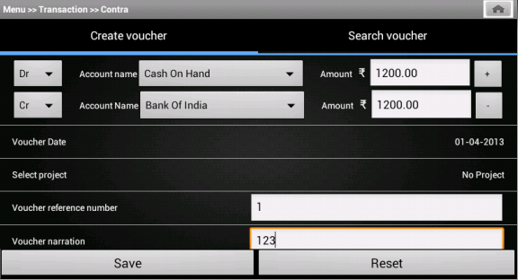
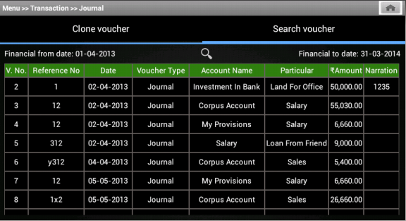

Transaction management
======================

Transaction management
++++++++++++++++++++++

	- For recording/editing voucher we have two tabs ie. Create voucher and Search/edit voucher.
	
	* These two tabs are included in a path ``src/com.example.gkaakash/transaction_tab.java`` .

	+ Its activiy is explained below along with code. 

	* **File src/com/example/gkaakash/transaction_tab.java**

	+ The activity contains the essential and required import like

		::

			import android.app.AlertDialog;
			import android.app.TabActivity;
			import android.content.Context;
			import android.content.DialogInterface;
			import android.content.Intent;
			import android.graphics.Color;
			import android.os.Bundle;
			import android.view.View;
			import android.view.Window;
			import android.view.WindowManager;
			import android.view.View.OnClickListener;
			import android.widget.Button;
			import android.widget.EditText;
			import android.widget.TabHost;
			import android.widget.TabHost.OnTabChangeListener;
			import android.widget.TabHost.TabSpec;
			import android.widget.TextView;
			import android.widget.Toast;

	* The activity intializes all the essential parameters and variables.

	* onCreate method creates two Tabspec and include them in Tabhost.

	* It sets Create voucher as bydefault tab.

		::

			public class transaction_tab extends TabActivity {
	
			static TextView tab1 = null;
			static TextView tab2 = null;
			AlertDialog dialog;
			final Context context = this;
			Boolean nameflag;
		   	String name;
		    	Boolean edittabflag=false;
		   	static TabHost tabHost;
		   	static String tabname;
		   	EditText etRefNumber;
			  public void onCreate(Bundle savedInstanceState) {
				super.onCreate(savedInstanceState);
				requestWindowFeature(Window.FEATURE_CUSTOM_TITLE);
				setContentView(R.layout.tab);
				//tab name flag
				nameflag=MainActivity.nameflag;
				name=SearchVoucher.name;
				//Toast.makeText(context,"name"+name,Toast.LENGTH_SHORT).show();
			       
				edittabflag=createVoucher.edittabflag;
			      //customizing title bar
				getWindow().setFeatureInt(Window.FEATURE_CUSTOM_TITLE,R.layout.voucher_title);
				final TextView label = (TextView) findViewById(R.id.tvVoucherTitle);
				String vouchertypeflag = voucherMenu.vouchertypeflag;
				label.setText("Menu >> Transaction >> " + vouchertypeflag);
				final Button home = (Button) findViewById(R.id.btnhome);
				home.setOnClickListener(new OnClickListener() {

						@Override
						public void onClick(View arg0) {
							Intent intent = new Intent(context, menu.class);
							// To pass on the value to the next page
							startActivity(intent);
							}
				});
			
				tabHost = getTabHost();
				//creating TabSpec for create voucher
				TabSpec createspec = tabHost.newTabSpec("tab1");
				tab1 = new TextView(this);
				//setting properties in textView
				tab1.setGravity(android.view.Gravity.CENTER);
				tab1.setTextSize(18.0f);
				tab1.setHeight(50);
				tab1.setTextColor(Color.WHITE);
			
				if(nameflag==true){//setting tab name while editing and cloning
					tab1.setText(name); 
				}else {//setting tab name while creating account
					tab1.setText("Create voucher");
					tabname=(String) tab1.getText();
					} 
				createspec.setIndicator(tab1);//assigning TextView to tab Indicator
				Intent create = new Intent(this, createVoucher.class);
				create.putExtra("flag", vouchertypeflag);
				createspec.setContent(create);
				tabHost.addTab(createspec);  // Adding create tab
			
				//creating TabSpec for edit voucher
				TabSpec editspec = tabHost.newTabSpec("tab2");
				tab2 = new TextView(this);
				//setting properties in textView
				tab2.setGravity(android.view.Gravity.CENTER);
				tab2.setTextSize(18.0f);
				tab2.setHeight(50);
				tab2.setTextColor(Color.WHITE);
				tab2.setText("Search voucher");
				editspec.setIndicator(tab2);//assigning TextView to tab Indicator
				Intent edit = new Intent(this, SearchVoucher.class);
				edit.putExtra("flag",vouchertypeflag);
				editspec.setContent(edit);
				tabHost.addTab(editspec); // Adding edit tab
				tabHost.setCurrentTab(0);//setting tab1 on load
			 }
	
			}

	 **File  res/layout/create_voucher.xml**

		::

			<?xml version="1.0" encoding="utf-8"?>
			<LinearLayout xmlns:android="http://schemas.android.com/apk/res/android"
			 android:layout_width="fill_parent" 
			 android:layout_height="fill_parent"
			 android:orientation="vertical"
			 android:weightSum="100"
			 android:background="@drawable/dark_gray_background">
			 
			    <LinearLayout
				   android:orientation="horizontal"
				   android:layout_width="400dp"
				   android:layout_height="3dp"
				   android:paddingLeft="20dp"
				   android:paddingRight="20dp"
				   android:background="#60AFFE"/>
			   
			    <LinearLayout
				   android:orientation="horizontal"
				   android:layout_width="match_parent"
				   android:layout_height="3dp"
				   android:paddingLeft="20dp"
				   android:paddingRight="20dp"
				   android:background="#60AFFE"/>
			    
			<ScrollView xmlns:android="http://schemas.android.com/apk/res/android"
			    android:layout_width="fill_parent"
			    android:layout_height="fill_parent"
			    android:layout_weight="80"
			    android:background="@drawable/dark_gray_background" >
				<LinearLayout xmlns:android="http://schemas.android.com/apk/res/android"
				    android:orientation="vertical"
				    android:layout_width="match_parent"
				    android:layout_height="wrap_content"
				    android:paddingTop="5dp" >
			 
					<TableLayout
					    xmlns:android="http://schemas.android.com/apk/res/android"
					    android:layout_width="match_parent"
					    android:layout_height="wrap_content"
					    android:orientation="vertical"
					    android:paddingLeft="20dp"
					    android:paddingRight="20dp"
					    android:stretchColumns="7" >

					    <TableRow
						android:layout_width="match_parent"
						android:layout_height="wrap_content" >

						   	
					    <Spinner
						android:id="@+id/sDrCr"
						android:layout_width="wrap_content"
						android:layout_height="wrap_content"
						android:entries="@array/SearchBy_arrays"
						android:prompt="@string/Search_prompt" />
						
					    <TextView
						android:id="@+id/accountName"
						android:layout_width="wrap_content"
						android:layout_height="wrap_content"
						android:text="        Account name"
						android:textSize="14dp"
						android:textColor="#FFFFFF" />

					    <Spinner
						android:id="@+id/getAccountByRule"
						android:layout_width="259px"
						android:layout_height="wrap_content"
						android:entries="@array/accountName_arrays"
						android:prompt="@string/accountName_prompt" />
			    
					    <TextView
						android:id="@+id/amount"
						android:layout_width="wrap_content"
						android:layout_height="wrap_content"
						android:text="        Amount"
						android:textSize="14dp"
						android:textColor="#FFFFFF" />
					    
					     <TextView
						android:id="@+id/rupeeSym"
						android:layout_width="wrap_content"
						android:layout_height="wrap_content"
						android:text="@string/Rs"
						android:textColor="#FFFFFF"
						android:textSize="19dp"
						android:paddingRight="5dp"
						android:paddingLeft="10dp"/>
					     
			    
						  <EditText
						android:id="@+id/etDrCrAmount"
						android:layout_width="fill_parent"
						android:layout_height="wrap_content"
						android:layout_weight="2"
						android:inputType="numberDecimal"
						android:text="0.00         " >

					  <requestFocus />
						  </EditText>
						   
						 <Button
						    android:id="@+id/add"
						    android:layout_weight="0.3"
						    android:text=" +  " />
			   
					    </TableRow>
					</TableLayout>
		
					<TableLayout xmlns:android="http://schemas.android.com/apk/res/android"
				    android:id="@+id/Vouchertable"
				    android:orientation="vertical"
				    android:layout_width="fill_parent"
				    android:layout_height="fill_parent" 
		    		    android:stretchColumns="7" 
		    		    android:paddingLeft="20dp"
		    		    android:paddingRight="20dp"
		    		    android:paddingBottom="5dp"
			    		/>
		
					<LinearLayout 
				    android:orientation="horizontal"
				    android:layout_width="match_parent"
				    android:layout_height="1dp"
				    android:paddingLeft="20dp"
				    android:paddingRight="20dp"
				    android:weightSum="100" 
				    android:background="@android:color/darker_gray">
		
		
		
					</LinearLayout>

				<ListView
				android:id="@+id/voucher_list"
				android:layout_width="match_parent"
				android:layout_height="wrap_content">
				</ListView>
	
				<LinearLayout 
				    android:orientation="horizontal"
				    android:layout_width="match_parent"
				    android:layout_height="0.01dp"
				    android:paddingLeft="20dp"
				    android:paddingRight="20dp"
				    android:background="@android:color/darker_gray"/>
	
				<ListView
				android:id="@+id/voucher_list4"
				android:layout_width="match_parent"
				android:layout_height="wrap_content">
				</ListView>
	
				<LinearLayout 
				    android:orientation="horizontal"
				    android:layout_width="match_parent"
				    android:layout_height="0.01dp"
				    android:paddingLeft="20dp"
				    android:paddingRight="20dp"
				    android:background="@android:color/darker_gray"/>
	
				<LinearLayout
				android:layout_width="fill_parent"
				android:layout_height="wrap_content"
				android:orientation="horizontal"
				android:weightSum="100"
				android:paddingTop="3dp"
				android:paddingRight="20dp"
				android:gravity="left">
				<TextView
				    android:id="@+id/tvRefNumber"
				    android:layout_width="wrap_content"
				    android:layout_height="wrap_content"
				    android:text="Voucher reference number"
				    android:layout_weight="70"
				    android:textSize="14dp"
				    android:paddingLeft="20dp"
				    android:textColor="#FFFFFF"/>
	
				<EditText
					android:id="@+id/etRefNumber"
					android:layout_width="305dp"
					android:layout_height="wrap_content"
					android:layout_weight="30"
					android:hint="Tap to enter reference number" 
					android:paddingTop="2dp"/>
				</LinearLayout>
	
				<LinearLayout 
					android:orientation="horizontal"
					android:layout_width="match_parent"
					android:layout_height="0.01dp"
					android:paddingLeft="20dp"
					android:paddingRight="20dp"
					android:background="@android:color/darker_gray"/>
	
				<LinearLayout
				android:layout_width="fill_parent"
				android:layout_height="wrap_content"
				android:orientation="horizontal"
				android:weightSum="100"
				android:paddingTop="3dp"
				android:paddingRight="20dp"
				android:gravity="left">
				<TextView
					android:id="@+id/tvVoucherNarration"
					android:layout_width="wrap_content"
					android:layout_height="wrap_content"
					android:text="Voucher narration"
					android:layout_weight="70"
					android:textSize="14dp"
					android:paddingLeft="20dp"
					android:textColor="#FFFFFF"/>
	
				<EditText
					android:id="@+id/etVoucherNarration"
					android:layout_width="283dp"
					android:layout_height="wrap_content"
					android:layout_weight="30"
					android:hint="Tap to enter voucher narration" 
					android:paddingTop="2dp"
					android:inputType="textCapSentences"/>
				</LinearLayout>
	
				</LinearLayout>
			</ScrollView>

			<LinearLayout
				android:layout_width="fill_parent"
				android:layout_height="wrap_content"
				android:orientation="horizontal"
				android:layout_weight="20"
				android:weightSum="100"
				android:layout_alignParentBottom="true"
				android:background="@drawable/blackbutton" >

				<Button
				    android:id="@+id/btnSaveVoucher"
				    android:layout_width="wrap_content"
				    android:layout_height="match_parent"
				    android:layout_gravity="center_vertical"
				    android:layout_weight="50"
				    android:text="Save"
				    android:textSize="20dp" />
		
				<Button
				    android:id="@+id/btnResetVoucher"
				    android:layout_width="wrap_content"
				    android:layout_height="match_parent"
				    android:layout_gravity="center_vertical"
				    android:layout_weight="50"
				    android:text="Reset"
				    android:textSize="20dp" />

			    </LinearLayout>
			</LinearLayout>

* **File src/com/example/gkaakash/createVoucher.java**

	*  Create voucher layout includes fields such as Account type, Account name, Amount, Voucher date, 
           Project name,Reference No., and Narration(filling naration is not mandatory).

	* Values are sent to database using Save option.

	* All the fields are cleared using Reset option.

	* Its activity is explained below along with code.

	* The activity contains the essential and required import like

		::
		
			import java.math.RoundingMode;
			import java.text.DecimalFormat;
			import java.text.SimpleDateFormat;
			import java.util.ArrayList;
			import java.util.Calendar;
			import java.util.Date;
			import java.util.HashMap;
			import java.util.List;
			import android.R.color;
			import com.gkaakash.controller.*;
			import android.app.Activity;
			import android.app.AlertDialog;
			import android.app.DatePickerDialog;
			import android.app.Dialog;
			import android.content.Context;
			import android.content.DialogInterface;
			import android.content.Intent;
			import android.graphics.Color;
			import android.os.Bundle;
			import android.text.InputType;
			import android.text.method.KeyListener;
			import android.text.style.ClickableSpan;
			import android.view.KeyEvent;
			import android.view.View;
			import android.view.View.OnClickListener;
			import android.view.View.OnFocusChangeListener;
			import android.view.ViewGroup;
			import android.view.ViewGroup.LayoutParams;
			import android.widget.AdapterView;
			import android.widget.AdapterView.OnItemSelectedListener;
			import android.widget.ArrayAdapter;
			import android.widget.Button;
			import android.widget.DatePicker;
			import android.widget.EditText;
			import android.widget.ListView;
			import android.widget.SimpleAdapter;
			import android.widget.Spinner;
			import android.widget.TabHost;
			import android.widget.TableLayout;
			import android.widget.TableRow;
			import android.widget.TextView;
			import android.widget.AdapterView.OnItemClickListener;
			import android.widget.Toast;
			import android.view.View.OnKeyListener;
			import android.view.inputmethod.InputMethodManager;
	
	* The activity intializes all the essential parameters and variables.

	* onCreate method loads all the methods required.

		::

			public class createVoucher extends Activity {
			TableLayout list;
			int rowsSoFar = 0, tableRowCount;
			String amount, financialFromDate, financialToDate, drcramount, vouchertypeflag;
			AlertDialog dialog;
			final Context context = this;
			TextView voucherDate, tvTotalDebit, tvTotalCredit, projectName;
			final List<String> dr_cr=new ArrayList<String>();
			ListView voucher_date,projetct_name;;
			final Calendar c = Calendar.getInstance();
			static int day, month, year;
			static final int VOUCHER_DATE_DIALOG_ID = 1;
			private SimpleAdapter dateAdapter,projectAdapter; 
			static Integer client_id;
			private Transaction transaction; 
			private Organisation organisation;
			static Object[] voucherAccounts;
			static Integer setVoucher; 
			static Integer editVoucher;
			static ArrayAdapter<String> dataAdapter;
			protected String selDrCr;
			Spinner account, actionButton, DrCr, sp1;
			TableRow newRow;
			ArrayList<ArrayList> paramsMaster;
			float totalDr, totalCr;
			static String vDate, vproject; 
			DecimalFormat mFormat;
			EditText firstRowamount, etnarration, et;
			static EditText etRefNumber;
			private Object diffbal;
			Float drcrAmountFirstRow, drcrAmount, amountdrcr;
			boolean addRowFlag = true;
			List<String> accnames=new ArrayList<String>();
			List<String>  DrAccountlist, CrAccountlist;
			static Boolean searchFlag;
			ArrayList otherdetailsrow;
			ArrayAdapter<String> da1 ;
			String proj,searchdate;
			static ArrayList<String> accdetails;
			static ArrayList<ArrayList<String>> accdetailsList;
			String Fsecond_spinner,Ssecond_spinner,Sacctype,Facctype;
			static int FaccnamePosition,SaccnamePosition,SacctypePosition,FacctypePosition;
			String vouchercode;
			static Boolean cloneflag;
			boolean nameflag;
			static boolean edittabflag;
			String name;
	
	
			    @Override 
			    public void onCreate(Bundle savedInstanceState) {
			       	super.onCreate(savedInstanceState);
			       	setContentView(R.layout.create_voucher);
			       
			       	transaction = new Transaction();
			       	organisation = new Organisation();
			       	client_id= Startup.getClient_id();
			    	vouchertypeflag =  voucherMenu.vouchertypeflag;
			       
			     	try {
			     		searchFlag=MainActivity.searchFlag;
			       	
			     		cloneflag=SearchVoucher.cloneflag;
			     		//Toast.makeText(context, "abbbbccc"+searchFlag, Toast.LENGTH_SHORT).show();
			     		//Toast.makeText(context, "clone"+cloneflag, Toast.LENGTH_SHORT).show();
			     		etRefNumber = (EditText)findViewById(R.id.etRefNumber);
			      	
			     		name = SearchVoucher.name;
			     		//Toast.makeText(context,"namecre"+name,Toast.LENGTH_SHORT).show();
			     		// after click om edit voucher Reff Edit text non-editable
			     		if(searchFlag==true&&cloneflag==false){
			     			etRefNumber.setEnabled(false);
			     		}else {
			     			etRefNumber.setEnabled(true); 
			     		}
			       	
			     		etnarration = (EditText)findViewById(R.id.etVoucherNarration);
			     		account = (Spinner) findViewById(R.id.getAccountByRule);
			     		firstRowamount = (EditText) findViewById(R.id.etDrCrAmount);
			     		DrCr = (Spinner) findViewById(R.id.sDrCr);
			     		list = (TableLayout) findViewById( R.id.Vouchertable );
			     		if(searchFlag==false){
			     			//for setting voucher reference number
			     			etRefNumber =  (EditText)findViewById(R.id.etRefNumber);
			     			String reff_no = transaction.getLastReferenceNumber(new Object[]{vouchertypeflag},client_id);
			     			etRefNumber.setText(reff_no.toString());
			     		}
			
			     		//for edit Details
			     		if(searchFlag==true){
			     			//System.err.println("cumning form serach voucher"+SearchVoucher.value);
				       		//list coming from search voucher
				       		ArrayList<String> abc = SearchVoucher.value;
				       		vouchercode=abc.get(0);
				       		Object[] params = new Object[]{vouchercode};
				       		
				       		Object[] VoucherMaster = (Object[]) transaction.getVoucherMaster(params,client_id);
				       		Object[] VoucherDetails = (Object[]) transaction.getVoucherDetails(params,client_id);
				       		
				       		otherdetailsrow = new ArrayList();
				       		for(Object row1 : VoucherMaster){
				       			Object a=(Object)row1;
				       			otherdetailsrow.add(a.toString());//getting vouchermaster details
				       		}
			       	
				       		String refno=(String) otherdetailsrow.get(0);
				       		//String date=(String) row.get(1);
				       		String narration=(String)otherdetailsrow.get(3);
				       		proj=(String)otherdetailsrow.get(4);
				       		searchdate=(String) otherdetailsrow.get(1);
				       		etnarration.setText(narration);
				       		etRefNumber.setText(refno);
			       		
				       		projetct_name =  (ListView)findViewById(R.id.voucher_list4);
				       		projetct_name.setTextFilterEnabled(true);
				       		projetct_name.setCacheColorHint(color.transparent);
				       		setProject();
				
				       		accdetailsList = new ArrayList<ArrayList<String>>();
				       		for(Object row2 : VoucherDetails){
				       			Object[] a2=(Object[])row2;
				       			accdetails = new ArrayList<String>();
				       			for(int i=0;i<a2.length;i++){
				       				accdetails.add((String) a2[i].toString());//getting voucherdetails
				       			}
				       			accdetailsList.add(accdetails);
				       		}
				       		//for filling 1st row amount
				       		firstRowamount.setText(accdetailsList.get(0).get(2));
				       		account.setMinimumWidth(283);
			     		}
			       
		       	
			     		//two digit date format for dd and mm
			     		mFormat= new DecimalFormat("00");
			     		mFormat.setRoundingMode(RoundingMode.DOWN);
			     		list = (TableLayout) findViewById( R.id.Vouchertable );
			       
			     		account.setMinimumWidth(283);
			    	
			     		//add second row and set first & second row account names in spinner
			     		setFirstAndSecondRow();
		       		
			     		//for setting voucher date
			     		voucher_date =  (ListView)findViewById(R.id.voucher_list);
			     		voucher_date.setTextFilterEnabled(true);
			     		voucher_date.setCacheColorHint(color.transparent);
			     		setVoucherDate();
			      
			     		// for setting project 
			     		projetct_name =  (ListView)findViewById(R.id.voucher_list4);
			     		projetct_name.setTextFilterEnabled(true);
			     		projetct_name.setCacheColorHint(color.transparent);
			     		setProject();
				
			     	} catch (Exception ex) {
			     		AlertDialog.Builder builder = new AlertDialog.Builder(context);
					   builder.setMessage("Please try again")
						   .setCancelable(false)
						   .setPositiveButton("Ok",
						           new DialogInterface.OnClickListener() {
						               public void onClick(DialogInterface dialog, int id) {
						               	
						               }
						           });
						   
					   AlertDialog alert = builder.create();
					   alert.show();	
			     		}
				 //add all onclick events in this method
			     	OnClickListener();
			
				//on dr/cr item selected from dropdown...
				OnDrCrItemSelectedListener();
			
				//move foucs from amount to reference number edittext
				OnAmountFocusChangeListener(); 
		   	 }

	* This methods manages all the activity at the time of focus change(from one edittext to another).

		::

			private void OnAmountFocusChangeListener() {
		    	/*
		    	 * onfocuschange of amount edittext move focus to reference number
		    	 */
		    	tableRowCount = list.getChildCount();
				for(int i=0;i<(tableRowCount);i++){
					View row = list.getChildAt(i);
					//amount edittext
					final EditText e = (EditText)((ViewGroup) row).getChildAt(5);
			
					e.setOnFocusChangeListener(new OnFocusChangeListener() {
				
						@Override
						public void onFocusChange(View v, boolean hasFocus) {
					
							etRefNumber = (EditText)findViewById(R.id.etRefNumber);
							e.setNextFocusDownId(etRefNumber.getId());
						}
					});
				}
			 }

	* This methods checks whether the amount in the amount field is tallied or not, if not it throws an error message.

	* If amount field is left unfilled it automatially updates that field with the value "0.00".

		::

			public void testAmountTally() {
		    	/*
		    	 * this method calculate toatalDr and totalCr
		    	 */
		    	totalDr = 0;
		    	totalCr = 0;
		    	//System.out.println("m in..........");
				//selected dr/cr and amount of the first row
		    	
				String Dr_Cr = DrCr.getSelectedItem().toString();
		
				//System.out.println("sasa:"+Dr_Cr);
		
				String drcramountFirstRow = firstRowamount.getText().toString();
				if(drcramountFirstRow.length()<1)
			{
					drcramountFirstRow="0.00";
			}
				drcrAmountFirstRow = Float.parseFloat(drcramountFirstRow);
		
				if("Dr".equals(Dr_Cr)){
					totalDr = totalDr + drcrAmountFirstRow;
				}
				else if("Cr".equals(Dr_Cr)){
					totalCr = totalCr + drcrAmountFirstRow;
				}
		
				//selected dr/cr and amount of the remaining rows
		
				tableRowCount = list.getChildCount();
		
				for(int i=0;i<(tableRowCount);i++){
					View row = list.getChildAt(i);
					//dr cr spinner
					Spinner s = (Spinner)((ViewGroup) row).getChildAt(0);
					String drcr = s.getSelectedItem().toString();
					//System.out.println("ssdsdSSS:"+drcr);
			
					//amount edittext
					EditText e = (EditText)((ViewGroup) row).getChildAt(5);
					drcramount = e.getText().toString();
			
					if(drcramount.length()<1)
			    {
				drcramount="0.00";
			    }
					drcrAmount = Float.parseFloat(drcramount);
			
					if("Dr".equals(drcr)){
						totalDr = totalDr + drcrAmount;
					}
					else if("Cr".equals(drcr)){
						totalCr = totalCr + drcrAmount;
					}
				}
		
			}

	* This method sets the second row of the table.

	* It fills the dropdown of second and first row of table with respective values according to the account type.

		::
		
			private void setFirstAndSecondRow() {
			/*this onload function takes the account name list 
			 * from voucherMenu.java depending upon getAccountByRule
			 * sets first row account name spinner
			 * add the second row and set the account name in spinner
			 */
			if("Contra".equals(vouchertypeflag) || "Journal".equals(vouchertypeflag)){
				accnames = voucherMenu.Accountlist;
		
				//set first row account name spinner
		
		    	//set resource layout of spinner to that adapter
				if(searchFlag==false){
					dataAdapter = new ArrayAdapter<String>(this, android.R.layout.simple_spinner_item, accnames);
					dataAdapter.setDropDownViewResource(android.R.layout.simple_spinner_dropdown_item);
					account.setAdapter(dataAdapter);
					//add second row
					addButton();
			
					dr_cr.clear();
					dr_cr.add("Dr");
			    	dr_cr.add("Cr");
			    	da1 = new ArrayAdapter<String>(createVoucher.this, android.R.layout.simple_spinner_item,dr_cr);
			  	   	da1.setDropDownViewResource(android.R.layout.simple_spinner_dropdown_item);
				sp1.setAdapter(da1);
				sp1.setSelection(1);
			
					//set adaptor with account name list in second row spinner
			    	actionButton.setAdapter(dataAdapter);
			    	
				}else {//for setting second row for editing
					dr_cr.clear();
					//for setting 1st row's 2nd spinner
					Fsecond_spinner = accdetailsList.get(0).get(0);
					//setting adapter
					dataAdapter = new ArrayAdapter<String>(this, android.R.layout.simple_spinner_item, accnames);
					dataAdapter.setDropDownViewResource(android.R.layout.simple_spinner_dropdown_item);
					FaccnamePosition = dataAdapter.getPosition(Fsecond_spinner);
					account.setAdapter(dataAdapter);
					account.setSelection(FaccnamePosition);
			
					//add second row
					addButton();
			
			    	dr_cr.add("Dr");
			    	dr_cr.add("Cr");
			    	
			    	//for setting 1st spinner of 1st and 2nd row 
			    	Sacctype=accdetailsList.get(1).get(1);
			    	Facctype=accdetailsList.get(0).get(1);
			    	da1 = new ArrayAdapter<String>(createVoucher.this, android.R.layout.simple_spinner_item,dr_cr);
			  	   	da1.setDropDownViewResource(android.R.layout.simple_spinner_dropdown_item);
			     	SacctypePosition=da1.getPosition(Sacctype);
			     	FacctypePosition=da1.getPosition(Facctype);
			     	sp1.setAdapter(da1);
				sp1.setSelection(SacctypePosition);//setting spinner selection acc to obtained value
				DrCr.setAdapter(da1);
				DrCr.setSelection(FacctypePosition);//setting spinner selection acc to obtained value
			
		       		//for filling 2nd row amount
				et.setText(accdetailsList.get(1).get(2));
			
					//for setting 2nd row's 2nd spinner
			    	Ssecond_spinner = accdetailsList.get(1).get(0);
			     	SaccnamePosition = dataAdapter.getPosition(Ssecond_spinner);
			     	actionButton.setAdapter(dataAdapter);
			    	actionButton.setSelection(SaccnamePosition);//setting spinner selection acc to obtained value
			    	
				tableRowCount = list.getChildCount();
			
					//if row count of 2nd table(list) is more than 1 code bellow will be executed
			
					if(accdetailsList.size()>2){
						for(int i=2;i<accdetailsList.size();i++){
							addButton();
							et.setText(accdetailsList.get(i).get(2));
				
							Ssecond_spinner = accdetailsList.get(i).get(0);
							SaccnamePosition = dataAdapter.getPosition(Ssecond_spinner);
							actionButton.setAdapter(dataAdapter);
							actionButton.setSelection(SaccnamePosition);
				    	
				    	
							Sacctype=accdetailsList.get(i).get(1);
							da1 = new ArrayAdapter<String>(createVoucher.this, android.R.layout.simple_spinner_item,dr_cr);
				  	   		da1.setDropDownViewResource(android.R.layout.simple_spinner_dropdown_item);
				  	   		SacctypePosition=da1.getPosition(Sacctype);
				  	   		sp1.setAdapter(da1);
				  	   		sp1.setSelection(SacctypePosition);
				
						}	
					}
			
				}
			}
			else{ 
		
				DrAccountlist = voucherMenu.DrAccountlist;
				CrAccountlist = voucherMenu.CrAccountlist;
				if(searchFlag==false){
					//set first row 
					dataAdapter = new ArrayAdapter<String>(this, android.R.layout.simple_spinner_item, DrAccountlist);
			    	//set resource layout of spinner to that adapter
			    	dataAdapter.setDropDownViewResource(android.R.layout.simple_spinner_dropdown_item);
					account.setAdapter(dataAdapter);
					//add second row
					addButton();
					dr_cr.clear();
					dr_cr.add("Dr");
					dr_cr.add("Cr");
					ArrayAdapter<String> da1 = new ArrayAdapter<String>(createVoucher.this, android.R.layout.simple_spinner_item,dr_cr);
					da1.setDropDownViewResource(android.R.layout.simple_spinner_dropdown_item);
					sp1.setAdapter(da1);
					sp1.setSelection(1);
			
					//set adaptor with account name list in second row spinner
					dataAdapter = new ArrayAdapter<String>(this, android.R.layout.simple_spinner_item, CrAccountlist);
					//set resource layout of spinner to that adapter
					dataAdapter.setDropDownViewResource(android.R.layout.simple_spinner_dropdown_item);
					//set adaptor with account name list in spinner
					actionButton.setAdapter(dataAdapter); 
				}else {
					//add second row
					addButton();
					dr_cr.clear();
			    	dr_cr.add("Dr");
			    	dr_cr.add("Cr");
			    	Sacctype=accdetailsList.get(1).get(1);
			    
			    	Facctype=accdetailsList.get(0).get(1);
			    	da1 = new ArrayAdapter<String>(createVoucher.this, android.R.layout.simple_spinner_item,dr_cr);
			  	   	da1.setDropDownViewResource(android.R.layout.simple_spinner_dropdown_item);
			     	SacctypePosition=da1.getPosition(Sacctype);
			     	FacctypePosition=da1.getPosition(Facctype);
			     	sp1.setAdapter(da1);
				sp1.setSelection(SacctypePosition);
				DrCr.setAdapter(da1);
				DrCr.setSelection(FacctypePosition);
			
				if("Dr".equals(Facctype)){//if acctype is DR
					dataAdapter = new ArrayAdapter<String>(this, android.R.layout.simple_spinner_item, DrAccountlist);
				}else {//if acctype is CR
					dataAdapter = new ArrayAdapter<String>(this, android.R.layout.simple_spinner_item, CrAccountlist);
					}
				Fsecond_spinner = accdetailsList.get(0).get(0);
					dataAdapter.setDropDownViewResource(android.R.layout.simple_spinner_dropdown_item);
					FaccnamePosition = dataAdapter.getPosition(Fsecond_spinner);
					account.setAdapter(dataAdapter);
					account.setSelection(FaccnamePosition);
			
			
				et.setText(accdetailsList.get(1).get(2));
			
			
				if("Dr".equals(Sacctype)){
					dataAdapter = new ArrayAdapter<String>(this, android.R.layout.simple_spinner_item, DrAccountlist);
				}else {
					dataAdapter = new ArrayAdapter<String>(this, android.R.layout.simple_spinner_item, CrAccountlist);
					}
			
			    	Ssecond_spinner = accdetailsList.get(1).get(0);
			    	System.out.println("sdss:"+Ssecond_spinner);
			     	SaccnamePosition = dataAdapter.getPosition(Ssecond_spinner);
			     	dataAdapter.setDropDownViewResource(android.R.layout.simple_spinner_dropdown_item);
			     	actionButton.setAdapter(dataAdapter);
			    	actionButton.setSelection(SaccnamePosition);
			  	   	
				tableRowCount = list.getChildCount();
					if(accdetailsList.size()>2){
						for(int i=2;i<accdetailsList.size();i++){
						addButton();
						et.setText(accdetailsList.get(i).get(2));
				
			
						if("Dr".equals(Sacctype)){
						dataAdapter = new ArrayAdapter<String>(this, android.R.layout.simple_spinner_item, DrAccountlist);
					}else {
						dataAdapter = new ArrayAdapter<String>(this, android.R.layout.simple_spinner_item, CrAccountlist);
						}
				
				
						Ssecond_spinner = accdetailsList.get(i).get(0);
						//System.out.println("ashagdSec:"+Ssecond_spinner+"");
				     	SaccnamePosition = dataAdapter.getPosition(Ssecond_spinner);
				     	dataAdapter.setDropDownViewResource(android.R.layout.simple_spinner_dropdown_item);
				     	actionButton.setAdapter(dataAdapter);
				    	actionButton.setSelection(SaccnamePosition);
				    	dr_cr.clear();
				    	dr_cr.add("Dr");
				    	dr_cr.add("Cr");
				    	Sacctype=accdetailsList.get(i).get(1);
				    	da1 = new ArrayAdapter<String>(createVoucher.this, android.R.layout.simple_spinner_item,dr_cr);
				  	   	da1.setDropDownViewResource(android.R.layout.simple_spinner_dropdown_item);
				     	SacctypePosition=da1.getPosition(Sacctype);
				     	sp1.setAdapter(da1);
					sp1.setSelection(SacctypePosition);
				
						}	
					}
			
				}	
			}
		 }

	* The below method fills the drop down of account names when respective account type is selected.

		::

			private void OnDrCrItemSelectedListener() {
			/*
			 * to set account names in dropdown when Dr/Cr changed
			 */
			//for first row
	       		 DrCr.setOnItemSelectedListener(new OnItemSelectedListener() {

			@Override
			public void onItemSelected(AdapterView<?> parent, View v, int position,long id) {
				// TODO Auto-generated method stub
				selDrCr = parent.getItemAtPosition(position).toString();
				if(selDrCr != null){
					Object[] params = new Object[]{selDrCr};
					getAccountsByRule(params);
					if(searchFlag==false){
						account.setAdapter(dataAdapter);
					}
			
				}
			}

			@Override
			public void onNothingSelected(AdapterView<?> arg0) {
				// ignore this method!!! :)
			}
			});
			//for remaining rows
			sp1.setOnItemSelectedListener(new OnItemSelectedListener() {

				@Override
				public void onItemSelected(AdapterView<?> parent, View v, int position,long id) {
					// TODO Auto-generated method stub
					String a = parent.getItemAtPosition(position).toString();
					if(a != null){
						if(searchFlag==false){
							Object[] params = new Object[]{a};
							getAccountsByRule(params);
							actionButton.setAdapter(dataAdapter);
						}
				
					}
			
				} 

				@Override
				public void onNothingSelected(AdapterView<?> arg0) {
					// TODO Auto-generated method stub
			
				}
			});
		 }

	* The below method populates drop down of account name by rule.

	* For example if transaction type is contra, this method filters the account names that comes under contra
      	  and fill them in the drop down.  

		::

			private void getAccountsByRule(Object[] DrCrFlag) {
			/*
			 * get account name list depending upon voucher type and 
			 * dr/cr flag (standard accounting rule)
			 */
			if("Contra".equals(vouchertypeflag)){
				voucherAccounts = (Object[]) transaction.getContraAccounts(client_id);
			}
			else if("Journal".equals(vouchertypeflag)){
				voucherAccounts = (Object[]) transaction.getJournalAccounts(client_id);
			}
			else if("Receipt".equals(vouchertypeflag)){
			
				voucherAccounts = (Object[]) transaction.getReceivableAccounts(DrCrFlag,client_id);
			}
			else if("Payment".equals(vouchertypeflag)){
			
				voucherAccounts = (Object[]) transaction.getPaymentAccounts(DrCrFlag,client_id);
			}
			else if("Debit Note".equalsIgnoreCase(vouchertypeflag)){
			
				voucherAccounts = (Object[]) transaction.getDebitNoteAccounts(DrCrFlag,client_id);
			}
			else if("Credit Note".equalsIgnoreCase(vouchertypeflag)){
			
				voucherAccounts = (Object[]) transaction.getCreditNoteAccounts(DrCrFlag,client_id);
			}
			else if("Sales".equals(vouchertypeflag)){
			
				voucherAccounts = (Object[]) transaction.getSalesAccounts(DrCrFlag,client_id);
			}
			else if("Purchase".equals(vouchertypeflag)){
			
				voucherAccounts = (Object[]) transaction.getPurchaseAccounts(DrCrFlag,client_id);
			}
			else if("Sales Return".equalsIgnoreCase(vouchertypeflag)){
			
				voucherAccounts = (Object[]) transaction.getSalesReturnAccounts(DrCrFlag,client_id);
			}
			else if("Purchase Return".equalsIgnoreCase(vouchertypeflag)){
			
				voucherAccounts = (Object[]) transaction.getPurchaseReturnAccounts(DrCrFlag,client_id);
			}
			List<String> Accountlist = new ArrayList<String>();
			for(Object ac : voucherAccounts)
			{	
				Accountlist.add((String) ac);
			}	
			dataAdapter = new ArrayAdapter<String>(this,
	    		android.R.layout.simple_spinner_item, Accountlist);
		    	//set resource layout of spinner to that adapter
		    	dataAdapter.setDropDownViewResource(android.R.layout.simple_spinner_dropdown_item);
			    
			}

	* The below method manages the activity when plus button is clicked,by adding one row.

	* It takes values filled in the fields and calls setTransaction for saving transation.  

	* After saving transaction it resets all the fields.

		::

			private void OnClickListener() { 
			/*
			 * on click method for add, save and reset button
			 * 1. add: Every time the "+" button is clicked, add a new row to the table
			 * 2. save: takes all necessary field values and calls transaction.setTransaction
			 * 			for adding transaction and resets all fileds after adding transaction
			 * 3. reset: resets all fields
			 */
		
			/*==============================================================================
	    		 * Every time the "+" button is clicked, add a new row to the table 
	    		 */
			Button addButton = (Button) findViewById( R.id.add );
	       		 addButton.setOnClickListener( new OnClickListener() {
				public void onClick(View view) { 
					testAmountTally();
					if(totalDr == totalCr){
						String message = "Debit and Credit amount is tally";
						toastValidationMessage(message);
					}
					else if (drcrAmountFirstRow <= 0 || drcrAmount <= 0) {
						String message = "No row can be added,Please fill the existing row";
						toastValidationMessage(message);
					}
					else{
						for(int i=0;i<(tableRowCount);i++){
		                View row = list.getChildAt(i);
		               
		                //amount edittext
		                EditText e = (EditText)((ViewGroup) row).getChildAt(5);
		                drcramount = e.getText().toString();
		                if(drcramount.length()<1)
		                {
		                    drcramount="0.00";
		                }
		                amountdrcr = Float.parseFloat(drcramount);
		                
		                if(amountdrcr<=0){
		                	addRowFlag = false;
		                    break;
		                }
		                else{
		                	addRowFlag = true;
		                }
		            }
					
				if(addRowFlag == true){
					//add new row
					addButton();
					ArrayAdapter<String> da1 = new ArrayAdapter<String>(
					createVoucher.this, android.R.layout.simple_spinner_item,dr_cr);
			  	   	da1.setDropDownViewResource(android.R.layout.simple_spinner_dropdown_item);
				sp1.setAdapter(da1);
			      
				//set totalDr and totalCr in textview
				String tvTotalDr = Float.toString(totalDr);
				//tvTotalDebit.setText("Total Debit: "+tvTotalDr+"0");
				
				String tvTotalCr = Float.toString(totalCr);
				//tvTotalCredit.setText("Total Credit: "+tvTotalCr+"0");
				
				DrCr.setOnItemSelectedListener(new OnItemSelectedListener() {
					
						@Override
						public void onItemSelected(AdapterView<?> parent,
						 View v, int position,long id) {
							// TODO Auto-generated method stub
							selDrCr = parent.getItemAtPosition(position).toString();
							if(selDrCr != null){
								Object[] params = new Object[]{selDrCr};
								getAccountsByRule(params);
									account.setAdapter(dataAdapter);
							}
						}

						@Override
						public void onNothingSelected(AdapterView<?> arg0) {
							// ignore this method!!! :)
						}
					});
				
				sp1.setOnItemSelectedListener(new OnItemSelectedListener() {

						@Override
						public void onItemSelected(AdapterView<?> parent, 
						View v, int position,long id) {
							// TODO Auto-generated method stub
							String a = parent.getItemAtPosition(position).toString();
							if(a != null){
									Object[] params = new Object[]{a};
									getAccountsByRule(params);
									actionButton.setAdapter(dataAdapter);
							}
						
						}

						@Override
						public void onNothingSelected(AdapterView<?> arg0) {
							// TODO Auto-generated method stub
						
						}
					});
				
				
			      //set Dr/Cr selected in dropdown according to the condition and set amount in new row
					if(totalDr > totalCr){
						diffbal = totalDr-totalCr;
						et.setText(String.format("%.2f",diffbal ));
						//set 'Cr' selected in Dr/Cr dropdown
						sp1.setSelection(1);
					}
					else{
						diffbal = totalCr-totalDr;
						et.setText(String.format("%.2f",diffbal ));
						//set 'Dr' selected in Dr/Cr dropdown
						sp1.setSelection(0);
					}
				
				}
				else{
					String message = "No row can be added,Please fill the existing row";
					toastValidationMessage(message);
				}
			
			   }
			}

	
		 	});  
		
			/*==============================================================================
		    	 * save transaction
		    	 */
		
		    	Button btnSaveVoucher = (Button) findViewById( R.id.btnSaveVoucher );
		    	btnSaveVoucher.setOnClickListener(new OnClickListener() {

				private String ac;
				private boolean  flag = false;

				@Override
				public void onClick(View v) {
					testAmountTally();
			
					String refNumber = etRefNumber.getText().toString();
			
					if(totalDr == totalCr && !"".equals(refNumber)){
						if(totalDr == 0){
							String message = "Please enter amount";
							toastValidationMessage(message);
						}
						else{
							//main list
							paramsMaster = new ArrayList<ArrayList>(); 
							 ArrayList<String> accNames = new ArrayList();
					
							//first row
							List<String> paramFirstRow = new ArrayList<String>();
							String fistRowDrCr = DrCr.getSelectedItem().toString();
					
							String fistRowAccountName = account.getSelectedItem().toString();
							accNames.add(fistRowAccountName);
					
							EditText firstRowamount = (EditText) findViewById(R.id.etDrCrAmount);
							String firstRowAmount = firstRowamount.getText().toString();
					
							if(searchFlag==false){//for creating account
								paramFirstRow.add(fistRowDrCr);
								paramFirstRow.add(fistRowAccountName);
								paramFirstRow.add(firstRowAmount);
								paramsMaster.add((ArrayList<String>) paramFirstRow);	
							}else if (cloneflag==false) {//for editing account
								if("Dr".equals(fistRowDrCr)){
									paramFirstRow.add(fistRowAccountName);
									paramFirstRow.add(firstRowAmount);
									paramFirstRow.add("0");
									paramsMaster.add((ArrayList<String>) paramFirstRow);
								}else {
									paramFirstRow.add(fistRowAccountName);
									paramFirstRow.add("0");
									paramFirstRow.add(firstRowAmount);
									paramsMaster.add((ArrayList<String>) paramFirstRow);
								}
							}
							else if (cloneflag==true) {//for cloning account
								paramFirstRow.add(fistRowDrCr);
								paramFirstRow.add(fistRowAccountName);
								paramFirstRow.add(firstRowAmount);
								paramsMaster.add((ArrayList<String>) paramFirstRow);
							}
					
				
							//remaining rows
							int tableRowCount = list.getChildCount();
					
							for(int i=0;i<(tableRowCount);i++){
								List<String> paramRow = new ArrayList<String>();
								  
								View row = list.getChildAt(i);
								//drcr flag
								Spinner rowDrCr = (Spinner)((ViewGroup) row).getChildAt(0);
								String drcrFlag = rowDrCr.getSelectedItem().toString();
						
								//account name
								Spinner rowAccountName = (Spinner)((ViewGroup) row).getChildAt(2);
								String accountName = rowAccountName.getSelectedItem().toString();
								accNames.add(accountName);
						
								//amount edittext
								EditText etamount = (EditText)((ViewGroup) row).getChildAt(5);
								String rowAmount = etamount.getText().toString();
								if(searchFlag==false){//for editing account
									paramRow.add(drcrFlag);
									paramRow.add(accountName);
									paramRow.add(rowAmount);
									paramsMaster.add((ArrayList<String>) paramRow);	
								}else if (cloneflag==false) {//for editing account
									if("Dr".equals(drcrFlag)){
										paramRow.add(accountName);
										paramRow.add(rowAmount);
										paramRow.add("0");
										paramsMaster.add((ArrayList<String>) paramRow);	
									}else {
										paramRow.add(accountName);
										paramRow.add("0");
										paramRow.add(rowAmount);
										paramsMaster.add((ArrayList<String>) paramRow);	
									}
								}else if (cloneflag==true) {//for clonning account
									paramRow.add(drcrFlag);
									paramRow.add(accountName);
									paramRow.add(rowAmount);
									paramsMaster.add((ArrayList<String>) paramRow);
								}
							}
					
							for (int i = 0; i < accNames.size(); i++) {
								ac = accNames.get(i);
								for (int j = 0; j < accNames.size(); j++)
								{
									if (i!=j)
									{
										if(ac.equals(accNames.get(j)))
										{
											flag = true;
											break;
										}
								
									}
									else
									{
										flag = false;
									}
									if(flag == true){
										break;
									}
								}
								if(flag == true){
									break;
								}
							}
							if(flag == false)
							{
								//other voucher details...
								etnarration = (EditText)findViewById(R.id.etVoucherNarration);
								String narration = etnarration.getText().toString();
						
								if("".equals(narration)){
									narration = ""; //need to find solution for null
								}
								if(searchFlag==false){//for saving accounts details
									Object[] params_master = 
									new Object[]{refNumber,vDate,vouchertypeflag,vproject,narration};
									setVoucher = (Integer) 
									transaction.setTransaction(params_master,paramsMaster,client_id);
							
									//for satisfying reset condition
									searchFlag=false;
									edittabflag=false;
								}else if (cloneflag==false) {//for saving edited account details
							
									Object[] params_master = 
									new Object[]{vouchercode,vDate,vproject,narration};
									transaction.editVoucher(params_master,paramsMaster,client_id);
									//for satisfying reset condition
									searchFlag=false;
									edittabflag=true;
									MainActivity.nameflag=false;
									transaction_tab.tabHost.setCurrentTab(1);//for changing the tab
									String tabname1 = transaction_tab.tabname;
									transaction_tab.tab1.setText(tabname1);//for changing tab name
								}
								else if (cloneflag==true) {//for saving cloned details 
									Object[] params_master = 
									new Object[]{refNumber,vDate,vouchertypeflag,vproject,narration};
									setVoucher = (Integer) 
									transaction.setTransaction(params_master,paramsMaster,client_id);
							
									//for not getting reseted
									searchFlag=true;
									//this flag is seted for changing tab name on tab change 
									edittabflag=false;
								}
						
								AlertDialog.Builder builder = new AlertDialog.Builder(context);
								if(searchFlag==false && edittabflag==false ){
					 				builder.setMessage("Transaction added successfully");
								}else if (cloneflag==false && edittabflag==true) {
									builder.setMessage("Transaction edited successfully");	
								}else if (cloneflag==true) {
									builder.setMessage("Transaction cloned successfully");
								}
						AlertDialog alert = builder.create();
						alert.setCancelable(true);
						alert.setCanceledOnTouchOutside(true);
						alert.show();
						
					      //reset all fields
						if(searchFlag==false||cloneflag==false){
							
									//etRefNumber.setText("");
							 etRefNumber =  (EditText)findViewById(R.id.etRefNumber);
				  	     	       	String reff_no = transaction.getLastReferenceNumber
									(new Object[]{vouchertypeflag},client_id);
				  	     	       	etRefNumber.setText(reff_no.toString());
									etnarration.setText("");
							
									TextView tvproject = 
									(TextView)projetct_name.findViewById(R.id.tvSubItem1);
									tvproject.setText("No Project");
							
									setVoucherDate(); 
							
									DrCr.setSelection(0); 
									account.setSelection(0);
									firstRowamount.setText("0.00         ");
							
									list.removeAllViews();
									setFirstAndSecondRow();	
						}
						
							}
							else{
								String message = "Account name can not be repeated,
										 please select another account name";
								toastValidationMessage(message);
								}
						}
				
					}
					else if(totalDr != totalCr){
						String message = "Debit and Credit amount is not tally";
						toastValidationMessage(message);
					}
					else if("".equals(refNumber)){
						String message = "Please enter voucher reference number";
						toastValidationMessage(message);
					}
				}

		
				}); 
		    	
		    	/*==============================================================================
		    	 * reset all fields
		    	 */
		    	Button btnResetVoucher = (Button) findViewById( R.id.btnResetVoucher );
		    	btnResetVoucher.setOnClickListener(new OnClickListener() {
			
					@Override
					public void onClick(View v) {
				
						AlertDialog.Builder builder = new AlertDialog.Builder(context);
					builder.setMessage("Are you sure, you want reset all fields? ")
						.setCancelable(false)
						.setPositiveButton("Yes",
						        new DialogInterface.OnClickListener() {
						            public void onClick(DialogInterface dialog, int id) {
						            	
						            	name="Create voucher";
						            	// Toast.makeText(context,"namecre"+name,Toast.LENGTH_SHORT).show();
						            	 if("Create voucher".equals(name)){
							     	        	etRefNumber.setEnabled(true);
							     	        }
						            	etRefNumber =  (EditText)findViewById(R.id.etRefNumber);
					      	     	       	String reff_no = transaction.getLastReferenceNumber
										(new Object[]{vouchertypeflag},client_id);
					      	     	       	etRefNumber.setText(reff_no.toString());
										etnarration = (EditText)
										findViewById(R.id.etVoucherNarration);
										etnarration.setText("");
										
										
										TextView tvproject = (TextView)
										projetct_name.findViewById(R.id.tvSubItem1);
										tvproject.setText("No Project");
										
										DrCr = (Spinner) findViewById(R.id.sDrCr);
										DrCr.setSelection(0); 
										
										account = (Spinner) findViewById(R.id.getAccountByRule);
										account.setSelection(0);
										
										firstRowamount = (EditText) 
										findViewById(R.id.etDrCrAmount);
										firstRowamount.setText("0.00");
										searchFlag=false;
										cloneflag=true;
										setVoucherDate();
										 
										// add a keylistener to keep track user input
										
										list.removeAllViews();
										setFirstAndSecondRow();
										String tabname1 = transaction_tab.tabname;
										transaction_tab.tab1.setText(tabname1);
										
						            }
						        })
						.setNegativeButton("No", new DialogInterface.OnClickListener() {
						    public void onClick(DialogInterface dialog, int id) {
						        dialog.cancel();
						    }
						});
					AlertDialog alert = builder.create();
					alert.show();
					}
				});
			}

	* This method populates Project names in the project name drop down. 

	* It sets ``No Project`` as project, bydefault. 

	* If any other Project name is selected from the dropdown, it updates the bydefault Project name.

		::

			private void setProject() {
			/*
			 * set 'No Project' in the subtitle on load and when item is clicked,
			 * populates the list of project names present in database
			 * when item(project name) is selected,
			 * sets selected name in the subtitle
			 */
	    	
			String[] abc = new String[] {"rowid", "col_1"};
			int[] pqr = new int[] { R.id.tvRowTitle1, R.id.tvSubItem1};
			if(searchFlag==true){//this code will be executed while cloning,editing
				List<HashMap<String, String>> fillMaps = new ArrayList<HashMap<String, String>>();
				HashMap<String, String> map = new HashMap<String, String>();
				map.put("rowid", "" + "Select project");
				map.put("col_1", "" + proj);
				fillMaps.add(map);
				projectAdapter = new SimpleAdapter(this, fillMaps, R.layout.child_row1, abc, pqr);
				projetct_name.setAdapter(projectAdapter);
				
			}else {//this code will be executed while creating account
				List<HashMap<String, String>> fillMaps = new ArrayList<HashMap<String, String>>();
				HashMap<String, String> map = new HashMap<String, String>();
				map.put("rowid", "" + "Select project");
				map.put("col_1", "" + "No Project");
				fillMaps.add(map);
				projectAdapter = new SimpleAdapter(this, fillMaps, R.layout.child_row1, abc, pqr);
				projetct_name.setAdapter(projectAdapter);
			
			}
			vproject = "No Project";
		
			projetct_name.setOnItemClickListener(new OnItemClickListener(){

				public void onItemClick(AdapterView<?> parent, View view,
						int position, long id) {
					// TODO Auto-generated method stub
					projetct_name.setCacheColorHint(color.transparent);
					if(position == 0){
						projectName = (TextView)view.findViewById(R.id.tvSubItem1);
					
						//call the getAllProjects method to get all projects
						Object[] projectnames = (Object[]) organisation.getAllProjects(client_id);
						// create new array list of type String to add gropunames
						List<String> projectnamelist = new ArrayList<String>();
						projectnamelist.add("No Project");
						for(Object pn : projectnames)
						{	
							Object[] p = (Object[]) pn;
							//p[0] is project code & p[1] is projectname
							projectnamelist.add((String) p[1]); 
						}	
					
					
						/*
						 * 'builder.setItems' takes Charsequence Array as a parameter, 
						we have to convert List<Address> to List<String> and 
						then use list.toarray() 
						*/
	 
						final CharSequence[] allProjectNames = projectnamelist.toArray(new String[0]);
					
					
						//creating a dialog box for popup
					AlertDialog.Builder builder = new AlertDialog.Builder(context);
					//setting title
					builder.setTitle("Select project");
					//adding allProjectNames
					builder.setItems(allProjectNames, new DialogInterface.OnClickListener() {
						
							@Override
							public void onClick(DialogInterface dialog, int pos) {
								// set project name in project field

									projectName.setText(allProjectNames[pos]);
									vproject = allProjectNames[pos].toString();
							
							
							}
						});
					//building a complete dialog
						dialog=builder.create();
						dialog.show();
					
					}
				}
			
			});
			}

	* This method sets financial date as Voucher date,if no transaction is recorded before. 

	* If any transaction is previously recorded,it sets the Voucher date of the
          previous transaction of the respective Voucher type as current Voucher date.

	* If the date is changed, it updates the bydefault date or previous date with the new date.  

		::

			private void setVoucherDate() {
			/*
			 * set the financial year from date in the subtitle and when date is changed by user,
			 * sets date in the subtitle
			 */
			String fromday,frommonth,fromyear,LastFromDate;
			if(searchFlag==true){
				//will get executed while clonning and editing
				financialFromDate =searchdate;
				String dateParts[] = financialFromDate.split("-");
				fromday  = dateParts[0];
			   	frommonth = dateParts[1];
			   	fromyear = dateParts[2];
			}else {
				//will get executed while creating account 
				financialFromDate =Startup.getfinancialFromDate();
				LastFromDate = transaction.getLastReferenceDate(
				new Object[]{financialFromDate,vouchertypeflag}, client_id);
				String dateParts[] = LastFromDate.split("-");
				fromday  = dateParts[0];
			   	frommonth = dateParts[1];
			   	fromyear = dateParts[2];
			}
		   	financialToDate = Startup.getFinancialToDate();
		   	
		   	
	    		year = Integer.parseInt(fromyear);
			month = Integer.parseInt(frommonth);
			day = Integer.parseInt(fromday);
		
			String[] abc = new String[] {"rowid", "col_1"};
			int[] pqr = new int[] { R.id.tvRowTitle1, R.id.tvSubItem1};
	
			List<HashMap<String, String>> fillMaps = new ArrayList<HashMap<String, String>>();
			HashMap<String, String> map = new HashMap<String, String>();
			map.put("rowid", "" + "Voucher Date");
			map.put("col_1", "" + 
			mFormat.format(Double.valueOf(day))+"-"+mFormat.format(Double.valueOf(month))+"-"+year);
			fillMaps.add(map);
		
			dateAdapter = new SimpleAdapter(this, fillMaps, R.layout.child_row1, abc, pqr);
			voucher_date.setAdapter(dateAdapter);
		
			vDate = mFormat.format(Double.valueOf(day))+"-"+mFormat.format(Double.valueOf(month))+"-"+year;
			voucher_date.setOnItemClickListener(new OnItemClickListener() {

			
				public void onItemClick(AdapterView<?> parent, View view,
						int position, long id) {
					voucher_date.setCacheColorHint(color.transparent);
					
					if(position == 0)
					{
						showDialog(VOUCHER_DATE_DIALOG_ID);
					}	
				}
			});
			}
		    //build dialog
		    @Override
			protected Dialog onCreateDialog(int id) {
				switch (id) {
				case VOUCHER_DATE_DIALOG_ID:
					// set 'from date' date picker as current date
					   return new DatePickerDialog(this, fromdatePickerListener, 
					         year, month-1,day);
				}
				return null;
			}
	
			private DatePickerDialog.OnDateSetListener fromdatePickerListener 
		    = new DatePickerDialog.OnDateSetListener() {

				// when dialog box is closed, below method will be called.
				public void onDateSet(DatePicker view, int selectedYear,
					int selectedMonth, int selectedDay) {
				year = selectedYear;
				month = selectedMonth;
				day = selectedDay;
		
				try {
					SimpleDateFormat sdf = new SimpleDateFormat("dd-MM-yyyy");
				Date date1 = sdf.parse(financialFromDate);
				Date date2 = sdf.parse(financialToDate);
				Date date3 = sdf.parse(mFormat.format(Double.valueOf(day))+"-"
				+mFormat.format(Double.valueOf(Integer.parseInt((mFormat.format(Double.valueOf(month))))+ 1))+"-"
				+mFormat.format(Double.valueOf(year)));
				Calendar cal1 = Calendar.getInstance(); //financial from date
				Calendar cal2 = Calendar.getInstance(); //financial to date
				Calendar cal3 = Calendar.getInstance(); //voucher date
			
				//24-10-2012 23-10-2013 23-10-2012

			
				cal1.setTime(date1);
				cal2.setTime(date2);
				cal3.setTime(date3);
				/*
				System.out.println(financialFromDate+financialToDate+mFormat.format(Double.valueOf(day))+"-"
		   		+mFormat.format(Double.valueOf(Integer.parseInt((mFormat.format(Double.valueOf(month))))+ 1))+"-"
				+mFormat.format(Double.valueOf(year)));
				*/
			
				if((cal3.after(cal1) && cal3.before(cal2)) || cal3.equals(cal1) || cal3.equals(cal2)){
					voucherDate =  (TextView)findViewById(R.id.tvSubItem1); 
				
					// set selected date into textview
					voucherDate.setText(new StringBuilder()
					.append(mFormat.format(Double.valueOf(day))).append("-")
					.append(mFormat.format(Double.valueOf
					(Integer.parseInt((mFormat.format(Double.valueOf(month))))+ 1)))
					.append("-").append(year));	
					vDate = mFormat.format(Double.valueOf(day))+"-"
							+(mFormat.format(Double.valueOf
							(Integer.parseInt((mFormat.format(Double.valueOf(month))))+ 1)))+"-"
							+year;
				}
				else{
					String message = "Please enter proper voucher date";
						toastValidationMessage(message);
				}
			
				} catch (Exception e) {
					// TODO: handle exception
				}
		
				}
			};

	* The below class provides funtionality to remove row.

	* The method inside the class ie.addButton() allow to add row if required.

		::

			/***
			* Gets all the information necessary to delete itself from the constructor.
			* Deletes itself when the button is pressed.
			*/
			private static class RowRemover implements OnClickListener {
			private TableLayout list;
			private TableRow rowToBeRemoved;

			/***
			 * @param list	The list that the button belongs to
			 * @param row	The row that the button belongs to
			 */
			public RowRemover( TableLayout list, TableRow row ) {
				this.list = list;
				this.rowToBeRemoved = row;
			}

			public void onClick( View view ) {
				int tableRowCount = list.getChildCount();
			    if (tableRowCount == 1){
			    }else{
				list.removeView( rowToBeRemoved );
			    }
			}
			}

			public void addButton() {
			/*
			 * this method add the transaction row to the table
			 */
			newRow = new TableRow( list.getContext() );
			newRow.setLayoutParams(new LayoutParams(LayoutParams.MATCH_PARENT,LayoutParams.WRAP_CONTENT));
			//newRow.addView(child, width, height)

			sp1 = new Spinner( newRow.getContext() );

			TextView tv = new TextView(newRow.getContext());
			tv.setText("        Account Name");
			tv.setTextSize(14); //for emulator 14
			tv.setTextColor(Color.WHITE);

			actionButton = new Spinner( newRow.getContext() );
			actionButton.setMinimumWidth(259);//for emulator keep 283

			OnDrCrItemSelectedListener();

			TextView tv1 = new TextView(newRow.getContext());
			tv1.setText( "        Amount" );
			tv1.setTextSize(14); //****
			tv1.setTextColor(Color.WHITE);

			TextView tv2 = new TextView(newRow.getContext());
			tv2.setText(R.string.Rs);
			tv2.setTextColor(Color.WHITE);
			tv2.setTextSize(19);
			tv2.setPadding(10, 0, 5, 0);

			//tv1.setWidth(100);
			et = new EditText(newRow.getContext());
			et.setText( "0.00" );
			et.setWidth(159); //for emulator 80
			et.setInputType(InputType.TYPE_CLASS_NUMBER | InputType.TYPE_NUMBER_FLAG_DECIMAL);

			//actionButton.setText( "Action: " + ++rowsSoFar );
			Button removeSelfButton = new Button( newRow.getContext() );
			removeSelfButton.setText( "   -    " ); //for tablet ***** add  space

			// pass on all the information necessary for deletion
			removeSelfButton.setOnClickListener( new RowRemover( list, newRow ));

			newRow.addView(sp1);
			newRow.addView(tv);
			newRow.addView(actionButton,259,50);
			newRow.addView(tv1);
			newRow.addView(tv2);
			newRow.addView(et,159,50);
			newRow.addView( removeSelfButton );
			list.addView(newRow);
			OnAmountFocusChangeListener();
			}

	* The below method bulids an alert dialog for displaying message.

		::

			public void toastValidationMessage(String message) {
			/*
			* call this method for alert messages
			* input: a message Strig to be display on alert
			*/
			AlertDialog.Builder builder = new AlertDialog.Builder(context);
			builder.setMessage(message)
			.setCancelable(false)
			.setPositiveButton("Ok",
			new DialogInterface.OnClickListener() {
			    public void onClick(DialogInterface dialog, int id) {
			    	
			    }
			});

			AlertDialog alert = builder.create();
			alert.show();	
			} 

	* The below method manages the activity when android back button is pressed.

		::

			public void onBackPressed() {
		    	 MainActivity.searchFlag=false;
		    	 MainActivity.nameflag=false;
		    	
		    	Intent intent = new Intent(getApplicationContext(), voucherMenu.class);
				 intent.addFlags(Intent.FLAG_ACTIVITY_CLEAR_TOP);
				 startActivity(intent);
			}
		        }

	  **File  res/layout/search_voucher.xml**
		
		::

			<?xml version="1.0" encoding="utf-8"?>
			<LinearLayout 
			    android:id="@+id/LinearLayout01"
			    android:layout_width="fill_parent"
				android:layout_height="fill_parent"
			    xmlns:android="http://schemas.android.com/apk/res/android"
			    android:orientation="vertical"
			    android:background="@drawable/dark_gray_background">

			    <LinearLayout
				   android:orientation="horizontal"
				   android:layout_width="400dp"
				   android:layout_height="3dp"
				   android:layout_gravity="right"
				   android:paddingLeft="20dp"
				   android:paddingRight="20dp"
				   android:background="#60AFFE"/>
			   
			    <LinearLayout
				   android:orientation="horizontal"
				   android:layout_width="match_parent"
				   android:layout_height="3dp"
				   android:paddingLeft="20dp"
				   android:paddingRight="20dp"
				   android:background="#60AFFE"/>

			    <LinearLayout
				android:layout_width="match_parent"
				android:layout_height="wrap_content" 
				android:paddingBottom="3dp"
				android:paddingTop="3dp">

				<TextView
				    android:id="@+id/tvVFromdate"
				    android:layout_width="wrap_content"
				    android:layout_height="wrap_content"
				    android:layout_weight="1"
				    android:paddingLeft="10dp"
				    android:textSize="15dp"
				    android:textColor="#FFFFFF"/>

				<Button
				    android:id="@+id/btnSearchVoucher"
				    style="?android:attr/buttonStyleSmall"
				    android:layout_width="wrap_content"
				    android:layout_height="wrap_content"
				    android:background="@drawable/ic_action_search"/>

				<TextView
				    android:id="@+id/tvVTodate"
				    android:layout_width="wrap_content"
				    android:layout_height="wrap_content"
				    android:layout_weight="1"
				    android:gravity="right"
				    android:paddingRight="10dp"
				    android:textSize="15dp"
				    android:textColor="#FFFFFF"/>

			    </LinearLayout>
			    
			    
			    <LinearLayout
				    xmlns:android="http://schemas.android.com/apk/res/android"
				    android:id="@+id/layout_root"
				    android:layout_width="fill_parent"
				    android:layout_height="fill_parent"
				    android:paddingLeft="10dp"
				    android:paddingRight="10dp"
				    android:paddingBottom="10dp" >
					 <HorizontalScrollView 
			       			android:layout_height="fill_parent"
				    	android:layout_width="fill_parent"
				    	android:fillViewport="true">
				    
				      <ScrollView
				    android:layout_width="wrap_content"
				    android:layout_height="wrap_content"
				    android:fillViewport="true">
					<TableLayout
				    android:layout_width="wrap_content"
				    android:layout_height="0dp"
				    android:stretchColumns=",1,2,3,4"
				    android:id="@+id/maintable"
				    android:background="#696565" >
				       </TableLayout>
				
				    </ScrollView>
				    </HorizontalScrollView>
				 </LinearLayout>

			</LinearLayout>

* **File src/com/example/gkaakash/SearchVoucher.java**

	* The activity contains the essential and required import like

		::

			import java.math.RoundingMode;
			import java.text.DecimalFormat;
			import java.text.SimpleDateFormat;
			import java.util.ArrayList;
			import java.util.Arrays;
			import java.util.Calendar;
			import java.util.Date;
			import java.util.regex.Matcher;
			import java.util.regex.Pattern;
			import com.example.gkaakash.R.layout;
			import com.gkaakash.controller.Startup;
			import com.gkaakash.controller.Transaction;
			import android.app.Activity;
			import android.app.AlertDialog;
			import android.app.Dialog;
			import android.app.ActionBar.LayoutParams;
			import android.content.Context;
			import android.content.DialogInterface;
			import android.content.Intent;
			import android.graphics.Color;
			import android.os.Bundle;
			import android.text.Layout;
			import android.text.SpannableString;
			import android.view.Gravity;
			import android.view.LayoutInflater;
			import android.view.View;
			import android.view.ViewGroup;
			import android.view.WindowManager;
			import android.view.View.OnClickListener;
			import android.widget.AdapterView;
			import android.widget.AdapterView.OnItemSelectedListener;
			import android.widget.Button;
			import android.widget.DatePicker;
			import android.widget.EditText;
			import android.widget.LinearLayout;
			import android.widget.Spinner;
			import android.widget.TabHost;
			import android.widget.TableLayout;
			import android.widget.TableRow;
			import android.widget.TextView;
			import android.widget.Toast;

	* The activity intializes all the essential parameters and variables.

	* OnCreate method calls all required methods at load time.

		::

			public class SearchVoucher extends Activity {
			int textlength=0;
			Context context = SearchVoucher.this;
			AlertDialog dialog;
			DecimalFormat mFormat;
			private Transaction transaction;
			static Integer client_id;
			static ArrayList<ArrayList<String>> searchedVoucherGrid;
			static ArrayList<String> searchedVoucherList;
			TableLayout vouchertable;
			TableRow tr;
			TextView label;
			static String financialFromDate;
			static String financialToDate;
			int rowid=0;
			static String vouchertypeflag;
			static ArrayList<String> value;
			static String name;
			static Boolean cloneflag=false;
			String vouchercode;
			LinearLayout.LayoutParams params;
			static int searchVoucherBy = 2; // by date
			protected Boolean deleteVoucher;
			static String searchByNarration;
			static String searchByRefNumber;
			DecimalFormat formatter = new DecimalFormat("#,##,##,###.00");
		  	String colValue;
		     
			  @Override
			    public void onCreate(Bundle savedInstanceState) {
			    	super.onCreate(savedInstanceState);
				setContentView(R.layout.search_voucher);
			       
				client_id = Startup.getClient_id();
				transaction = new Transaction();
		
				//for two digit format date for dd and mm
					mFormat= new DecimalFormat("00");
					mFormat.setRoundingMode(RoundingMode.DOWN);
		
					financialFromDate =Startup.getfinancialFromDate(); 
					financialToDate = Startup.getFinancialToDate();
		
					TextView tvVFromdate = (TextView) findViewById( R.id.tvVFromdate );
				    TextView tvVTodate = (TextView) findViewById( R.id.tvVTodate );
				      
				    tvVFromdate.setText("Financial from date: " +financialFromDate);
				    tvVTodate.setText("Financial to date: " +financialToDate);
				    
					vouchertypeflag = voucherMenu.vouchertypeflag;
				    
					try {
						 setOnSearchButtonClick();
				
						 Object[] params = new Object[]{2,"",financialFromDate,financialToDate,""};
						 getallvouchers(params);
			
						 
					} catch (Exception e) {
			
						AlertDialog.Builder builder = new AlertDialog.Builder(SearchVoucher.this);
					   builder.setMessage("Please try again")
						   .setCancelable(false)
						   .setPositiveButton("Ok",
							   new DialogInterface.OnClickListener() {
							       public void onClick(DialogInterface dialog, int id) {
							           
							       }
							   });
						   
					   AlertDialog alert = builder.create();
					   alert.show();
					}
		
			       
		
				}

	* The below method manages all the activity when Search button is clicked.

	* We can search voucher in three ways:Search by Reference No., Date ,Narration.

		::

			private void setOnSearchButtonClick() {
		
		
			Button btnSearchVoucher = (Button)findViewById(R.id.btnSearchVoucher);
			btnSearchVoucher.setOnClickListener(new OnClickListener() {
			
			@Override
			public void onClick(View v) {
			LayoutInflater inflater = (LayoutInflater) getSystemService(LAYOUT_INFLATER_SERVICE);
			View layout = inflater.inflate(R.layout.search_voucher_by, (ViewGroup) findViewById(R.id.timeInterval));
			//Building DatepPcker dialog
			AlertDialog.Builder builder = new AlertDialog.Builder(context);
			builder.setView(layout);
			builder.setTitle("Search voucher by,");

			 	   	
		   	String dateParts[] = financialFromDate.split("-");
		   	String setfromday  = dateParts[0];
		   	String setfrommonth = dateParts[1];
		   	String setfromyear = dateParts[2];
		   	
		   	
		   	String dateParts1[] = financialToDate.split("-");
		   	String settoday  = dateParts1[0];
		   	String settomonth = dateParts1[1];
		   	String settoyear = dateParts1[2];

		   	DatePicker SearchVoucherFromdate = (DatePicker) layout.findViewById(R.id.dpSearchVoucherFromdate);
		   	SearchVoucherFromdate.init(Integer.parseInt(setfromyear),(Integer.parseInt(setfrommonth)-1),Integer.parseInt(setfromday), null);
		   	
		   	DatePicker SearchVoucherTodate = (DatePicker) layout.findViewById(R.id.dpSearchVoucherTodate);
		   	SearchVoucherTodate.init(Integer.parseInt(settoyear),(Integer.parseInt(settomonth)-1),Integer.parseInt(settoday), null);
		   	
			final EditText etVoucherCode = (EditText)layout.findViewById(R.id.searchByVCode);
			etVoucherCode.setVisibility(EditText.GONE);

			final EditText etNarration = (EditText)layout.findViewById(R.id.searchByNarration);
			etNarration.setVisibility(EditText.GONE);

			final LinearLayout timeInterval = (LinearLayout)layout.findViewById(R.id.timeInterval);
			timeInterval.setVisibility(LinearLayout.GONE);

			final Spinner searchBy = (Spinner) layout.findViewById(R.id.sSearchVoucherBy);
			searchBy.setOnItemSelectedListener(new OnItemSelectedListener() {

				@Override
				public void onItemSelected(AdapterView<?> parent, View v, int position,long id) {
					if(position == 0){
						etNarration.setVisibility(EditText.GONE);
						timeInterval.setVisibility(LinearLayout.GONE);
						etVoucherCode.setVisibility(EditText.VISIBLE);
					}
					if(position == 1){
						etVoucherCode.setVisibility(EditText.GONE);
						etNarration.setVisibility(EditText.GONE);
						timeInterval.setVisibility(LinearLayout.VISIBLE);
					}
					if(position == 2){
						etVoucherCode.setVisibility(EditText.GONE);
						timeInterval.setVisibility(LinearLayout.GONE);
						etNarration.setVisibility(EditText.VISIBLE);
					}
		
				}

				@Override
				public void onNothingSelected(AdapterView<?> arg0) {
					// TODO Auto-generated method stub
		
				}
			});
			 
			builder.setPositiveButton("View",new  DialogInterface.OnClickListener(){

				@Override
				public void onClick(DialogInterface arg0, int arg1) {
					int pos = searchBy.getSelectedItemPosition();
				   	
				   	if(pos == 0){
				   		searchByRefNumber = etVoucherCode.getText().toString();
				   		if(searchByRefNumber.length() < 1){
						toastValidationMessage("Please enter voucher reference number");
				   		}
				   		else{
				   			searchVoucherBy = 1; //by reference no
				   			Object[] params = new Object[]{1,searchByRefNumber,financialFromDate,financialToDate,""};
				   			getallvouchers(params);
				   			
				   		}
				   	}
				   	else if(pos == 1){
				   		final   DatePicker dpSearchVoucherFromdate = (DatePicker) dialog.findViewById(R.id.dpSearchVoucherFromdate);
					   	int SearchVoucherFromDay = dpSearchVoucherFromdate.getDayOfMonth();
					   	int SearchVoucherFromMonth = dpSearchVoucherFromdate.getMonth();
					   	int SearchVoucherFromYear = dpSearchVoucherFromdate.getYear();
					   	
					   	String SearchVoucherFromdate = mFormat.format(Double.valueOf(SearchVoucherFromDay))+ "-" 
					   	+(mFormat.format(Double.valueOf(Integer.parseInt((mFormat.format(Double.valueOf(SearchVoucherFromMonth))))+ 1))) + "-" 
					   	+ SearchVoucherFromYear;
					   	
					   	final   DatePicker dpSearchVoucherTodate = (DatePicker) dialog.findViewById(R.id.dpSearchVoucherTodate);
					   	int SearchVoucherToDay = dpSearchVoucherTodate.getDayOfMonth();
					   	int SearchVoucherToMonth = dpSearchVoucherTodate.getMonth();
					   	int SearchVoucherToYear = dpSearchVoucherTodate.getYear();
					   	
					   	String SearchVoucherTodate = mFormat.format(Double.valueOf(SearchVoucherToDay))+ "-" 
					   	+(mFormat.format(Double.valueOf(Integer.parseInt((mFormat.format(Double.valueOf(SearchVoucherToMonth))))+ 1))) + "-" 
					   	+ SearchVoucherToYear;
					   	
					   	try {
					   		SimpleDateFormat sdf = new SimpleDateFormat("dd-MM-yyyy");
						Date date1 = sdf.parse(financialFromDate);
						Date date2 = sdf.parse(financialToDate);
						Date date3 = sdf.parse(SearchVoucherFromdate);
						Date date4 = sdf.parse(SearchVoucherTodate);
						/*
						System.out.println("all dates are...........");
						System.out.println(financialFromDate+"---"+financialToDate+"---"+SearchVoucherFromdate+"---"+SearchVoucherTodate);
						*/
						Calendar cal1 = Calendar.getInstance(); //financial from date
						Calendar cal2 = Calendar.getInstance(); //financial to date
						Calendar cal3 = Calendar.getInstance(); //from date
						Calendar cal4 = Calendar.getInstance(); //to date
						cal1.setTime(date1);
						cal2.setTime(date2);
						cal3.setTime(date3);
						cal4.setTime(date4);  
				
						if(((cal3.after(cal1)&&(cal3.before(cal2))) || (cal3.equals(cal1) || (cal3.equals(cal2)))) 
								&& ((cal4.after(cal1) && (cal4.before(cal2))) || (cal4.equals(cal2)) || (cal4.equals(cal1)))){
							searchVoucherBy = 2; // by date
							Object[] params = new Object[]{2,"",SearchVoucherFromdate,SearchVoucherTodate,""};
							getallvouchers(params);
						}
						else{
							toastValidationMessage("Please enter proper date");
						}
						} catch (Exception e) {
							// TODO: handle exception
						}
					   	
				   	}
				   	else if(pos == 2){
				   		searchByNarration = etNarration.getText().toString();
						if(searchByNarration.length() < 1){
						toastValidationMessage("Please enter narration");
						}
						else{
							searchVoucherBy = 3; //by narration
							Object[] params = new Object[]{3,"",financialFromDate,financialToDate,searchByNarration};
							getallvouchers(params);
						}
				   	}
		
				}

	
			});

			builder.setNegativeButton("Cancel",new  DialogInterface.OnClickListener(){
				@Override
				public void onClick(DialogInterface dialog, int which) {
	
				}	
			});
			dialog=builder.create();
			dialog.show();
			WindowManager.LayoutParams lp = new WindowManager.LayoutParams();
			//customizing the width and location of the dialog on screen 
			lp.copyFrom(dialog.getWindow().getAttributes());
			lp.width = 700;
			dialog.getWindow().setAttributes(lp);

			}
		      });
		      }
		       addTable(); }

	* The below method sets all data in a tabular format using for loop.

	* It calls another method ``addHeader()`` for setting table header for the table. 

		::

			public void addTable() {
		
			if(searchedVoucherGrid.size()>1){
				addHeader();
			}
	
			/** Create a TableRow dynamically **/
		    for(int i=0;i<searchedVoucherGrid.size();i++){
		    ArrayList<String> columnValue = new ArrayList<String>();
		    columnValue.addAll(searchedVoucherGrid.get(i));
		    tr = new TableRow(SearchVoucher.this);
		   
		    for(int j=0;j<columnValue.size();j++){
		        /** Creating a TextView to add to the row **/
		        addRow(columnValue.get(j),i);  ////
		       // System.out.println("rowid"+i);
		        label.setBackgroundColor(Color.BLACK);
		        /*
		         * set center aligned gravity for amount and for others set center gravity
		         */
		        if(j==6){
		        	
		  	label.setGravity(Gravity.RIGHT);
		            
		            if(columnValue.get(j).length() > 0){
		            	
		            	colValue=columnValue.get(j);
		            	if(!"".equals(colValue)){
		            		System.out.println("m in ");
		            		if(!"0.00".equals(colValue)){
		            			// for checking multiple \n and pattern matching
		            			Pattern pattern = Pattern.compile("\\n");
		            			Matcher matcher = pattern.matcher(colValue);
		            			boolean found = matcher.find();
		            			System.out.println("value:"+found);
		            			if(found==false){
		            				double amount = Double.parseDouble(colValue);	
		            				label.setText(formatter.format(amount));
		            			}else {
		            				label.setText(colValue);
						}
		            			
		            		}else {
		            			label.setText(colValue);
					}
		            	}
		            }
		        
		        }
		        else{
		            label.setGravity(Gravity.CENTER);
		        }
		        
		    }
		   
		    // Add the TableRow to the TableLayout
		    vouchertable.addView(tr, new TableLayout.LayoutParams(
		            LayoutParams.FILL_PARENT,
		            LayoutParams.WRAP_CONTENT));
		}
		}

	* The below methed sets header for the table.

		::

			/*
			* add column heads to the table
			*/
			public void addHeader() {

				 /** Create a TableRow dynamically **/
				final SpannableString rsSymbol = new SpannableString(SearchVoucher.this.getText(R.string.Rs)); 
			String[] ColumnNameList = new String[] { "V. No.","Reference No","Date","Voucher Type","Account Name","Particular",rsSymbol+"Amount","Narration"};

			tr = new TableRow(SearchVoucher.this);

			for(int k=0;k<ColumnNameList.length;k++){
			    /** Creating a TextView to add to the row **/

			    addRow(ColumnNameList[k],k);
			    params.height=LayoutParams.WRAP_CONTENT;
			    label.setBackgroundColor(Color.parseColor("#348017"));
			    label.setGravity(Gravity.CENTER);
			    tr.setClickable(false);
			}

			 // Add the TableRow to the TableLayout
			vouchertable.addView(tr, new TableLayout.LayoutParams(
				LayoutParams.FILL_PARENT,
				LayoutParams.WRAP_CONTENT));

			}

	* The below method add row to the table and make that clickable.

	* It add functionailty to edit/clone/delete Voucher.

		::

			/*
			 * this function add the value to the row
			 */
			public void addRow(String string,final int i) {
			     tr.setClickable(true);
		
			     tr.setOnClickListener(new OnClickListener() {
					 
				@Override
					public void onClick(View v) {
						 
					 try {
						 final CharSequence[] items = { "Edit voucher", "Clone voucher","Delete voucher"};
							//creating a dialog box for popup
						AlertDialog.Builder builder = new AlertDialog.Builder(SearchVoucher.this);
							//setting title
						builder.setTitle("Edit/Delete Voucher");
							//adding items
						builder.setItems(items, new DialogInterface.OnClickListener() {

							@Override
						public void onClick(DialogInterface dialog,
						int pos) {
						if(pos == 0){
							MainActivity.nameflag=true;
						 	name="Edit voucher";
						 	
						 	cloneflag=false;
						 	
							//System.out.println("in addrow"+i); 
							value=searchedVoucherGrid.get(i);
					
						
							MainActivity.searchFlag=true;
							Intent intent = new Intent(context, transaction_tab.class);
								// To pass on the value to the next page
							startActivity(intent);

							}
							if(pos==1){
							 	MainActivity.nameflag=true;
							 	cloneflag=true;
								name="Clone voucher";
						
								value=searchedVoucherGrid.get(i);
						
								MainActivity.searchFlag=true;
								Intent intent = new Intent(context, transaction_tab.class);
								// To pass on the value to the next page
								startActivity(intent);
						
							}
								
							if(pos==2){
							AlertDialog.Builder builder = new AlertDialog.Builder(SearchVoucher.this);
							builder.setMessage("Are you sure you want to detete the Voucher?")
									.setCancelable(false).setPositiveButton("Yes",
							new DialogInterface.OnClickListener() {
							public void onClick(DialogInterface dialog, int id) {
								value=searchedVoucherGrid.get(i);
								vouchercode=value.get(0);
								Object[] params = new Object[]{vouchercode};
								deleteVoucher = (Boolean) transaction.deleteVoucher(params,client_id);
						
								Object[] allvouchersparams = new Object[]{2,"",financialFromDate,financialToDate,""};
							    getallvouchers(allvouchersparams);
							    
								toastValidationMessage("Voucher deleted successfully");
							}
							})
							.setNegativeButton("No", new DialogInterface.OnClickListener() {
								public void onClick(DialogInterface dialog, int id) {
									dialog.cancel();
								}
									});
							AlertDialog alert = builder.create();
							alert.show();
							}
							}				        	
							});
							dialog=builder.create();
			  	            ((Dialog) dialog).show();
			  	              WindowManager.LayoutParams lp = new WindowManager.LayoutParams();
			  	            //customizing the width and location of the dialog on screen 
			  	            lp.copyFrom(dialog.getWindow().getAttributes());
			  	            lp.height = 600;
			  	            lp.width = 400;
			  	            dialog.getWindow().setAttributes(lp);		
						
						} catch (Exception e) {
							System.out.println(e);
						} 
					}
			
				});
		
				label = new TextView(SearchVoucher.this);
				label.setText(string);
				label.setTextSize(15);
				label.setTextColor(Color.WHITE);
				label.setGravity(Gravity.CENTER_VERTICAL);
				label.setLayoutParams(new LayoutParams(LayoutParams.WRAP_CONTENT,
					LayoutParams.WRAP_CONTENT));
				label.setPadding(2, 2, 2, 2);
				LinearLayout Ll = new LinearLayout(SearchVoucher.this);
				params = new LinearLayout.LayoutParams(LayoutParams.MATCH_PARENT,
				       35);
				params.setMargins(1, 1, 1, 1);
				//Ll.setPadding(10, 5, 5, 5);
				Ll.addView(label,params);
				tr.addView((View)Ll); // Adding textView to tablerow.
			}

	* The below method gets all data from the database.

	* This method calls addtable() method to show all the data retrived from database.

		::

			 public void getallvouchers(Object[] params){
		
			Object[] searchedVoucher = (Object[])transaction.searchVoucher(params,client_id);
			searchedVoucherGrid = new ArrayList<ArrayList<String>>();
			for(Object voucherRow : searchedVoucher){
				Object[] v = (Object[]) voucherRow;
		    searchedVoucherList = new ArrayList<String>();
		    for(int i=0;i<v.length;i++){
		    	
		    	if(((String) v[3].toString()).equalsIgnoreCase(vouchertypeflag)){
		    		searchedVoucherList.add((String) v[i].toString());
		    	}
		    	
		    }
		    searchedVoucherGrid.add(searchedVoucherList);
			}
		
		
			vouchertable = (TableLayout)findViewById(R.id.maintable);
			vouchertable.removeAllViews();
		       
			addTable();
			}

	* The resume method will be called when there is sudden change in activity such as tab change.

		::

			 /*
			 * (non-Javadoc)
			 * @see android.app.Activity#onResume()
			 * to execute code when tab is changed because 
			 * when the tab is clicked onResume is called for that activity
			 */
			@Override
			protected void onResume() {
				super.onResume();
			if(searchVoucherBy == 1){ // by reference number
				Object[] params = new Object[]{1,searchByRefNumber,financialFromDate,financialToDate,""};
					getallvouchers(params);
			}
			else if(searchVoucherBy == 2){ // by date
				Object[] params = new Object[]{2,"",financialFromDate,financialToDate,""};
				getallvouchers(params);
			}
			else if(searchVoucherBy == 3){ // narration
				Object[] params = new Object[]{3,"",financialFromDate,financialToDate,searchByNarration};
					getallvouchers(params);
			}	
			}
