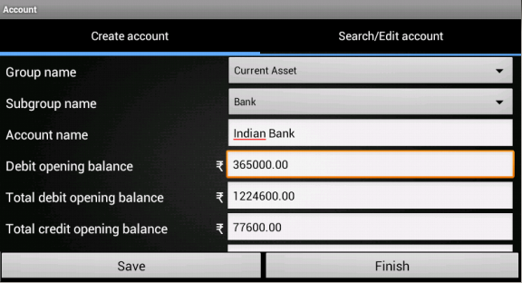
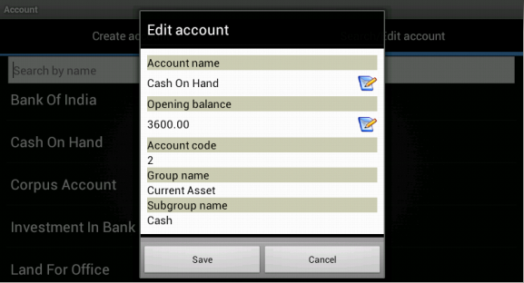

.. toctree::
   :numbered:

Account management
==================
* Account management covers three major parts ie. create,search, edit and delete account.

* Go to ``create account`` which is the first menu by default.

Save account code preference
----------------------------

* Alert box will appear on the screen (See below figure), where user need to specify 
  account code type ie. manual or automated.
  
.. image:: images/account_code_pref.png
   :align: center	
   :height: 200pt
   :width: 350pt
  
* Check the check-box if manual account code has to be provided or leave it as it is, for automatic
  account code generation. Click on ``Confirm`` button to save this preference. 
  Remember, this is one time activity. Later, this alert-box will 
  never appear, it will follow the saved preference(manual or automatic).

How to start?
-------------

* We can start with ABT by creating minimum of two accounts. 

How to create an account?
-------------------------

* In the create account you have to choose your ``group`` and ``sub group``. See below table:
  
	+------------------------------+-------------------------------------+
	| Group	                       |    Sub-Group                        |
	+==============================+=====================================+
	|Capital/Corpus                |  - No subgroup                      |
	+                              +  - Create new subgroup              +
	|                              |                                     |
	+------------------------------+-------------------------------------+             
	|Current Asset                 |  - No subgroup                      |
	+		               +  - Bank                             +
	|                              |  - Cash                             |
	+                              +  - Inventory                        +
	|                              |  - Loan and Advance                 |
	+		               +  - Sundry Debtors                   +
	| 		               |  - Create new subgroup              |
	+------------------------------+-------------------------------------+
	|Current Liability             |  - No subgroup                      |
	+		               +  - Provision                        +
	|                              |  - Sundry Creditors for Expense     |
	+                              +  - Sundry Creditors for Purchase    +
	|                              |  - Loan abd Advance                 |
	+                              +  - Create new subgroup              +
	|                              |                                     |
	+------------------------------+-------------------------------------+
	|Direct Income                 |  - No subgroup                      |
	+                              +  - Create new subgroup              +
	|                              |                                     |
	+------------------------------+-------------------------------------+  
	|Direct Expense                |  - No subgroup                      |
	+                              +  - Create new subgroup              +
	|                              |                                     |
	+------------------------------+-------------------------------------+  
	|Fixed Assest                  |  - No subgroup                      |
	+		               +  - Building                         +
	|                              |  - Furniture                        |
	+                              +  - Land                             +
	|                              |  - Plant and Machinery              |
	+                              +  - Create new subgroup              +
	|                              |                                     |
	+------------------------------+-------------------------------------+
	|Indirect Income               |  - No subgroup                      |
	+                              +  - Create new subgroup              +
	|                              |                                     |
	+------------------------------+-------------------------------------+
	|Indirect Expense              |  - No subgroup                      |
	+                              +  - Create new subgroup              +
	|                              |                                     |
	+------------------------------+-------------------------------------+
	|Investment                    |  - No subgroup                      |
	+		               +  - Investment in Share & Debentures +
	|                              |  - Investment in Bank Deposits      |
	+                              +  - Create new subgroup              +
	|                              |                                     |
	+------------------------------+-------------------------------------+
	|Loans(Asset)                  |  - No subgroup                      |
	+                              +  - Create new subgroup              +
	|                              |                                     |
	+------------------------------+-------------------------------------+
	|Loans(Liability)              |  - No subgroup                      |
	+                              +  - Secured                          +
        |                              |  - Unsecured                        |
	+                              +  - Create new subgroup              +
        |                              |                                     |
	+------------------------------+-------------------------------------+
	|Reserves                      |  - No subgroup                      |
	+                              +  - Create new subgroup              +
	|                              |                                     |
	+------------------------------+-------------------------------------+
	|Miscellaneous Expense(Asset)  |  - No subgroup                      |
	+                              +  - Create new subgroup              +
	|                              |                                     |
	+------------------------------+-------------------------------------+
	

* Create accounts under respective ``group`` and ``subgroup`` (specified in the above table) with opening balance(it can be ``0.00``).
  This will automatically update the ``total debit opening balance, total credit opening balance`` and ``difference`` between them.
  

  
* Press ``Save`` to save an account.

* ``Finish`` button will take to the Master menu page. 
 
Example
-------
Before passing any transaction we are now going to create an account.
( Cash on hand and Bank account).

* Go to Create account - Group name is **current asset**

* Sub group is **cash**

* Account name could be **Cash on hand**

* Account code is an auto generation code which has to be specified at the time 
  of creating an organization or user can give the account code.
  
* Opening balance can be mentioned during the time of create account. If you 
  are setting up a new business and is your first accounting package you need 
  to enter opening balance. If you are closing a previous book-keeping system, 
  the closing position (Trial Balance) will be the Opening Balance.

* Likewise, for creating ``bank`` account group name is again ``current asset``, 
  sub group is ``bank`` and the bank name would be the name of the bank. 
  An organization can have any number of banks. Finally, the bank balance 
  will show the consolidated amount in the balance sheet.
	
  
Search/Edit account
-------------------

* Select ``Edit account`` tab.

* It displays the ``list`` of account names along with their opening balance.

.. image:: images/search_account.png
   :name: ABT main page
   :align: center
   :height: 200pt
   :width: 350pt

* If ``manual account code`` was checked, there will be ``two`` options ie. Search by account name or code. Otherwise, only one option ie. search by account name.
	
* User can Edit/Delete the selected account name from the list ,only if that account has no transactions.

* **Edit account** dailog will display complete information about respective account as shown in figure. Only account name and opening balance fields are editable. Press ``Save`` to save the changes.

	  
* **Note**: Opening balance field is not editable, if account comes under the following groups: ``Direct Income``, ``Direct Expense``, ``Indirect Income`` and ``Indirect Expense``.
	
* Press **Delete account** to delete the account. Accounts under transaction cannot be deleted.
