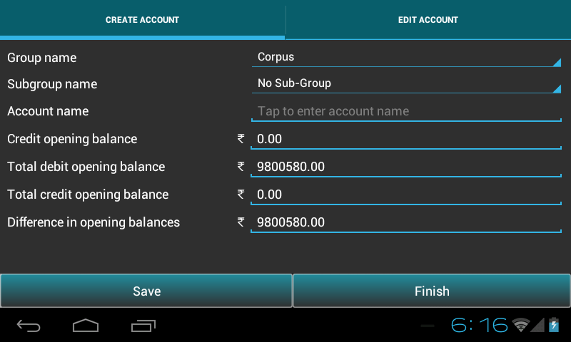
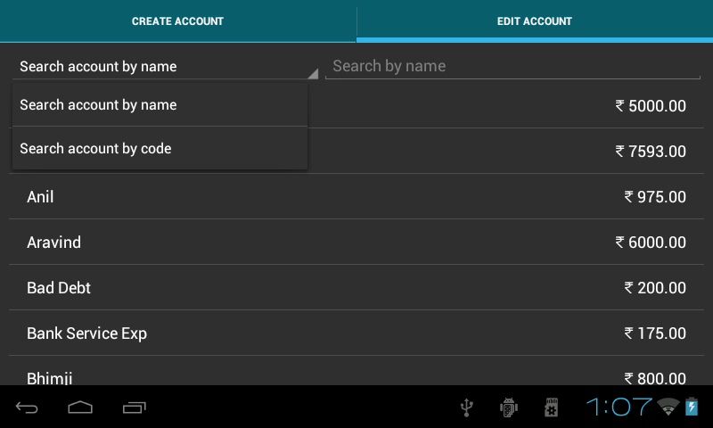

.. toctree::
   :numbered:

Account management
==================
* Account management covers three major parts ie. Create,Search and Edit/Delete account .

Create account
--------------

* Go to ``Master menu`` > ``Create account``.

* Create an account under respective ``group`` and ``subgroup`` with an
  opening balance. This will automatically update the ``total debit opening balance, 
  total credit opening balance`` and ``difference`` between them.

	
* Press ``Save`` to save an account.

* ``Finish`` button will take to the Master menu page.

  
Search/Edit account
-------------------

* Select ``Search/Edit account`` tab.

* It displays ``list`` of all account names.

* If ``manual account code`` was checked in Preferences, there will be ``two`` options ie. Search by account name and code. Otherwise,search by account name.

.. image:: images/search_acc.png
	   :name: ABT main page
	   :align: center
	   :height: 200pt
   	   :width: 350pt
	
* User can Edit/Delete select account name by selecting name from the list.

* **Edit account** will display complete information about respective account as shown in fig.. Only account name and opening balance fields are editable. Press ``Save`` to save the changes.

.. image:: images/edit_account.png
   :name: ABT main page
   :align: center	
   :height: 200pt
   :width: 350pt	
	  
* **Note**: Opening balance field is not editable, if account comes under group ``Direct Income``, ``Direct Expense``, ``Indirect Income`` and ``Indirect Expense`` due to its ``zero`` opening balance.
	
* Press **Delete account** to delete the account. Account having opening balance or under transaction cannot be deleted.
