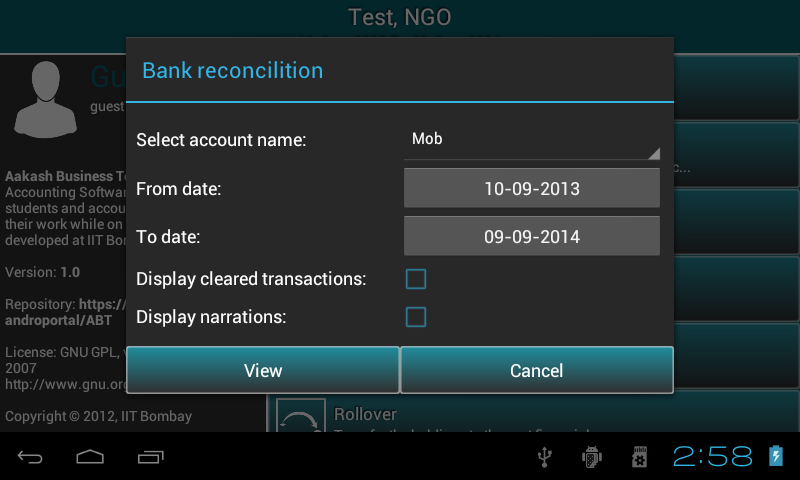

.. toctree::
   :numbered:

Bank reconciliation
===================

* Go to ``Master menu`` > ``Bank Reconciliation``.
  
* It will pop up a ``dialog box`` (see fig.).
  
* Select ``Account name`` from the ``dropdown`` for which Bank Reconciliation need to be done .
      
* ``From date`` and ``To date``, by default it is organisation's financial from date and to date. Change date as per the requirement.
      
* Check the first check box to view cleared+uncleared transactions and second one to view transactions with ``narrations``.
      

  	  
* Press ``View``.
  
* It will display all transactions(cleared + uncleared).All the cleared transactions for specified period and all uncleared transactions from the very 
  first day of the financial year to the last day of the specified period..
  
.. image:: images/bank_reconciliation.png
   :name: ABT main page
   :align: center
   :height: 200pt
   :width: 350pt
  	
* ``Total Debit`` & ``Total Credit`` in the last row of the table.
	    	
* Bank Reconciliation Statement is located at the bottom of the table.
  
.. image:: images/bank_statement.png
   :name: ABT main page
   :align: center
   :height: 200pt
   :width: 350pt
   
* In options menu two features are provided: export report in PDF or CSV format.
