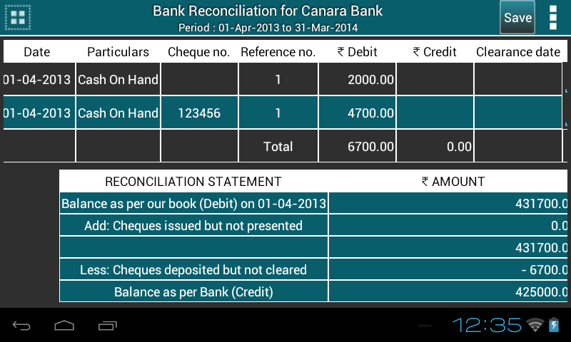

.. toctree::
   :numbered:

Bank reconciliation
===================

* When the user clicks on the Bank Reconciliation Statement under Masters menu, 
  it pops up a dialog box.
  
.. image:: images/bank_reco_before.png
   :name: ABT main page
   :align: center
   :height: 200pt
   :width: 350pt
  
* A list of ``bank account`` names will be populated. The user selects one of the 
  account names displayed and gives the ``from date`` and ``to date`` i.e the time 
  period. By default it is organisation's financial from date and to date. 
  Change date as per the requirement.
      
* Check the first check box to view ``cleared+uncleared`` transactions and second 
  one to view transactions with ``narrations``.
  	  
* Press ``View``.

* A Ledger for that period for the selected account will be displayed to the 
  user with the fields: Date, Particulars, Reference Number, Debit Amount, 
  Credit Amount, Clearance date & Memo. This shall consist all the 
  reconciled transactions with the clearance date and not-reconciled transactions 
  along with all not-reconciled transactions from the start of the 
  organisation (i.e start date of the company) to the entered ``to date``.
  

  	
* ``Total Debit`` & ``Total Credit`` are displayed in the last row of the table.
	    	
* Bank Reconciliation Statement is located at the bottom of the table.
  
.. image:: images/bank_statement.png
   :name: ABT main page
   :align: center
   :height: 200pt
   :width: 350pt
  
* If the user wishes to reconcile now, he clicks the ``Clearance date`` column. 
  The clearance date field and memo are the ``Text input`` areas for the user to 
  enter valid data.
  
* The user enters the date and some text in the memo (if he wishes to) and 
  clicks on ``Save`` button(located at the title bar).
  
* There are 3 conditions to decide if the transaction has to be reconciled or not.

  **Condition 1:** If clearance date has been entered and memo field is empty, 
  the transaction is cleared i.e reconciled.
  **Condition 2:** If clearance date has NOT been entered by the user, then, this 
  transaction will be reconciled in the future.

  On clicking ``Save``, the transactions which fall into Condition 1 will be the
  only ones which will be reconciled.

* So the ``Bank Reconciliation Statement`` will get updated automatically.
   
* Click on the table row to see the details of the transaction. In accounting 
  terms this fuctionality is called ``Drilldown``.
   
* In options menu two features are provided: export report in PDF or CSV format.

* To change the input informations, user can click on button present 
  in top-left corner of the screen.
