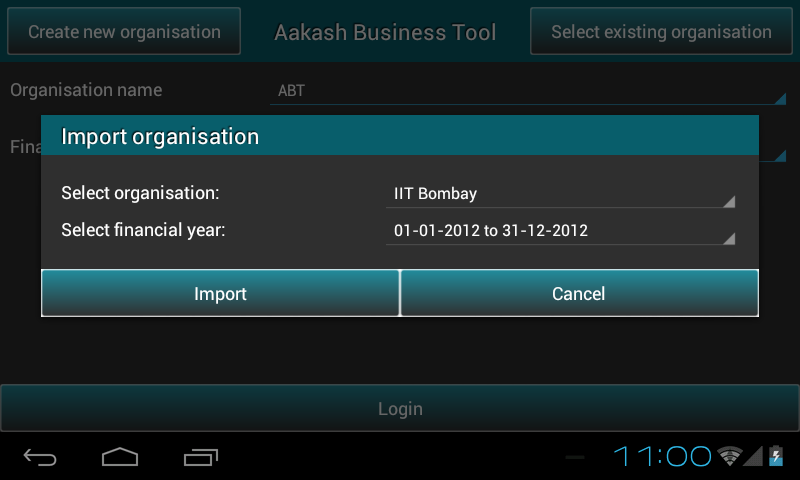

.. toctree::
   :numbered:

Export/Import organisation
==========================

Export organisation
-------------------

* Go to ``Master menu`` > ``Export organisation``.

* As the user clicks on ``Export organisation``, it prompts the location where 
  the organisation data/backup is exported.

* Location of the exported data : ``/mnt/sdcard/export``.

Import organisation
-------------------

* To import same organisation in another tablet just copy ``export`` folder
  to internal storage space(/mnt/sdcard) of that device, provided ``ABT`` is 
  installed.

* ``Options menu`` or left side ``drawer`` present in the first page of ``ABT`` 
  include **import organisation** option.

.. image:: images/drawer_options.png
   :align: center
   :height: 200pt
   :width: 350pt		

* Just click on ``Import organisation``, it will show all available exported organisation 
  names and respected financial years to import.

* Select organisation name and it's financial year which you would like to 
  import and click on ``Import`` button.

 
