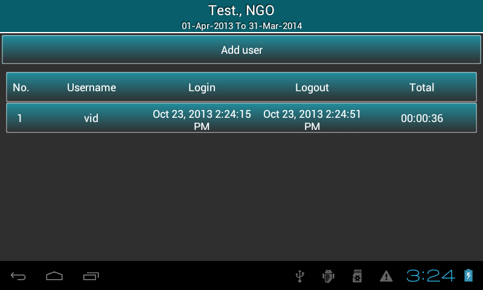
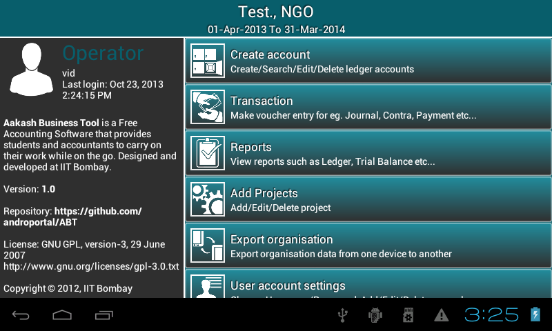

.. toctree::
   :numbered:

Master menu
===========

Aakash Business Tool's master menu includes below options:

**Create account**
	* Create accounts under respective ``group`` and ``subgroup`` with opening balance(it can be ``0.00``).
	* Search/Edit/Delete account.

**Transaction**
	* ``Record`` transaction in ABT.
	* ``Search/Edit/Clone/Delete`` transaction.

**Reports**
	* View different types of reports such as ``Ledger, Trial Balance, Project Statement, Cash Flow, Balance Sheet, Profit & Loss/Income & Expenditure``.
	
**Bank Reconciliation**
	*  Set clearance date for cleared transaction and view ``Bank Reconciliation`` statement.

**Preferences**
	* User can ``Edit/Delete organisation details`` and ``Add/Edit/Delete project name``.

**Rollover**
	* Transfer the holdings to the next financial year.

**Export organisation**
	* Export organisation data from one tablet to another.

**User User account settings**
	* Set new username and password.
	* Create new user role.

**Help**
	* How to use ABT

Guest
-----

**Rights of Guest** :

1. Except ``User account settings``,  **guest** can access all other options.
   
Admin
-----

**Rights of Admin** :

1. **Admin** have access to all the above options.

2. As ``User account settings`` option is selected, it prompts a dialog with three options ie. ``Change username``, ``Change password`` (to change own username and password) and ``add user``.

.. image:: images/user_settings.png
   :name: ABT main page
   :align: center
   :height: 200pt
   :width: 350pt
   

3. As ``add user`` is clicked, all the details about last login and logout time of manager and operator are displayed in the
   list as per the seleted radio button ie. manager or operator.

3. Admin can add user ie. manager or operator using add user button.

4. Admin can change username or password of any user by clicking the respective user row from the list .

   
Manager
-------
.. image:: images/manager_master.png
   :name: ABT main page
   :align: center
   :height: 200pt
   :width: 350pt

**Rights of Manager** :

1. Except ``rollover`` and ``delete existing organisation``, **manager** can access all other options.

2. As ``User account settings`` option is selected, it prompts a dialog with three options ie. ``Change username``, ``Change password`` (to change own username and password) and ``add user``.
3. As ``add user`` is clicked, all the details about last login and logout time of operator are displayed in the
   list.

4. Manager can add operator using add user button.
5. Manager can change username or password of operator by clicking the respective user row from the list .
   
Operator
--------

**Rights of Operator** :

1. **Operator** has access to ``Create account, Transaction, all reports except Income & Expenditure/Profit & Loss, Add projects, User account settings, Export organisation and Help``.

	

