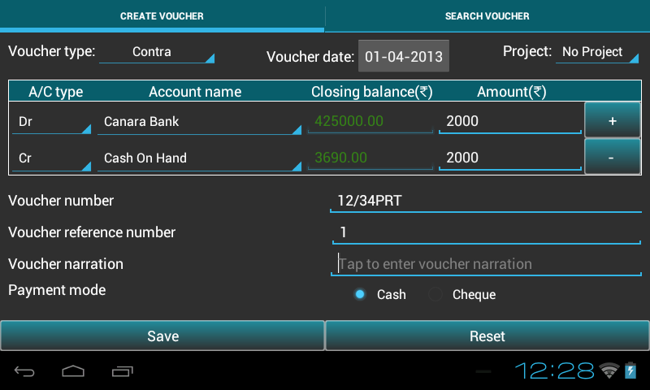

.. toctree::
   :numbered:

======================
Transaction management
======================
* This chapter provides guidence to ``add/search/edit/copy/delete``
  transaction.

* Go to ``Master menu`` >> ``Create voucher``.

How to pass a transaction
-------------------------
* Below table will help the user to understand, ``voucher types`` and
  their respective accounts as per rule:

	+------------------------------+-------------------------------------+----------------------------------------+
	|Voucher type                  |   Accounts(dr)                      |	Accounts(cr)			      |
	|                              |                                     |                                        |
	+==============================+=====================================+========================================+
	|Contra                        |    subgroup(Cash,Bank)              |   subgroup(Cash,Bank)                  |
	+------------------------------+-------------------------------------+----------------------------------------+
	|Journal                       |    **except** subgroup(Cash,Bank)   |   **except** subgroup(Cash,Bank)       |
	+------------------------------+-------------------------------------+----------------------------------------+             
	|Receivable                    |    subgroup(Cash,Bank)              |   **except** subgroup(Cash,Bank)       |
	+------------------------------+-------------------------------------+----------------------------------------+  
	|Payment                       |    **except** subgroup(Cash,Bank)   |   subgroup(Cash,Bank)                  |
	+------------------------------+-------------------------------------+----------------------------------------+   
	|Debit Note                    |subgroup(Sundry Creditors for Expense|group(Direct Income,Indirect Expense,   |
	+			       +     ,Sundry Creditors for Purchase) +   Fixed Assets)                        +
	|                              |                                     |                                        |
	+------------------------------+-------------------------------------+----------------------------------------+
	|Credit Note                   |groupname(Direct Income,Indirect     |  subgroup(Sundry Debtors)              |
	+			       +	Income)                      +                                        +
	|                              |                                     |                                        |
	+------------------------------+-------------------------------------+----------------------------------------+
	|Sales                         | subgroup(Cash,Bank,Sundry Debtors)  |groupname(Direct Income,Indirect Income)|
	+------------------------------+-------------------------------------+----------------------------------------+   
	|Purchase                      |groupname(Direct Expense,Indirect    |subgroup(Sundry Creditors for Expense,  |
	+                              +    Expense)                         +Sundry Creditors for Purchase,Bank,Cash)+
	|                              |                                     |                                        |
	+------------------------------+-------------------------------------+----------------------------------------+
	|Sales Return                  |groupname(Direct Expense,Indirect    |subgroup(Sundry Debtors)                |
	+                              +         Expense)                    +                                        +
	|                              |                                     |                                        |
	+------------------------------+-------------------------------------+----------------------------------------+
	|Purchase Returns              |subgroup(Sundry Creditors for Expense|groupname(Direct Income,Indirect        |
	+                              +     ,Sundry Creditors for Purchase) +        Income)                         +
	|                              |                                     |                                        |
	+------------------------------+-------------------------------------+----------------------------------------+   
	
	
* Here, on this page we can record transactions in ABT. 

* It has been designed with user-friendliness in mind, with a default
  chart of accounts as a starting point. However, you have to create
  at least two accounts to start any transaction. It also offers every
  opportunity for creating your own user-defined variations.

* So, Let us start creating a new voucher. 

* Select the type of transaction from the dropdown list of Voucher
  type. ``Type`` of transaction can be Contra, Journal, Payment,
  Receipt, Debit Note, Credit Note, Sales, Sales Return, Purchase,
  Purchase Return.
	
.. image:: images/voucher_type.png
   :align: center
   :height: 200pt
   :width: 350pt

* Voucher Date - date on which the transaction is happened.

* **Note**: ABT sets financial date as Voucher date, if no transaction
  is recorded before. If any transaction is previously recorded,it
  sets the voucher date of the previous transaction of the respective
  voucher type.  If the date is changed, it updates the by default
  date or previous date with the new date.

* Project - The project module is organized with project-based work processes 
  in mind. This module is also closely integrated with other modules in the 
  program. The Project register can be opened by going to Ledger -Select 
  project name- View.
  
* ABT populates drop down of account name by Voucher type rule. Select
  the Account name for Dr and Cr side. It will automatically show the
  closing balances for both the account name. Debit balance are
  highlighted in Green color and Credit balances are highlighted in
  Red color.
  
* Default focus helps you make voucher entry more efficient. For
  example, If you register a journal item in journal entry, the
  setting will guide you to the correct field. This is set based on
  the Accounting Principles, ``Debit what comes in; credit what goes
  out, Debit the receiver; Credit the Giver, Debit all Expenses and
  losses; Credit all incomes and gains``.
  
* This also helps in selecting multiple debit or credit sides using
  ``plus`` button.
 
* Amount - enter the amount.

* Now, add Voucher number and Voucher reference number. Voucher number
  must be unique as vouchers are meant for different purposes. There
  is difference between Voucher number and Voucher reference
  number. There can be many vouchers with same voucher reference
  number.

* Voucher Narration is also a mandatory field. 

* Payment mode - There are 2 options to make payment: Cheque or
  Cash. If you select Cheque option, Cheque number need to be
  filled. Payment mode is not available for vouchers Debit Note,
  Credit Note and Journal.

* Press ``Save`` to save transaction. The closing balance gets updated
  as the voucher is saved.

* After saving transaction it resets all the fields automatically.
   
* You can change the voucher type if you want to make different voucher entries.

* Press ``Reset`` to clear all fields.

* To indicate the transfer of funds from cash to bank, bank to bank
  and bank to cash **contra** type is used.
 
Search/Edit/Clone/Delete Transaction
------------------------------------

* To manage transaction select ``Search voucher`` tab. Depending on
  the Voucher Type selected, we get the list of created vouchers in
  table.
	
* You can see the financial period at the top. 

.. image:: images/search_voucher.png
   :align: center
   :height: 200pt
   :width: 350pt

* Tap on the Search icon, at the top middle of the screen. 

.. image:: images/search_voucher_by.png
   :align: center
   :height: 200pt
   :width: 350pt

* You can search vouchers in a number of ways such as Voucher
  reference number, Date, Narration, Voucher number, Account name and
  Voucher type.

.. image:: images/search_voucher_by_options.png
   :align: center
   :height: 200pt
   :width: 350pt

* Select option, give the input and press ``View`` button to view the
  transaction.
  
* Long press on the row on which you want to perform any of these
  tasks: Edit voucher, Copy voucher and Delete voucher.

.. image:: images/edit_voucher_alert.png
   :align: center
   :height: 200pt
   :width: 350pt

* Tap on ``Edit Voucher`` option to edit the selected voucher. It will
  take you to the Edit Voucher tab. Except Voucher number and Voucher
  type, all other fields are editable.

.. image:: images/edit_voucher.png
   :align: center
   :height: 200pt
   :width: 350pt

* Select ``Copy voucher`` option, to make a copy of the voucher. Copy
  voucher duplicates information on an existing transaction, to create
  a new one with all the fields pre-filled for the same voucher type.
  There is an option to ``keep or change`` the existing field
  values. It is mandatory to change Voucher Number as this is a unique
  parameter. Change the ``Cheque No`` as cheque number differs in
  different transactions.  Press ``Save`` to save the transaction.

.. image:: images/clone_voucher.png
   :align: center
   :height: 200pt
   :width: 350pt

* ``Delete voucher``: Tap on ``Yes`` to delete the voucher. 

