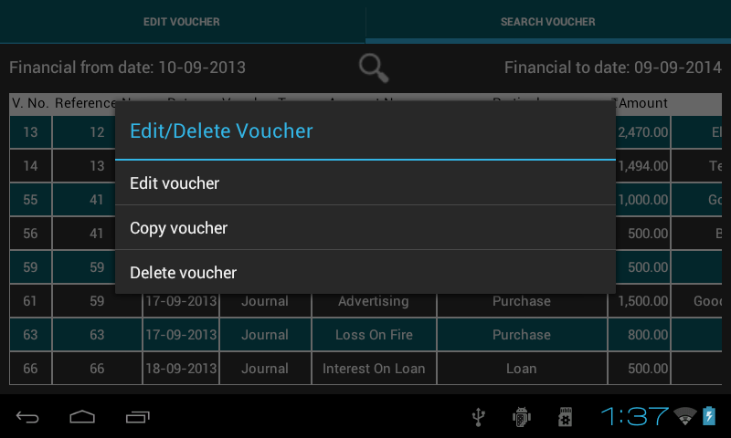
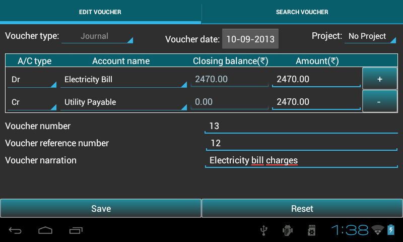

.. toctree::
   :numbered:

======================
Transaction management
======================
* This chapter provides guidence to ``add/search/edit/copy/delete`` transaction.

* Go to ``Master menu`` > ``Create voucher``.

How to pass a transaction
-------------------------
Below table will help the user to understand, ``voucher types`` and their respective accounts as per rule:

	+------------------------------+-------------------------------------+----------------------------------------+
	|Voucher type                  |   Accounts(dr)                      |	Accounts(cr)			      |
	|                              |                                     |                                        |
	+==============================+=====================================+========================================+
	|Contra                        |    subgroup(Cash,Bank)              |   subgroup(Cash,Bank)                  |
	+------------------------------+-------------------------------------+----------------------------------------+
	|Journal                       |    **except** subgroup(Cash,Bank)   |   **except** subgroup(Cash,Bank)       |
	+------------------------------+-------------------------------------+----------------------------------------+             
	|Receivable                    |    subgroup(Cash,Bank)              |   **except** subgroup(Cash,Bank)       |
	+------------------------------+-------------------------------------+----------------------------------------+  
	|Payment                       |    **except** subgroup(Cash,Bank)   |   subgroup(Cash,Bank)                  |
	+------------------------------+-------------------------------------+----------------------------------------+   
	|Debit Note                    |subgroup(Sundry Creditors for Expense|group(Direct Income,Indirect Expense,   |
	+			       +     ,Sundry Creditors for Purchase) +    Fixed Assets)                       +
	|                              |                                     |                                        |
	+------------------------------+-------------------------------------+----------------------------------------+
	|Credit Note                   |groupname(Direct Income,Indirect     |  subgroup(Sundry Debtors)              |
	+			       +	Income)                      +                                        +
	|                              |                                     |                                        |
	+------------------------------+-------------------------------------+----------------------------------------+
	|Sales                         | subgroup(Cash,Bank,Sundry Debtors)  |groupname(Direct Income,Indirect Income)|
	+------------------------------+-------------------------------------+----------------------------------------+   
	|Purchase                      |groupname(Direct Expense,Indirect    |subgroup(Sundry Creditors for Expense,  |
	+                              +    Expense)                         +Sundry Creditors for Purchase,Bank,Cash)+
	|                              |                                     |                                        |
	+------------------------------+-------------------------------------+----------------------------------------+
	|Sales Return                  |groupname(Direct Expense,Indirect    |subgroup(Sundry Debtors)                |
	+                              +         Expense)                    +                                        +
	|                              |                                     |                                        |
	+------------------------------+-------------------------------------+----------------------------------------+
	|Purchase Returns              |subgroup(Sundry Creditors for Expense|groupname(Direct Income,Indirect        |
	+                              +     ,Sundry Creditors for Purchase) +        Income)                         +
	|                              |                                     |                                        |
	+------------------------------+-------------------------------------+----------------------------------------+   
	
	
To record transaction in ``ABT``, select ``Create voucher`` tab (see bellow fig.) and follow the below steps:

.. image:: images/create_voucher.png
   :name: ABT main page
   :align: center
   :height: 200pt
   :width: 350pt

* The journal entry has been designed with user-friendliness in mind, with a 
  default chart of accounts as a starting point. However, you have to create 
  at least two accounts to start any transaction. It also offers every 
  opportunity for creating your own user-defined variations.

* Select the mode of transaction from the list of voucher type. ``Mode`` of transaction 
  can be Contra, Journal, Payment, Receipt, Debit Note, Credit Note, Sales, 
  Sales Return, Purchase, Purchase Return.
	
.. image:: images/voucher_type.png
   :name: ABT main page
   :align: center
   :height: 200pt
   :width: 350pt

* Voucher Date - date on which the transaction is happened.

* **Note**: ABT sets financial date as Voucher date, if no transaction is recorded before. 
  If any transaction is previously recorded,it sets the voucher date of the previous transaction 
  of the respective voucher type. If the date is changed, it updates the bydefault date or previous 
  date with the new date. 

* Project - The project module is organized with project-based work processes 
  in mind. This module is also closely integrated with other modules in the 
  program. The Project register can be opened by going to Ledger -Select 
  project name- View.
  
* Select the Account name for Dr and Cr side. It will automatically show the 
  closing balances for both the account name. Debit balance are highlighted 
  in Green color and Credit balances are highlighted in Red color.   
  
* Default focus helps you make voucher entry more efficient. For example, If you register 
  a journal item in journal entry, the setting will guide you to the correct 
  field. This is set based on the Accounting Principles, ``Debit what comes in; 
  credit what goes out, Debit the receiver; Credit the Giver, Debit All 
  Expenses and losses; Credit all incomes and gains``.
  
* This also helps in selecting multiple debit or credit sides using ``plus`` button.
 
* Amount - enter the amount.

* Voucher number - Its a unique key for all the transaction.

* Voucher Reference number - Many transaction can have a single voucher reference number.

* Voucher Narration - Narration for a particular transaction.

* Press ``Save`` to save transaction.

After saving transaction it resets all the fields automatically.
   
You can change the voucher type if you want to make different voucher entries.

Press ``Reset`` to clear all fields.

To indicate the transfer of funds from cash to bank, bank to bank and bank to cash 
**contra** type is used.
 
Search/Edit/Clone/Delete Transaction
------------------------------------

* To ``Edit/Clone/Delete`` transaction select ``Search voucher`` tab.

.. image:: images/search_voucher.png
   :name: ABT main page
   :align: center
   :height: 200pt
   :width: 350pt

.. image:: images/search_voucher_by.png
	   :align: center
	   :height: 200pt
   	   :width: 350pt

* Here Search option is given to search a particular transaction or group of 
  transactions by ``Voucher reference number, Date, Narration, Voucher number, Account name or Voucher type``. 

.. image:: images/search_voucher_by_options.png
	   :align: center
	   :height: 200pt
   	   :width: 350pt

* You have several opportunities to view figures based on period
  department and project accounting, key figures and more.

* Select option, give the input and press ``View`` button to view the transaction.
  
* Click table ``row`` to Edit/Copy/Delete the transactions.

* In **Edit voucher**, all fields are editable except voucher type and voucher number. 
  Press ``Save`` to save the changes. 

* **Copy voucher** duplicates information on an existing transaction, to create 
  a new one with all the fields pre-filled for the same voucher type. 
  There is an option to ``keep or change`` the existing field values. **Note**: 
  Change the voucher number, as this is an unique parameter. 
  Press ``Save`` to save the transaction. 

.. image:: images/clone_voucher.png
   :align: center
   :height: 200pt
   :width: 350pt

* **Delete voucher**: Press ``Delete`` to delete the transaction.

