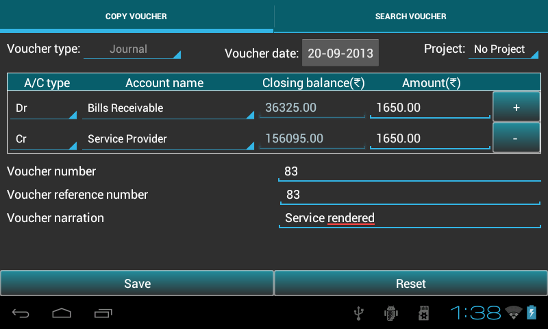

.. toctree::
   :numbered:

======================
Transaction management
======================
* This chapter provides guidence to ``add/search/edit/clone/delete`` transaction.

* Go to ``Master menu`` > ``Create voucher``.

Record Transaction
------------------
* Below table will help the user to understand, ``voucher types`` and their respective accounts as per rule:

	+------------------------------+-------------------------------------+----------------------------------------+
	|Voucher type                  |   Accounts(dr)                      |	Accounts(cr)			      |
	|                              |                                     |                                        |
	+==============================+=====================================+========================================+
	|Contra                        |    subgroup(Cash,Bank)              |   subgroup(Cash,Bank)                  |
	+------------------------------+-------------------------------------+----------------------------------------+
	|Journal                       |    **except** subgroup(Cash,Bank)   |   **except** subgroup(Cash,Bank)       |
	+------------------------------+-------------------------------------+----------------------------------------+             
	|Receivable                    |    subgroup(Cash,Bank)              |   **except** subgroup(Cash,Bank)       |
	+------------------------------+-------------------------------------+----------------------------------------+  
	|Payment                       |    **except** subgroup(Cash,Bank)   |   subgroup(Cash,Bank)                  |
	+------------------------------+-------------------------------------+----------------------------------------+   
	|Debit Note                    |subgroup(Sundry Creditors for Expense|group(Direct Income,Indirect Expense,   |
	+			       +     ,Sundry Creditors for Purchase) +    Fixed Assets)                       +
	|                              |                                     |                                        |
	+------------------------------+-------------------------------------+----------------------------------------+
	|Credit Note                   |groupname(Direct Income,Indirect     |  subgroup(Sundry Debtors)              |
	+			       +	Income)                      +                                        +
	|                              |                                     |                                        |
	+------------------------------+-------------------------------------+----------------------------------------+
	|Sales                         | subgroup(Cash,Bank,Sundry Debtors)  |groupname(Direct Income,Indirect Income)|
	+------------------------------+-------------------------------------+----------------------------------------+   
	|Purchase                      |groupname(Direct Expense,Indirect    |subgroup(Sundry Creditors for Expense,  |
	+                              +    Expense)                         +Sundry Creditors for Purchase,Bank,Cash)+
	|                              |                                     |                                        |
	+------------------------------+-------------------------------------+----------------------------------------+
	|Sales Return                  |groupname(Direct Expense,Indirect    |subgroup(Sundry Debtors)                |
	+                              +         Expense)                    +                                        +
	|                              |                                     |                                        |
	+------------------------------+-------------------------------------+----------------------------------------+
	|Purchase Returns              |subgroup(Sundry Creditors for Expense|groupname(Direct Income,Indirect        |
	+                              +     ,Sundry Creditors for Purchase) +        Income)                         +
	|                              |                                     |                                        |
	+------------------------------+-------------------------------------+----------------------------------------+   
	
	
* To record transaction in ``ABT``, select ``Create voucher`` (see bellow fig.) tab and follow the below steps:

.. image:: images/create_voucher.png
   :name: ABT main page
   :align: center
   :height: 200pt
   :width: 350pt

* Select the mode of transaction from the list of voucher type.

* ``Mode`` of transaction can be Contra, Journal, Payment, Receipt, Debit Note, Credit Note,Sales, 
  Sales Return, Purchase, Purchase Return.
	
.. image:: images/voucher_type.png
   :name: ABT main page
   :align: center
   :height: 200pt
   :width: 350pt

There should be atleast ``two`` accounts for recording transactions. To get started with,

* Select account ``Type(Dr/Cr)``, ``Account name`` from the dropdown and enter the ``Amount`` in rupees
  and repeat the same until amount gets tallied. Use ``plus`` button for adding new row.
  
* **Note**: ABT populates drop down of account name by voucher type ``rule``. 
  For example, if transaction type is contra, it filters account names that 
  comes under contra and fill them in the drop down.
     
* Closing balance is displayed in between the account name and amount field. It's a read only field.    
 
* Press ``Voucher date`` to set the date of transaction.

* **Note**: ABT sets financial date as Voucher date, if no transaction is recorded before. 
  If any transaction is previously recorded,it sets the voucher date of the previous transaction 
  of the respective voucher type. If the date is changed, it updates the bydefault date or previous 
  date with the new date. 

* Select ``Project name`` from the dropdown for recording transaction if there are any , otherwise select ``No project``.

* Enter ``Voucher code``, ``Voucher reference No.`` or edit the last reference No. and ``Narration``.

* Press ``Save`` to save transaction and ``Reset`` to clear all fields.

* After saving transaction it resets all the fields automatically.
   
* You can change the voucher type if you want to make different voucher entries.
 
Search/Edit/Clone/Delete Transaction
------------------------------------

* To ``Edit/Clone/Delete`` transaction select ``Search voucher`` tab.

* Its displays ``all`` transactions for the complete financial year which comes under ``selected``
  voucher type as shown in figure.

.. image:: images/search_voucher.png
   :name: ABT main page
   :align: center
   :height: 200pt
   :width: 350pt

* Press ``Search`` button (see figure) to search transaction by ``Voucher reference No., Date, Narration, Voucher No., type or Account name`` 
  and press ``View`` button to view the transactions.

.. image:: images/search_voucher_by.png
	   :align: center
	   :height: 200pt
   	   :width: 350pt

* Click table ``row`` to Edit/Clone/Delete the transactions.

.. image:: images/edit_voucher_alert.png
   :align: center
   :height: 200pt
   :width: 350pt

* In **Edit voucher**, all fields are editable. Press ``Save`` to save the changes. 

.. image:: images/edit_voucher.png
   :align: center
   :height: 200pt
   :width: 350pt

* **Clone voucher** duplicates information on an existing transaction, to create a new one with all the fields pre-filled. There is an option to ``keep or change`` the existing field values. Press ``Save`` to save the transaction. 

* **Delete voucher**: Press ``Delete`` to delete the transaction.

