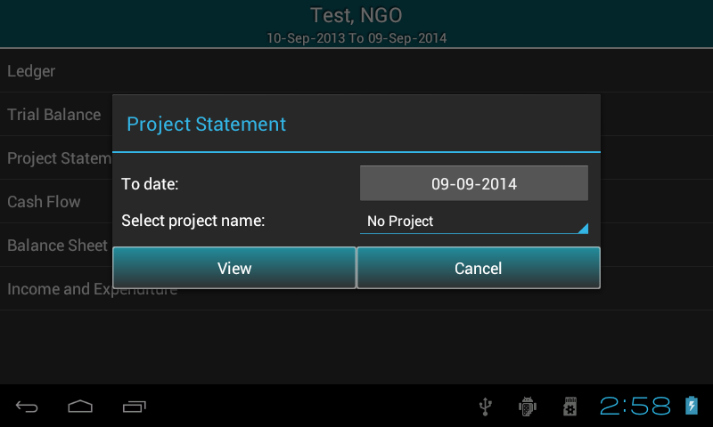
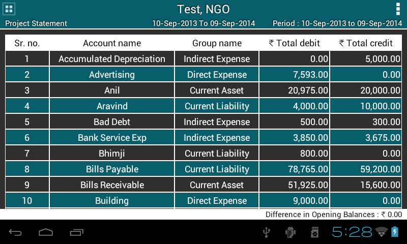
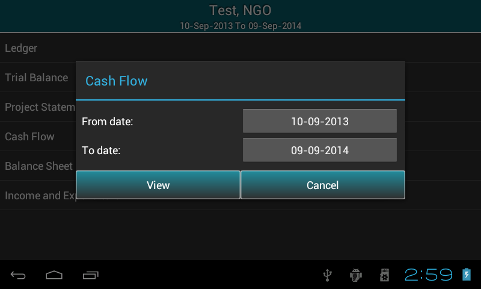
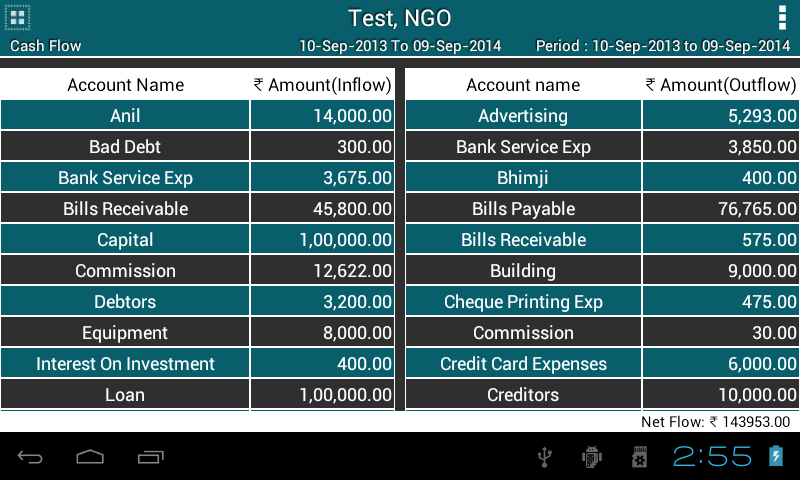
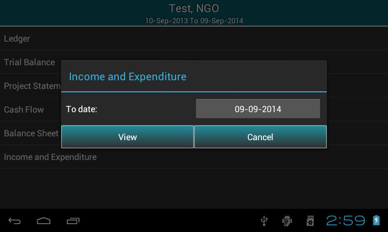

.. toctree::
   :numbered:

Reports
=======

* Go to ``master menu`` >> ``Reports``.

* It displays list of all types of reports . If organisation type is NGO, the list contains Income and Expenditure otherwise Profit and Loss.
  
.. image:: images/report_list.png
   :name: ABT main page
   :align: center
   :height: 200pt
   :width: 350pt

	  	
* Title will display respective organisation information such as name, type and financial year.

* In options menu two features are provided: export report in PDF or CSV format.

.. image:: images/export_pdf.png
   :align: center
   :height: 200pt
   :width: 350pt

* You can also set security to your file.

.. image:: images/file_security.png
   :name: ABT main page
   :align: center
   :height: 200pt
   :width: 350pt

Ledger
----------
Select Ledger option from list, It will pop up a ``dialog box`` (see fig.) which ask’s following information:
  
* Select ``Account name`` from the list for which ledger is to be displayed.

* ``From date`` and ``To date``, by default it is organisation's financial from date and to date. Change date as per the requirement or keep it as it is.

* Check box to view transactions with ``narrations``.

* Select ``Project name`` from the list to view projectwise ledger ,by default it is ``No Project``.

.. image:: images/ledger_before.png
   :name: ABT main page
   :align: center
   :height: 200pt
   :width: 350pt
  	  
* Press ``View``.
  
* It will display ledger for the given period in a tabular format. Opening balance is located at the first row of the table then followed by other details 
  such as transactions, total of transactions, closing balance and grand total .
  
.. image:: images/ledger.png
   :name: ABT main page
   :align: center
   :height: 200pt
   :width: 350pt

Trial Balance
-------------------
* Like Ledger, It will pop up a ``dialog box`` (see fig.) which ask’s following information:
  
* ``To date``, by default it is financial year's to date. Change date as per the requirement or keep it as it is.

* In ABT, there are 3 types of trial balances such as Net, Gross and Extended. Select it from the dropdown.

.. image:: images/trial_before.png
   :name: ABT main page
   :align: center
   :height: 200pt
   :width: 350pt
  	  
* Press ``View``.
  
* It will display Trial Balance for the given period in a tabular format. Difference in Opening Balance is located at the bottom of the screen.
  
.. image:: images/trial_balance.png
   :name: ABT main page
   :align: center
   :height: 200pt
   :width: 350pt

Project Statement
--------------------------
* It will pop up a ``dialog box`` (see fig.) which ask’s following information:
  
* ``To date``, by default it is financial year's to date. Change date as per the requirement or keep it as it is.

* Select ``Project name`` from the dropdown to view projectwise transactions, by default ``No Project`` is selected.

  	  
* Press ``View``.
  
* It will display Project Statement for the given period in a tabular format. Difference in Opening Balance is located at the bottom of the screen.
  

Cash Flow
---------------
* It will pop up a ``dialog box`` (see fig.) which ask’s following information:
  
* ``From date`` and ``To date``, by default it is financial year's from date and to date. Change date as per the requirement or keep it as it is.

  	  
* Press ``View``.
  
* It will display Cash Flow for the given period in a tabular format. Net Flow is located at the bottom of the screen.
  

Balance Sheet
--------------------
* It will pop up a ``dialog box`` (see fig.) which ask’s following information:
  
* ``To date``, by default it is financial year's to date. Change date as per the requirement or keep it as it is.

* In ABT, there are 2 types of balance Sheets such as Conventional(horizontal) and Sources & Application of Funds(vertical). Select it from the dropdown.

.. image:: images/balancesheet_before.png
   :name: ABT main page
   :align: center
   :height: 200pt
   :width: 350pt
  	  
* Press ``View``.
  
* It will display Balance Sheet for the given period in a tabular format. Difference in Opening Balance is located at the bottom of the screen.
  
.. image:: images/balancesheet.png
   :name: ABT main page
   :align: center
   :height: 200pt
   :width: 350pt

Income & Expenditure/Profit & Loss
----------------------------------------------------
* It will pop up a ``dialog box`` (see fig.) which ask’s following information:
  
* ``To date``, by default it is financial year's to date. Change date as per the requirement or keep it as it is.

  	  
* Press ``View``.
  
* It will display Income & Expenditure/Profit & Loss for the given period in a tabular format.
  
.. image:: images/profitloss.png
   :name: ABT main page
   :align: center
   :height: 200pt
   :width: 350pt

