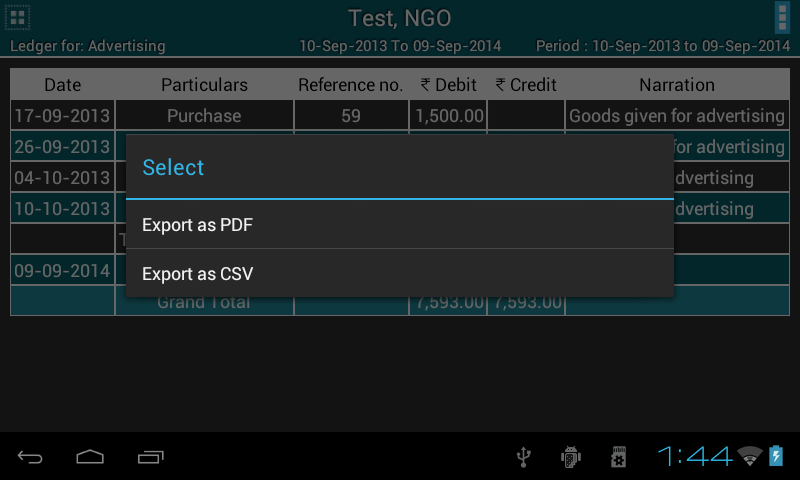
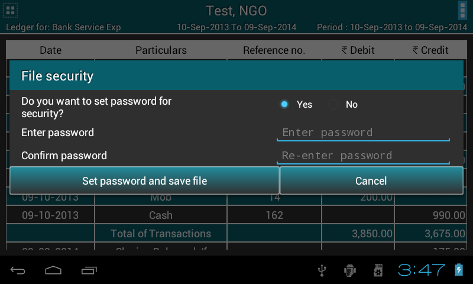
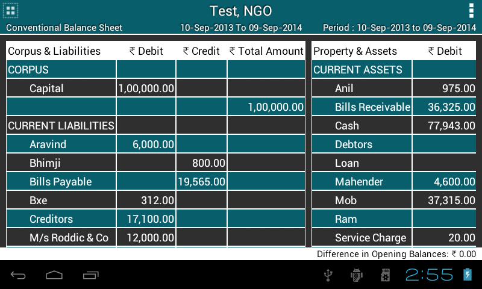

.. toctree::
   :numbered:

Reports
=======

* Go to ``master menu`` >> ``Reports``.

* It displays list of all types of reports provided by ABT. If organisation type is NGO, it shows Income and Expenditure in the list otherwise Profit and Loss.
  
.. image:: images/report_list.png
   :name: ABT main page
   :align: center
   :height: 200pt
   :width: 350pt

	  	
* Title will display respective organisation information such as name, type and financial year.

* Options button is provided to export report in a PDF or CSV format. 

* You can also set security to your file.

Ledger
----------
Select Ledger option from list, It will pop up a ``dialog box`` (see fig.) which ask’s following information:
  
* ``Account name`` for which ledger to be shown. Select account name from the ``dropdown``.

* ``from date`` and ``to date``, by default it is financial year's from date and to date. Change date as per the requirement or keep it as it is.

* Check box to view transactions with ``narrations``.

* ``Project name`` to view projectwise ledger. Select project from the dropdown, by default ``No Project`` is selected.

.. image:: images/ledger_before.png
   :name: ABT main page
   :align: center
   :height: 200pt
   :width: 350pt
  	  
* Press ``View``.
  
* It will display ledger for the given period in a tabular format. Opening balance is located at the first row of the table followed by transactions, with Total of transactions, Closing balance and Grand total at bottom of the table.
  
.. image:: images/ledger.png
   :name: ABT main page
   :align: center
   :height: 200pt
   :width: 350pt

Trial Balance
-------------------
* Like Ledger, It will pop up a ``dialog box`` (see fig.) which ask’s following information:
  
* ``to date``, by default it is financial year's to date. Change date as per the requirement or keep it as it is.

* Trial Balance type. In ABT, there are 3 types of trial balances such as Net, Gross and Extended. Select it from the dropdown.

.. image:: images/trial_before.png
   :name: ABT main page
   :align: center
   :height: 200pt
   :width: 350pt
  	  
* Press ``View``.
  
* It will display Trial Balance for the given period in a tabular format. Difference in Opening Balance is located at the bottom of the screen.
  
.. image:: images/trial_balance.png
   :name: ABT main page
   :align: center
   :height: 200pt
   :width: 350pt

Project Statement
--------------------------
* It will pop up a ``dialog box`` (see fig.) which ask’s following information:
  
* ``to date``, by default it is financial year's to date. Change date as per the requirement or keep it as it is.

* ``Project name`` to view projectwise transactions. Select project from the dropdown, by default ``No Project`` is selected.

.. image:: images/proj_before.png
   :name: ABT main page
   :align: center
   :height: 200pt
   :width: 350pt
  	  
* Press ``View``.
  
* It will display Project Statement for the given period in a tabular format. Difference in Opening Balance is located at the bottom of the screen.
  
.. image:: images/proj_statement.png
   :name: ABT main page
   :align: center
   :height: 200pt
   :width: 350pt

Cash Flow
---------------
* It will pop up a ``dialog box`` (see fig.) which ask’s following information:
  
* ``from date`` and ``to date``, by default it is financial year's from date and to date. Change date as per the requirement or keep it as it is.

.. image:: images/cashflow_before.png
   :name: ABT main page
   :align: center
   :height: 200pt
   :width: 350pt
  	  
* Press ``View``.
  
* It will display Cash Flow for the given period in a tabular format. Net Flow is located at the bottom of the screen.
  
.. image:: images/cashflow.png
   :name: ABT main page
   :align: center
   :height: 200pt
   :width: 350pt

Balance Sheet
--------------------
* It will pop up a ``dialog box`` (see fig.) which ask’s following information:
  
* ``to date``, by default it is financial year's to date. Change date as per the requirement or keep it as it is.

* Balance Sheet type. In ABT, there are 2 types of balance Sheets such as Conventional(horizontal) and Sources & Application of Funds(vertical). Select it from the dropdown.

.. image:: images/balancesheet_before.png
   :name: ABT main page
   :align: center
   :height: 200pt
   :width: 350pt
  	  
* Press ``View``.
  
* It will display Balance Sheet for the given period in a tabular format. Difference in Opening Balance is located at the bottom of the screen.
  

Income & Expenditure/Profit & Loss
----------------------------------------------------
* It will pop up a ``dialog box`` (see fig.) which ask’s following information:
  
* ``to date``, by default it is financial year's to date. Change date as per the requirement or keep it as it is.

.. image:: images/profitloss_before.png
   :name: ABT main page
   :align: center
   :height: 200pt
   :width: 350pt
  	  
* Press ``View``.
  
* It will display Income & Expenditure/Profit & Loss for the given period in a tabular format.
  
.. image:: images/profitloss.png
   :name: ABT main page
   :align: center
   :height: 200pt
   :width: 350pt

