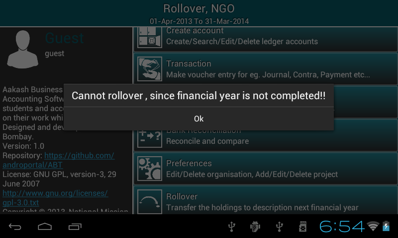
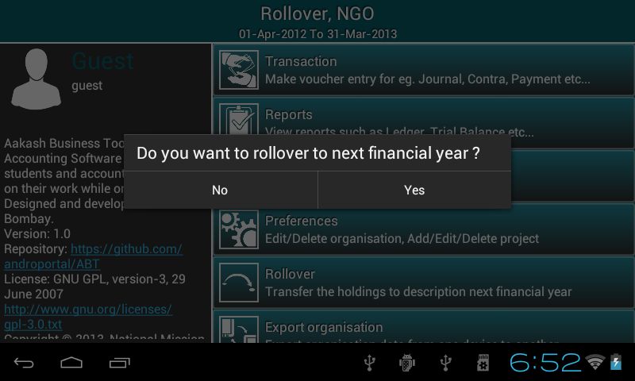
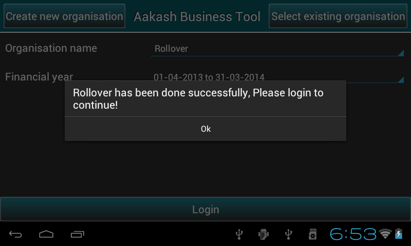
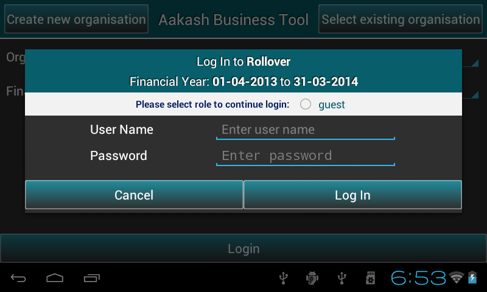
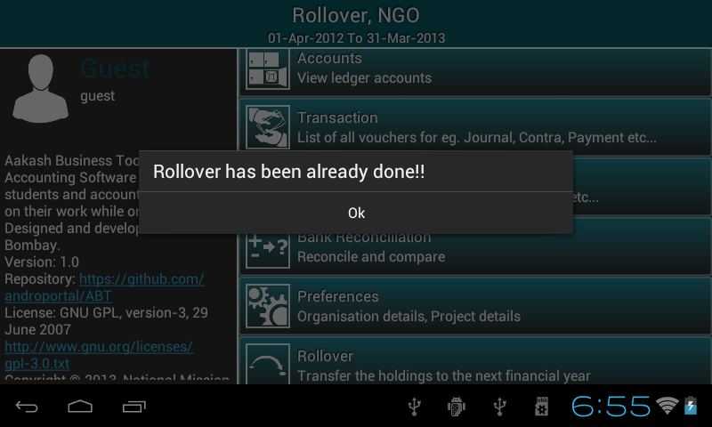
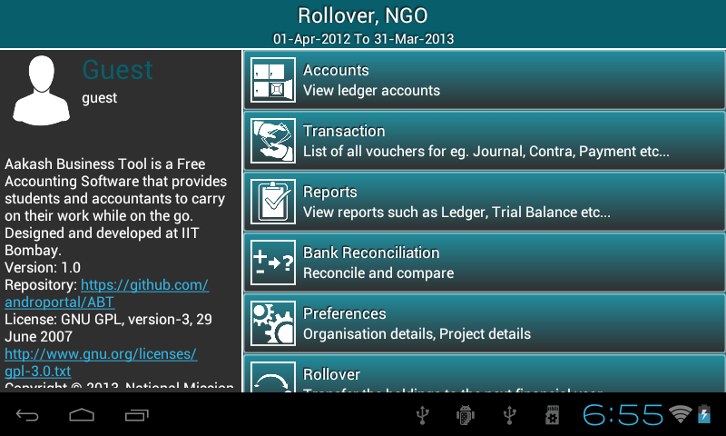

.. toctree::
   :numbered:

Rollover
========
1. Go to ``Master menu``. 

2. You can find ``Rollover`` option.

3. Click on ``Rollover``, it prompts according to following conditions:

* If financial period is not completed then, it prompts ``cannot rollover,
  since financial year is not completed!!``.

 
* If the financial period has completed, it prompts ``Do you want to rollover to next financial year?``.

* If you click ``Yes``, it will prompt ``Rollover has been done successfully, please login to continue``, click ``ok``.

* Now you can login to new financial year.

 

* Rollover will be done only once for particular financial period so, if you click on it again, it prompts ``Rollover has been already done!!``.

4. Please note that after the rollover, your previous year's accounts will get friezed and you are not allowed to make any changes, however you are allowed to view, take reports and update the Bank reconciliation statement.

