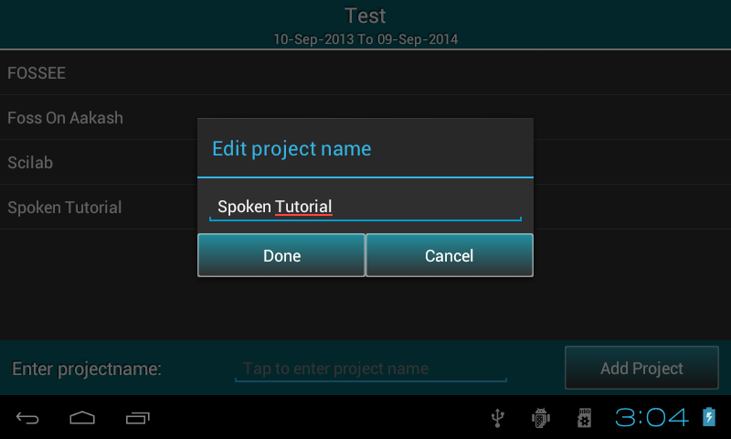

.. toctree::
   :numbered:

Setting up preferences
======================

Select ``Preferences`` option from master menu to edit/delete/reset organisation details or Add/Edit/Delete project.

Edit/delete/reset organisation details
--------------------------------------

* Displays previously saved organisation information, all the fields are editable.

.. image:: images/edit_org.png
   :align: center
   :height: 200pt
   :width: 350pt

* User can edit these fields if required.

* Press ``Save`` to save the changes.

* Press ``Reset`` to clear all the fields.

* Press ``Delete`` button to delete organisation. You can also delete previous financial year of
  the same organisation.

.. image:: images/delete_org.png
   :align: center
   :height: 200pt
   :width: 350pt

Add/edit/delete project
-----------------------

* It displays list of all projects added before.

.. image:: images/project_list.png
   :align: center
   :height: 200pt
   :width: 350pt

* ``Add project`` (see figure) will help to add new project.
	
* Select project name from the list, it displays a popup which give two options such as ``edit`` or ``delete`` project name.

* **Note**: If project has transactions, it can not be deleted.
		

