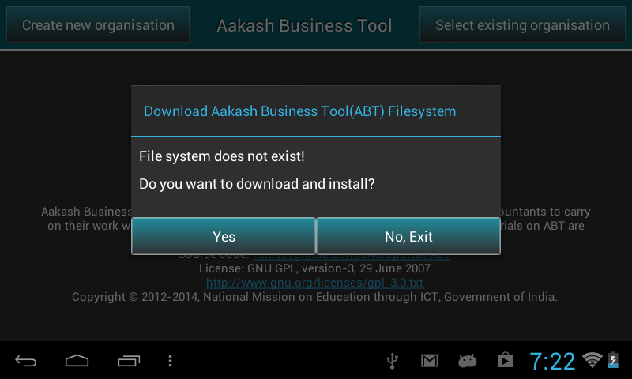

%%%%%%%%%%%%%%%%%%
How to install ABT
%%%%%%%%%%%%%%%%%%

Prerequisite 
============ 

ABT can be used on any ``rooted tablet`` of your choice. 
To install ABT on a rooted tablet, you will require

* a working Internet connection and

* 400MB of free space on internal/external SD card.

Start installation
==================
* You will need an internet connection to download files onto the
  tablet.

Set proxy settings
------------------
* If you work behind a proxy server, ensure that you bypass
  ``localhost`` under proxy settings. You can skip this step if you
  have a direct Internet connection.

* You can find this option under ``Settings and WiFi``. Ensure that
  ``WIFI`` is turned ON. Long press on the WIFI network that you want
  to connect to. Then, ``choose Modify network``.

* Check ``Show Advanced Options`` checkbox. 

* Add an entry for ``127.0.0.1`` to bypass the localhost.

Download ABT APK
----------------
* Now, open the web browser on your tablet. Type this URL in the
  address bar http://aakashlabs.org/ac/iitb/

* Search for Aakash Business Tool & tap on ``Download``.

* It will download ``ABT.apk`` file to Download folder of internal
  card.

* Go to that location. To install, tap on the ABT apk file which you
  downloaded.

Simple and recommended install procedure
~~~~~~~~~~~~~~~~~~~~~~~~~~~~~~~~~~~~~~~~
* Now open the ABT application from the application menu.

* When we open ABT for the first time it will prompt, ``File system
  does not exist! Do you want to download and install?``. Select
  ``Yes``.

* This will download ``abt.tar.gz`` file in your internal
  memory. 

* After downloading the file, it will automatically ``extract``
  abt.tar.gz file.

* After extraction, it will again prompt ``To apply changes, please
  reboot``.

* Now click on ``Reboot``, to Reboot the tablet.

* If in case the application asks for superuser permission, say
  ``GRANT``.

Manual installation
~~~~~~~~~~~~~~~~~~~
* Once you have installed ABT apk, go to the browser. Now type
  http://www.it.iitb.ac.in/AakashApps/repo/abt.tar.gz in the address
  bar.

* ``abt.tar.gz`` will get downloaded to Download folder of internal
  sdcard.

* Go to the location and copy or move this file to the internal sd
  card.

* Now, open ABT application. It will directly start the ``extraction``
  of abt.tar.gz file.

* After extraction it will prompt the message, ``To apply changes,
  please reboot``, click on ``Reboot`` to Reboot the tablet.

* Aakash Business Tool is ready to use.

Note
----
In case there is not enough space in internal memory,

* Download and extract ``abt.tar.gz`` file on your computer & 

* Copy ``abt.img`` file to tablet's ``external SD card`` and reboot
  the tablet.
