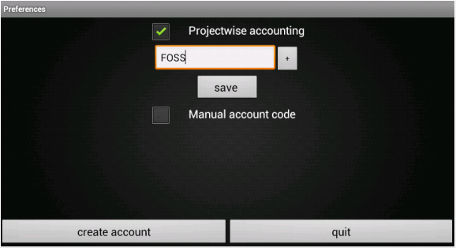

.. toctree::
   :numbered:

Maintaining organisations
=========================
* This article explains maintainance of organisation in **Aakash Business Tool(ABT)**.

* It includes ``creation`` of organisation, ``saving`` organisation details and setting ``preferences``.

welcome page
------------
* This page contains the features for the first screen that displays two buttons, **Create new organisation** and
  **Select existing organisation**, besides the main logo of Aakash Business Tool(ABT).

.. image:: images/home_page.png
   :name: ABT main page
   :align: center
   :height: 200pt
   :width: 350pt

Setting up a new organisation
-----------------------------
The first step to get started in ``ABT`` is to create an organisation

* Go to Welcome page of ABT >> Press ``Create New Organisation``.

* To get started with the application, there should be ``atleast one`` organization.
  
* Type the ``name`` of organisation.
  
* Select the organisation ``type`` (NGO or Profit Making).
  
* Specify the Financial Year ``From`` and Financial Year ``To``.

* **Note**: ABT provides 1st April to 31st March as the predefined financial year, But user can change the To date ``manually`` according to organization's rules or requirement. Once the ``From`` date is seted, ``To`` date gets automatically updated by ``12`` months and minus ``1`` day.
  
* Press ``next`` to go to the next page.

.. image:: images/create_org.png
   :name: ABT main page
   :align: center
   :height: 200pt
   :width: 350pt

* Fill the organisation details if required else, press ``Skip``.
  
* Press the ``Save`` button to save the organisation details.

.. image:: images/org_details.png
   :name: ABT main page
   :align: center
   :height: 200pt
   :width: 350pt

* **Note**: Organisation will get created by clicking either ``Save`` or ``Skip`` button.

* Once you create a new organisation and save details of it, ABT asks for preferences.

* It provides **preferences** to add new ``projects`` for projectwise accounting and ``manual account code`` generation.

* if project checkbox is checked, new edittext will appear on the screen to add project names and ``Save`` button will save project names in database if it is not exist.

* Check the account code using the ``check-box``,if a manual account code has to be provided.

Select existing organisation
----------------------------

* Go to Welcome page of ABT >> Press ``Select New Organisation``.
  
* It will display the list of Organisations.
  
* Select the required ``organisation`` and respective ``financial year``.
  
* Press ``Proceed``.

.. image:: images/select_org.png
   :name: ABT main page
   :align: center
   :height: 200pt
   :width: 350pt

* To delete existing organisation press ``Delete Organisation``.
  
* There can be same organisation with different financial year as shown in below fig.
  
.. image:: images/diff_financial_year.png
   :name: ABT main page
   :align: center
   :height: 200pt
   :width: 350pt

