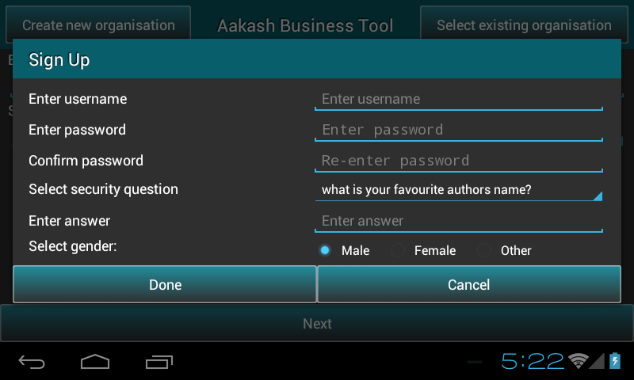
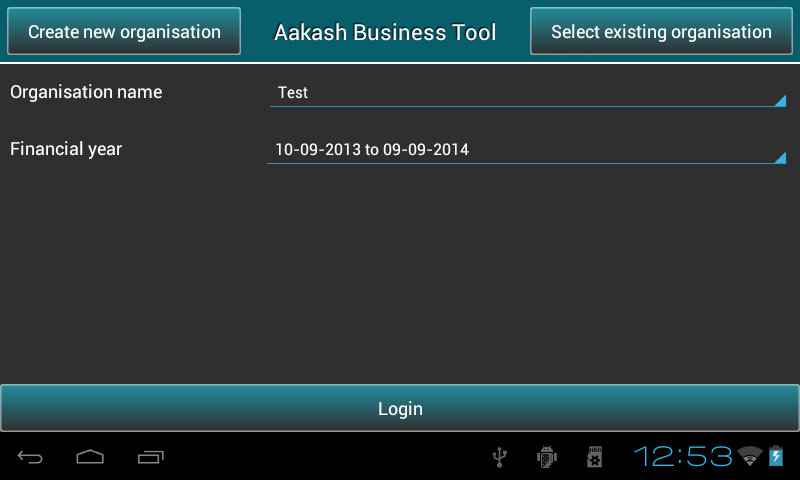

.. toctree::
   :numbered:

Maintaining organisations
=========================
* This article explains maintainance of organisation in **Aakash Business Tool(ABT)**.

* It includes ``creation`` of organisation and ``saving`` organisation details.

Welcome page
------------

* On loading application, it asks for address of the server location such as emulator,
  tablet or remote server. Select **any one** of them.
  
* Choose ``tablet`` option to run ABT on android device.

* Android developers can Choose ``emulator`` option, to test app or modify ABT source code.

* On selecting ``Remote server`` for ABT, enter IP address manually. 
  It requires a live internet connection, it can be within an Organization
  or an Institute. User can access a centralize remote server running within 
  the Institute. The advantage is, each user will have his/her own 
  account on the server. The central server runs Postgres as a database engine.

.. image:: images/remote_location.png
   :name: ABT main page
   :align: center
   :height: 200pt
   :width: 350pt

* Click ``Apply`` button and you will see a page contains the features for the 
  first screen that displays two buttons, **Create new organisation** and
  **Select existing organisation** at the top.

Setting up a new organisation
-----------------------------
The first step to get started in ``ABT`` is to create an organisation

* Go to Welcome page of ABT >> Press ``Create New Organisation``.

.. image:: images/create_org.png
   :name: ABT main page
   :align: center
   :height: 200pt
   :width: 350pt

* To get started with the application, there should be ``atleast one`` organization.
  
* Type the ``name`` of organisation.
  
* Select the organisation ``type`` (NGO or Profit Making).
  
* Specify the Financial Year ``From`` and Financial Year ``To``.

* **Note**: ABT provides 1st April to 31st March as the predefined financial year, But user can change the To date ``manually`` according to organization's rules or requirement. Once the ``From`` date is seted, ``To`` date gets automatically updated by ``12`` months and minus ``1`` day.
  
* Press ``next`` to sign up as a user. This will open a promt-box to select the user role such as Admin or guest.

.. image:: images/login.png
   :align: center
   :height: 200pt
   :width: 350pt

* Guest user has a default username ``guest`` and password is also ``guest``.

* If you select ``Admin``, a new pop-up box will appear on the screen to sign up as an Admin.
  Save details and press ``Login`` to continue.

* Fill the organisation details if required else, press ``Skip``.
  
* Press the ``Save`` button to save the organisation details.

.. image:: images/org_details.png
   :name: ABT main page
   :align: center
   :height: 200pt
   :width: 350pt

* **Note**: Organisation will get created by clicking either ``Save`` or ``Skip`` button.

* Welcome to ABT's master menu!

Select existing organisation
----------------------------

* Go to Welcome page of ABT >> Press ``Select New Organisation``.
  
* It will display the list of Organisations.
  
* Select the required ``organisation`` and respective ``financial year``.
  
* Press ``Next``.

   
* This will ask you to login. Guest user have to just select radio button and Admin/Manager/operator
  have to insert username and password.
  
.. image:: images/login_user.png
   :align: center
   :height: 200pt
   :width: 350pt
