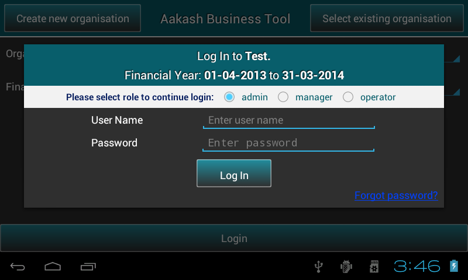

.. toctree::
   :numbered:

Maintaining organisations
=========================

* ``Create`` and ``save`` organisation details.

Welcome page
------------

.. image:: images/welcome_page.png
   :align: center
   :height: 200pt
   :width: 350pt

* As the application is launched, it automatically checks whether the
  application is running on ``emulator`` or ``tablet`` and do the
  needful.

* Various options are present in the slide menu.

.. image:: images/drawer_options.png
   :align: center
   :height: 200pt
   :width: 350pt
	
  - Change server location

	+ On selecting ``Change server location`` , it prompts a dialog to enter IP address manually. 
	  It requires a live internet connection, it can be within an organisation
	  or an institute. User can access a centralized remote server running within 
  	  the institute. The advantage is, each user will have his/her own 
  	  account on the server. The central server runs Postgres as a database engine.

.. image:: images/remote_location.png
   :align: center
   :height: 200pt
   :width: 350pt

	+ Click on ``Ok`` button. 

* There are two options at the top of the screen: 
	+ Create new organisation 
	+ Select existing organisation

* At the bottom of the screen there is brief information about ABT. 

Setting up a new organisation
-----------------------------

* To get started, user need to create aleast one organisation.

* Press ``Create new organisation``.

.. image:: images/create_org.png
   :align: center
   :height: 200pt
   :width: 350pt
  
* Fill in the necessary information such as organisation name, type and specify the financial period.

* ABT provides 1st April to 31st March as the predefined financial year, but user can change the To date ``manually`` according to organisation's rules or requirement. Once the ``From`` date is set, ``To`` date gets automatically updated by ``12`` months and minus ``1`` day.
  
* Press ``Next`` to sign up as a new user. This will open a dialog where user can select role, it can be either an admin or a guest.

.. image:: images/login.png
   :align: center
   :height: 200pt
   :width: 350pt

* Guest user has a default username and password ie. ``guest``.

* If user will select ``admin``, a new pop-up box will appear on the screen to sign up as an admin.
  Save details and press ``Log In`` to continue.

.. image:: images/sign_up.png
   :align: center
   :height: 200pt
   :width: 350pt

* Fill the organisation details if required and save them, else skip.
  
.. image:: images/org_details.png
   :align: center
   :height: 200pt
   :width: 350pt
  
*  It will take the user to ABT’s master menu.

* **Note**: In both the cases, whether the user ``skips`` or
  ``saves``, organisation will be created .

Select existing organisation
----------------------------

* Press ``Select new organisation``.
  
* Select any ``organisation`` and respective ``financial year`` from
  the dropdown and login as per role.
  
.. image:: images/select_org.png
   :align: center
   :height: 200pt
   :width: 350pt

.. image:: images/login_user_test.png
   :align: center
   :height: 200pt
   :width: 350pt
   

* If in case, Admin ``forgets`` password, he can use ``Forgot
  password`` link and answer security question to reset the
  password(No other role can use this option).

.. image:: images/forget_password.png
   :align: center
   :height: 200pt
   :width: 350pt
  
.. image:: images/reset_password.png
   :align: center
   :height: 200pt
   :width: 350pt
  
