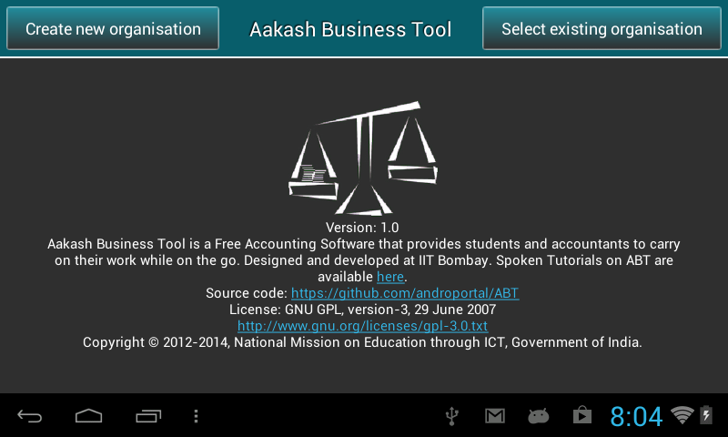
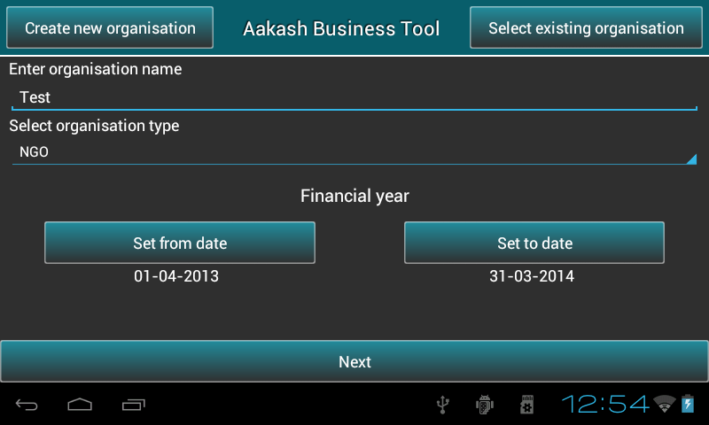
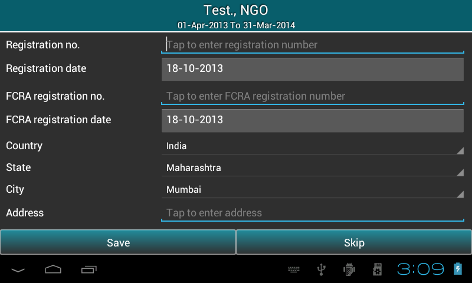

.. toctree::
   :numbered:

Maintaining organisations
=========================

* It includes ``creation`` of organisation and ``saving`` organisation details.

Welcome page
------------

* As the application is launched, it automatically checks whether the application is running on ``emulator`` or ``tablet`` and do all required things.

  
* To switch to ``Remote server``, user can drag the screen from left to right to find ``Change server location`` option.

* On selecting ``Change server location`` , it prompts a dialog to enter IP address manually. 
  It requires a live internet connection, it can be within an organization
  or an institute. User can access a centralized remote server running within 
  the institute. The advantage is, each user will have his/her own 
  account on the server. The central server runs Postgres as a database engine.

.. image:: images/remote_location.png
   :name: ABT main page
   :align: center
   :height: 200pt
   :width: 350pt

* Click on ``Ok`` button. 

* There are two options at the top of the screen: **Create new organisation** and
  **Select existing organisation**.

Setting up a new organisation
-----------------------------

* To get started, user need to create aleast one organisation.

* Press ``Create New Organisation``.

  
* Type the ``name`` of organisation.
  
* Select the organisation ``type`` (NGO or Profit Making).
  
* Specify the Financial Year ``From`` and Financial Year ``To``.

* **Note**: ABT provides 1st April to 31st March as the predefined financial year, But user can change the To date ``manually`` according to organization's rules or requirement. Once the ``From`` date is set, ``To`` date gets automatically updated by ``12`` months and minus ``1`` day.
  
* Press ``next`` to sign up as a user. This will open a dialog where user can select role such as admin or guest.

.. image:: images/login.png
   :align: center
   :height: 200pt
   :width: 350pt

* Guest user has a default username and password ie. ``guest``.

* If user will select ``admin``, a new pop-up box will appear on the screen to sign up as an admin.
  Save details and press ``Login`` to continue.

.. image:: images/sign_up.png
   :name: ABT main page
   :align: center
   :height: 200pt
   :width: 350pt

* Fill the organisation details if required else, press ``Skip``.
  

  
* Press the ``Save`` button to save the organisation details and it will take to ABT's master menu.

* **Note**: In both cases,whether the user clicks ``skip`` or ``save`` organisation will be created .

Select existing organisation
----------------------------

* Press ``Select New Organisation``.
  
* It will display the list of Organisations.
  
* Select the required ``organisation`` and respective ``financial year``.
  
* Press ``Login``.

.. image:: images/select_org.png
   :align: center
   :height: 200pt
   :width: 350pt
   
* This will ask you to login. Guest users just need to select radio button and rest ie. Admin/Manager/operator
  have to authenticate themselves by putting username and password.
  

   
.. image:: images/login_user.png
   :align: center
   :height: 200pt
   :width: 350pt

* If the admin forgets his password, he can reset his password by answering the security questions using ``Forgot password`` link .

   
* This step will be followed by reset password activity. Admin has to reset password to 
  perform any further activities.
  

  
