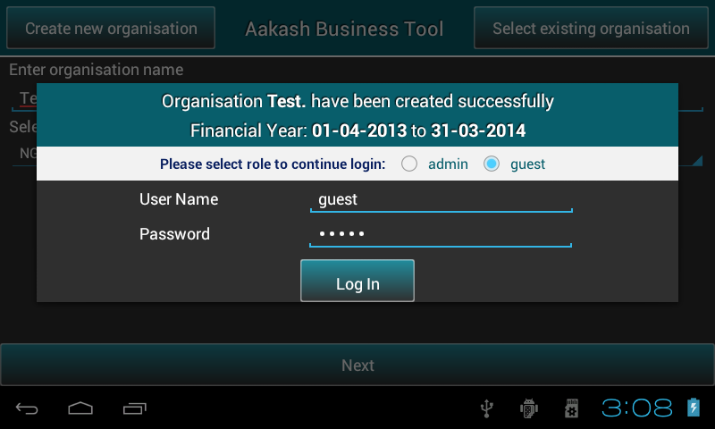
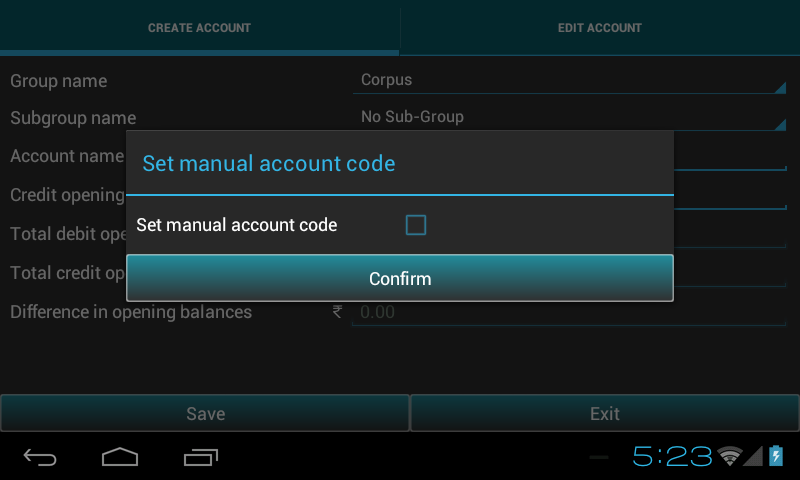
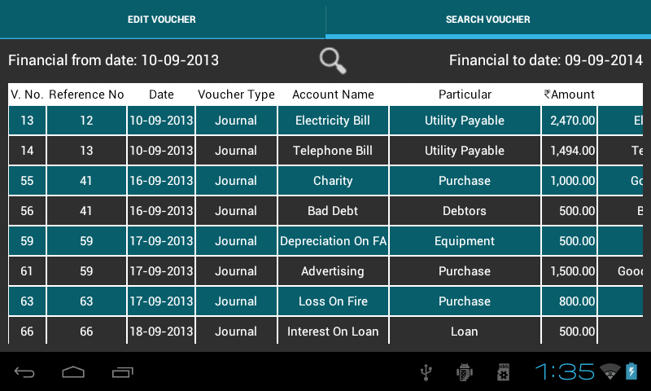
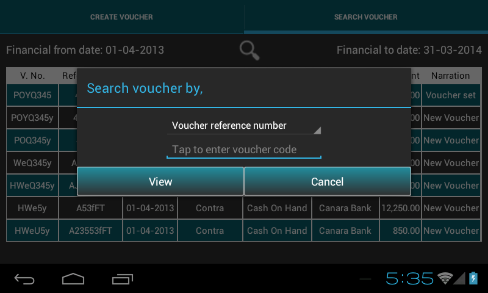
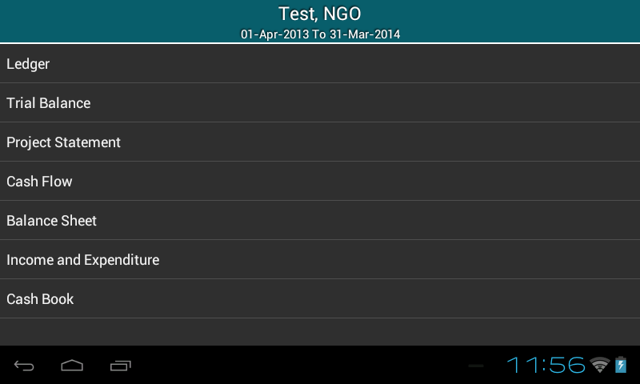
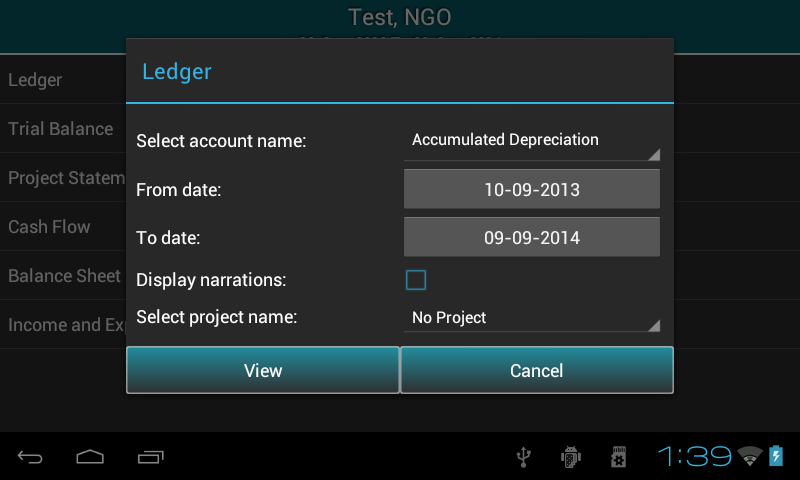
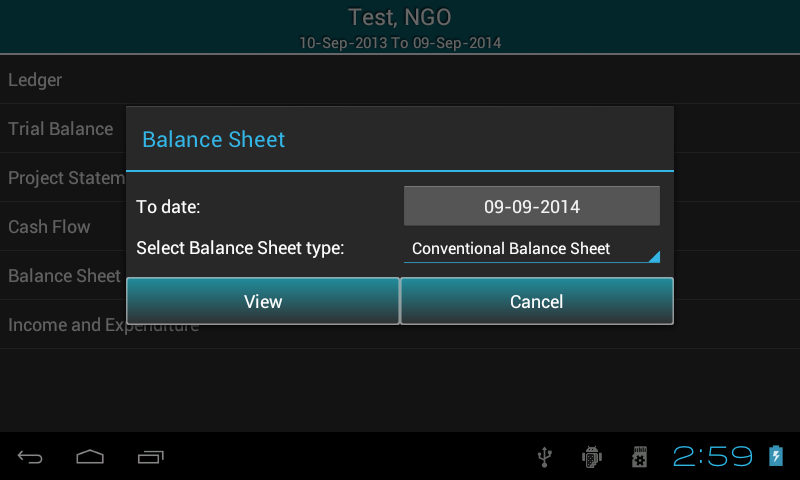
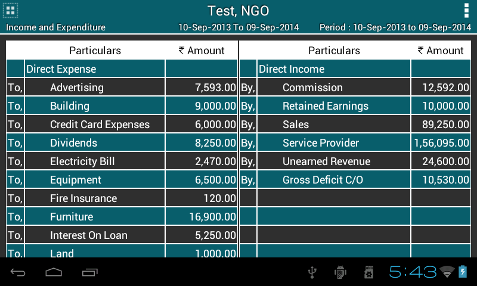
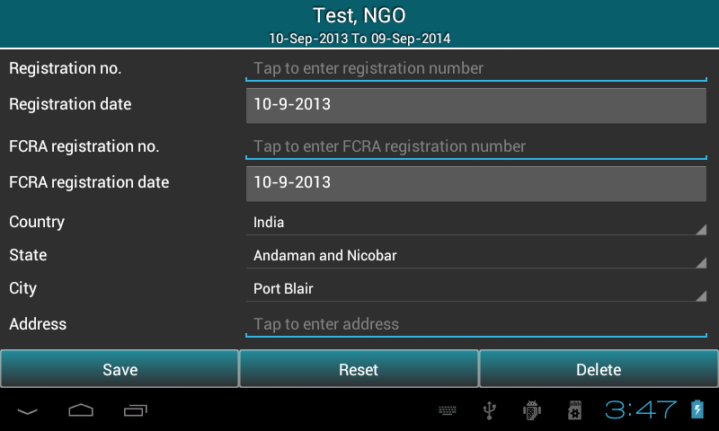

About Aakash Business Tool(ABT)
===============================

**Aakash Business Tool** is a portable accounting platform on Android
intended for Accountants and Students. `Aakash
<http://aakashlabs.org>`_ is a low cost computing device/tablet for
students, the project is initiated and funded by MHRD, Govt. of
India. Aakash already runs Android 4.0 with many educational `apps
<https://github.com/androportal/>`_
developed at IIT Bombay. Aakash
Accounting provides an easy to use interface specially for
students/newbies who have just started accounting. We have tried to
make the user's experience simple and elegant. This initial version
covers basic account management, creating vouchers and reports.

It was initially derived from `GNUkhata <http://www.gnukhata.org>`_, a free
accounting software which is mostly based on Python framework.

Some features included in Aakash Business Tool:
  #. Managing Organizations and User authentication
  #. Maintaining books of accounts
  #. Recording, cloning and editing transactions
  #. Recording of transactions under particular project
  #. Generating reports such as Ledger Accounts, Trial Balance(Net,
     Gross, Extended), Profit and Loss Account, Project Statement,
     Cash Flow and Balance Sheet(Conventional or Sources of application 
     and funds)
  #. Bank Reconciliation
  #. Rollover
  #. Export reports in PDF/CSV format
  #. Import/Export of organization data to other device
  #. ABT as a remote server

Maintaining organisations
=========================
* This article explains maintainance of organisation in **Aakash Business Tool(ABT)**.

* It includes ``creation`` of organisation and ``saving`` organisation details.

welcome page
------------

* On loading application, it asks for address of the server location such as emulator,
  tablet or remote server. Select **any one** of them.

	.. image:: images/remote_location.png
	   :align: center
	   :height: 200pt
	   :width: 350pt

* Choose ``tablet`` option to run ABT on android device.

* Android developers can Choose ``emulator`` option, to test app or modify ABT source code.

* On selecting ``Remote server`` for ABT, enter IP address manually. 
  It requires a live internet connection, it can be within an Organization
  or an Institute. 
  
* User can access a centralize remote server running within 
  the Institute. 
  
* The advantage is, each user will have his/her own 
  account on the server. 
  
* The central server runs Postgres as a database engine.

* Click ``Apply`` button and you will see a page contains the features for the 
  first screen that displays two buttons, **Create new organisation** and
  **Select existing organisation** at the top.

Setting up a new organisation
-----------------------------
The first step to get started in ``ABT`` is to create an organisation

* Go to Welcome page of ABT >> Press ``Create New Organisation``.

.. image:: images/create_org.png
   :align: center
   :height: 200pt
   :width: 350pt

* To get started with the application, there should be ``atleast one`` organization.
  
* Type the ``name`` of organisation.
  
* Select the organisation ``type`` (NGO or Profit Making).
  
* Specify the Financial Year ``From`` and Financial Year ``To``.

* **Note**: ABT provides 1st April to 31st March as the predefined financial year, But user can change the To date ``manually`` according to organization's rules or requirement. Once the ``From`` date is seted, ``To`` date gets automatically updated by ``12`` months and minus ``1`` day.
  
* Press ``next`` to sign up as a user. This will open a promt-box to select the user role such as Admin or guest.

* Guest user has a default username ``guest`` and password is also ``guest``.

* If you select ``Admin``, a new pop-up box will appear on the screen to sign up as an Admin.
  Save details and press ``Login`` to continue.

.. image:: images/sign_up.png
   :align: center
   :height: 200pt
   :width: 350pt

* Fill the organisation details if required else, press ``Skip``.
  
* Press the ``Save`` button to save the organisation details.

.. image:: images/org_details.png
   :align: center
   :height: 200pt
   :width: 350pt

* **Note**: Organisation will get created by clicking either ``Save`` or ``Skip`` button.

* Welcome to ABT's master menu!

Select existing organisation
----------------------------

* Go to Welcome page of ABT >> Press ``Select New Organisation``.
  
* It will display the list of Organisations.
  
* Select the required ``organisation`` and respective ``financial year``.
  
* Press ``Next``.

.. image:: images/select_org.png
   :align: center
   :height: 200pt
   :width: 350pt
   
* This will ask you to login. Guest user have to just select radio button and Admin/Manager/operator
  have to insert username and password.
  
.. image:: images/login_user.png
   :align: center
   :height: 200pt
   :width: 350pt

Master menu
===========

Aakash Business Tool's master menu includes list of menu options as shown in figure.

.. image:: images/master_menu.png
   :align: center
   :height: 200pt
   :width: 350pt

**Create account**
	* Create an account under respective ``group`` and ``subgroup`` with an opening balance.
	* Search/Edit/Delete account.

**Transaction**
	* ``Record`` transaction in ABT.
	* ``Search/Edit/Clone/Delete`` transaction.

**Reports**
	* View different types of reports such as ``Ledger, Trial Balance, Project Statement, Cash Flow, Balance Sheet, Profit & Loss/Income & Expenditure``.
	
**Bank Reconciliation**
	*  Set clearance date for cleared transaction and view ``Bank Reconciliation`` statement.

**Preferences**
	* Set preferences to ``Edit/Delete organisation details`` and ``Add/Edit/Delete project name``.

**Rollover**
	* Transfer the holdings to the next financial year.

**Export organisation**
	* Export organisation data from one tablet to another.

**Account settings**
	* Set new username and password.
	* Create new user role.

**Help**
	* How to use ABT
	
User authentication
-------------------
According to the user role access to the menus are provided.

1. **Admin** have access to all the above options.

2. Except ``rollover`` **Manager** can access all the options.

3. **Operator** has access to ``create account, Transaction, Export organisation, Account Settings, Help``.

4. Except ``rollover and account setting`` **guest** can access remaining options.

Account management
==================
* Account management covers three major parts ie. create,search, edit and delete account .

* Go to ``Master menu`` > ``Create account``.

Save account code preference
----------------------------

* Before you start creating a new account, you have to specify the account code type ie.
  manual or automated. When first time you enter into this page, The alert-box will appear on the screen
  (See below figure).
  

  
* Check the check-box if manual account code has to be provided or leave it as it is for automatic
  account code generation. Click on ``Save`` button to save this preference. 
  Remember, This is only one time activity. Later on this alert-box will 
  not appear on the screen instead it will follow the saved preference(manual or automatic) 
  for account code. 

How to create a new account?
----------------------------

* Create an account under respective ``group`` and ``subgroup`` with an
  opening balance. This will automatically update the ``total debit opening balance, 
  total credit opening balance`` and ``difference`` between them.

.. image:: images/create_account.png
   :align: center	
   :height: 200pt
   :width: 350pt
	
* Press ``Save`` to save an account.

* ``Finish`` button will take to the Master menu page.

  
Search/Edit account
-------------------

* Select ``Edit account`` tab.

* It displays ``list`` of all account names.

.. image:: images/search_account.png
   :align: center
   :height: 200pt
   :width: 350pt

* If ``manual account code`` was checked in Preferences, there will be ``two`` options ie. Search by account name and code. Otherwise,search by account name.
	
* User can Edit/Delete selected account name from the list only if that account has no transactions.

* **Edit account** will display complete information about respective account as shown in figure. Only account name and opening balance fields are editable. Press ``Save`` to save the changes.

.. image:: images/edit_account.png
   :align: center	
   :height: 200pt
   :width: 350pt	
	  
* **Note**: Opening balance field is not editable, if account comes under group ``Direct Income``, ``Direct Expense``, ``Indirect Income`` and ``Indirect Expense`` due to its ``zero`` opening balance.
	
* Press **Delete account** to delete the account. Account having opening balance or under transaction cannot be deleted.

======================
Transaction management
======================
* This chapter provides guidence to ``add/search/edit/clone/delete`` transaction.

* Go to ``Master menu`` > ``Create Voucher``.

Record Transaction
------------------
 
* See ``Create Voucher`` tab as shown in below fig. for recording transactions.

.. image:: images/create_voucher.png
   :align: center
   :height: 200pt
   :width: 350pt

* To record transaction in ``ABT`` follow the below steps:

* Select the mode of transaction from the list of voucher type.

* ``Mode`` of transaction can be Contra, Journal, Payment, Receipt, Debit Note, Credit Note,Sales, 
  Sales Return, Purchase, Purchase Return.
	
.. image:: images/voucher_type.png
   :align: center
   :height: 200pt
   :width: 350pt

There should be atleast ``two`` accounts for recording transactions. To get started with,

* Select account ``Type(Dr/Cr)``, ``Account name`` from the dropdown and enter the ``Amount`` in rupees
  and repeat the same until amount gets tallied. Use ``plus`` button for adding new row.
  
* **Note**: ABT populates drop down of account name by voucher type ``rule``. 
  For example, if transaction type is contra, it filters account names that 
  comes under contra and fill them in the drop down.
     
* Closing balance is displayed in between the account name and amount field. It's a read only field.    
 
* Press ``Voucher date`` to set the date of transaction.

* **Note**: ABT sets financial date as Voucher date, if no transaction is recorded before. 
  If any transaction is previously recorded,it sets the voucher date of the previous transaction 
  of the respective voucher type. If the date is changed, it updates the bydefault date or previous 
  date with the new date. 

* Press ``Project name`` to select the project name from list of projects for recording transaction 
  under that particular project, otherwise select ``No project``.

* Enter ``Voucher code``.

* Enter ``Voucher reference No.`` or edit the last reference No. .

* Enter ``Narration``.

* Press ``Save`` to save transaction and ``Reset`` to clear all fields.

* After saving transaction it resets all the fields automatically.

* ``Reset`` button shown below , present at the bottom will resets all the fields automatically.
   
* You can change the voucher type if you want to make different voucher entries.
 
Search/Edit/Clone/Delete Transaction
------------------------------------

* To ``Edit/Clone/Delete`` transaction select ``Search voucher`` tab.

* Its displays ``all`` transactions for the complete financial year which comes under ``selected``
  voucher type in create account page as shown in figure.

* Press ``Search`` button (see figure) to search transaction by ``Voucher reference No., Date or Narration`` 
  and press ``View`` button to view the transactions.

* Click table ``row`` to Edit/Clone/Delete the transactions.

.. image:: images/edit_voucher_alert.png
   :align: center
   :height: 200pt
   :width: 350pt

* In **Edit voucher**, except ``Voucher No.``, all other fields are editable. Press ``Save`` to save the changes. 

.. image:: images/edit_voucher.png
   :align: center
   :height: 200pt
   :width: 350pt

* **Clone voucher** duplicates information on an existing transaction, to create a new one without having to enter all the fields. There is an option to ``keep or change`` the existing field values. Press ``Save`` to save the transaction. 

.. image:: images/clone_voucher.png
   :align: center
   :height: 200pt
   :width: 350pt

* **Delete voucher**: Press ``Delete`` to delete the transaction.

Reports
=======

* Go to ``master menu`` >> ``Reports``.

* It displays list of all types of reports provided by ABT. If organisation type is NGO, it shows Income and Expenditure in the list otherwise Profit and Loss.
  

	  	
* Title will display respective organisation information such as name, type and financial year.

* Options button is provided to export report in a PDF or CSV format. 

.. image:: images/export_pdf.png
   :align: center
   :height: 200pt
   :width: 350pt
   
* You can also set security to your file.

.. image:: images/file_security.png
   :align: center
   :height: 200pt
   :width: 350pt

Ledger
----------
Select Ledger option from list, It will pop up a ``dialog box`` (see fig.) which ask’s following information:
  
* ``Account name`` for which ledger to be shown. Select account name from the ``dropdown``.

* ``from date`` and ``to date``, by default it is financial year's from date and to date. Change date as per the requirement or keep it as it is.

* Check box to view transactions with ``narrations``.

* ``Project name`` to view projectwise ledger. Select project from the dropdown, by default ``No Project`` is selected.

  	  
* Press ``View``.
  
* It will display ledger for the given period in a tabular format. Opening balance is located at the first row of the table followed by transactions, with Total of transactions, Closing balance and Grand total at bottom of the table.
  
.. image:: images/ledger.png
   :align: center
   :height: 200pt
   :width: 350pt

Trial Balance
-------------------
* Like Ledger, It will pop up a ``dialog box`` (see fig.) which ask’s following information:
  
* ``to date``, by default it is financial year's to date. Change date as per the requirement or keep it as it is.

* Trial Balance type. In ABT, there are 3 types of trial balances such as Net, Gross and Extended. Select it from the dropdown.

.. image:: images/trial_before.png
   :align: center
   :height: 200pt
   :width: 350pt
  	  
* Press ``View``.
  
* It will display Trial Balance for the given period in a tabular format. Difference in Opening Balance is located at the bottom of the screen.
  
.. image:: images/trial_balance.png
   :align: center
   :height: 200pt
   :width: 350pt

Project Statement
--------------------------
* It will pop up a ``dialog box`` (see fig.) which ask’s following information:
  
* ``to date``, by default it is financial year's to date. Change date as per the requirement or keep it as it is.

* ``Project name`` to view projectwise transactions. Select project from the dropdown, by default ``No Project`` is selected.

.. image:: images/proj_before.png
   :align: center
   :height: 200pt
   :width: 350pt
  	  
* Press ``View``.
  
* It will display Project Statement for the given period in a tabular format. Difference in Opening Balance is located at the bottom of the screen.
  
.. image:: images/proj_statement.png
   :align: center
   :height: 200pt
   :width: 350pt

Cash Flow
---------------
* It will pop up a ``dialog box`` (see fig.) which ask’s following information:
  
* ``from date`` and ``to date``, by default it is financial year's from date and to date. Change date as per the requirement or keep it as it is.

.. image:: images/cashflow_before.png
   :align: center
   :height: 200pt
   :width: 350pt
  	  
* Press ``View``.
  
* It will display Cash Flow for the given period in a tabular format. Net Flow is located at the bottom of the screen.
  
.. image:: images/cashflow.png
   :align: center
   :height: 200pt
   :width: 350pt

Balance Sheet
--------------------
* It will pop up a ``dialog box`` (see fig.) which ask’s following information:
  
* ``to date``, by default it is financial year's to date. Change date as per the requirement or keep it as it is.

* Balance Sheet type. In ABT, there are 2 types of balance Sheets such as Conventional(horizontal) and Sources & Application of Funds(vertical). Select it from the dropdown.

  	  
* Press ``View``.
  
* It will display Balance Sheet for the given period in a tabular format. Difference in Opening Balance is located at the bottom of the screen.
  
.. image:: images/balancesheet.png
   :align: center
   :height: 200pt
   :width: 350pt

Income & Expenditure/Profit & Loss
----------------------------------------------------
* It will pop up a ``dialog box`` (see fig.) which ask’s following information:
  
* ``to date``, by default it is financial year's to date. Change date as per the requirement or keep it as it is.

.. image:: images/profitloss_before.png
   :align: center
   :height: 200pt
   :width: 350pt
  	  
* Press ``View``.
  
* It will display Income & Expenditure/Profit & Loss for the given period in a tabular format.
  

Bank reconciliation
===================

* Go to ``Master menu`` > ``Bank Reconciliation``.
  
* It will pop up a ``dialog box`` (see fig.) which ask’s following information.
  
* ``Account name`` for which Bank Reconciliation is to be done. Select account name from the ``dropdown``.
      
* ``from date`` and ``to date``, by default it is financial year's from date and to date. Change date as per the requirement.
      
* Check box to view cleared+uncleared transactions.
      
* Check box to view transactions with ``narrations``.
      
.. image:: images/bank_reco_before.png
   :align: center
   :height: 200pt
   :width: 350pt
  	  
* Press ``View``.
  
* It will display all transactions(cleared + uncleared) for that period and all uncleared transactions from starting day of financial year to the last day of the entered period for that account in a tabular format.
  
.. image:: images/bank_reconciliation.png
   :align: center
   :height: 200pt
   :width: 350pt
  	
* More about this table:
  
* ``Total Debit`` & ``Total Credit`` at the end of the table.
	    	
* Bank Reconciliation Statement is located at the bottom of the table.
  
.. image:: images/bank_statement.png
   :align: center
   :height: 200pt
   :width: 350pt
   
* Options button is provided to export report in a PDF or CSV format.

Setting up preferences
======================

Select ``Preferences`` option from master menu to edit organisation details or Add/Edit/Delete project.

Edit/Delete organisation details
--------------------------------

* Displays previously saved organisation information, all the fields are editable.

* User can edit these fields if required.

* Press ``Save`` to save the changes.

* Press ``Reset`` to clear all the fields.

* Press ``Delete`` button to delete organisation. You can also delete previous financial year of
  the same organisation.

.. image:: images/delete_org.png
   :align: center
   :height: 200pt
   :width: 350pt

Add/Edit/Delete project
-----------------------

* It displays list of all projects added before.

.. image:: images/project_list.png
   :align: center
   :height: 200pt
   :width: 350pt

* ``Add project`` (see figure) will help to add new project if not exists.
	
* Select project name from the list, It diplays a popup which is having two options such as ``edit`` or ``delete`` project name.

* **Note**: If project has transactions, it can not be deleted.
		

Rollover
========
* Go to ``Master menu`` > ``Rollover``.

* Click on ``Rollover``, it will prompt accourding to following conditions.

	* It will check for financial period, if it is not completed financial to date then,
          it prompt for ``can not rollover, since financial year is not completed!!``.
	
	* Else if financial year is completed then it prompt to ``rollover has been done``.

	* Rollover will be done only once in a financial period so , if you click on it again,
          it prompt ``rollover has done already!!``

Export/Import organisation
==========================

	+ Export organisation :

		* Go to ``Master menu`` > ``Export organisation``.

		* Click on it, It will pop up a ``dialog box`` (see fig.) which ask’s "Do you want to export organisation".

		* If you will click on ``Yes`` then, it will again prompt "organisation has been exported to /mnt/sdcard/export/".

		* See, there is a location in tablet called ``/mnt/sdcard/export`` , you can able ton find exported organisation
		  sql formated file.

	+ Import organisation :

		* To import same organisation in another tablet just transfer ``export`` folder, provided ``ABT`` is installed.

		* Import option is available at first page of ``ABT`` in ``Options menu``.

		.. image:: images/import_option.png
		   :align: center
		   :height: 200pt
		   :width: 350pt		

		* Just click on ``Import``, it will show all available exported organisation and financial years 
		  to import it on current tablet.

		* Now, select organisation name and it's financial year which you would like to import and click on ``Import`` button.

		.. image:: images/import.png
		   :align: center
		   :height: 200pt
		   :width: 350pt

 
